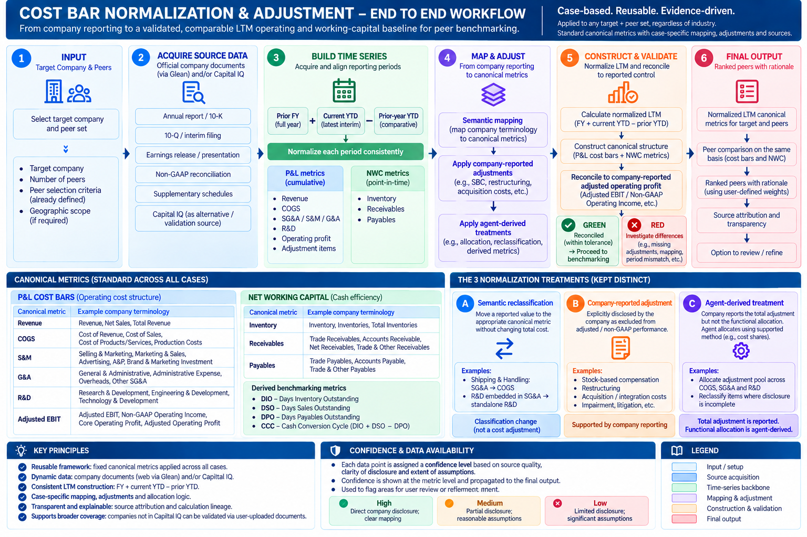

# Cost Bar & Normalization methodology

[View in Confluence](https://bainco.atlassian.net/wiki/spaces/OI30/pages/19888046107)

# Cost Bar Normalization & Adjustment Methodology

## 1. Summary

The purpose of the cost-bar methodology is to convert heterogeneous company financial reporting into a **consistent canonical cost structure that can be used for peer benchmarking**.

The framework is reusable, but each case is constructed individually based on the reporting of the **target company and its selected peers**.

A case is therefore simply:

**Target company + selected peer set**

The methodology does not change by industry. The same canonical metrics are used across cases, while the underlying company terminology, disclosure structure, adjustments, fiscal calendars and level of reporting detail can differ materially.

For each company, the process needs to:

1. find the relevant reported financial information,
1. align the correct reporting periods (as benchmarking needs to happen on LTM basis),
1. map company terminology into the canonical metrics,
1. apply reported and, where necessary, agent-derived adjustments,
1. construct the normalized LTM view, and
1. reconcile the result against the company's reported adjusted EBIT / operating-profit measure before benchmarking.

The canonical metrics and benchmark outputs are standard. The challenge is therefore not deciding **what** to benchmark, but constructing the same metrics consistently for every company in the case.

The framework covers both:

- **P&L cost bars** — Revenue, COGS, SG&A / S&M / G&A, R&D and Adjusted EBIT
- **Net Working Capital metrics** — Inventory, Receivables and Payables, which are subsequently used to derive DIO, DSO, DPO and the cash-conversion-cycle view

Not every company will support the same level of detail. Where a reliable S&M/G&A split is unavailable, for example, the methodology should retain SG&A rather than manufacture a more granular breakdown.

## End-to-end workflow (Diagram)

# 2. Why the process must be case-specific

The six verified cases demonstrate that companies can reach the same canonical metric through very different reporting structures.

For example:

- Adobe reports relatively recognizable software cost lines but requires SBC, amortization and other adjustment allocations.
- Beiersdorf peers use concepts including Brand & Marketing Investment, A&P, Advertising, Overheads and SG&A.
- Carrier and its peers often report product and service cost separately and frequently retain only aggregate SG&A rather than S&M/G&A.
- Dow and peers generally retain SG&A as the comparable parent cost bar and contain company-specific restructuring and non-GAAP adjustments.
- General Mills can use Advertising & Media as an S&M proxy, but that breakdown is unavailable for LTM.
- Graphic Packaging and its peers generally remain at SG&A level, while several companies require significant restructuring of the cost base.

The objective is therefore **not to prescribe one industry reporting template**. The objective is to provide a reusable mechanism for interpreting each company's reporting and translating it into the standard canonical structure.

This principle is particularly important because even companies within the same peer set may require different normalization logic.

# 3. Core design principle: fixed canonical model, flexible source taxonomy

The canonical metric labels remain stable.

| Canonical metric  | Possible company terminology  |
|---|---|
| COGS  | Cost of Revenue, Cost of Sales, Cost of Products Sold, Cost of Services, Production Costs  |
| S&M  | Selling & Marketing, Marketing & Sales, Advertising, A&P, Brand & Marketing Investment  |
| G&A  | General & Administrative, Administrative Expense, Overheads, Other SG&A  |
| R&D  | Research & Development, Engineering & Development, Technology & Development  |
| Adjusted EBIT  | Adjusted EBIT, Non-GAAP Operating Income, Core Operating Profit, Adjusted Operating Profit  |
| Inventory  | Inventory, Inventories, Total Inventories  |
| Receivables  | Trade Receivables, Accounts Receivable, Net Receivables, Trade & Other Receivables  |
| Payables  | Trade Payables, Accounts Payable, Trade & Other Payables  |

The first group represents the **operating P&L cost structure**.

Inventory, Receivables and Payables form the canonical **Net Working Capital / cash-efficiency structure**. These balances are used to derive:

- **DIO** — Days Inventory Outstanding
- **DSO** — Days Sales Outstanding
- **DPO** — Days Payables Outstanding
- **CCC** — Cash Conversion Cycle

The original company label should always be retained.

Semantic mapping changes the **classification**, not the source evidence.

The cases demonstrate why this matters. L'Oréal's A&P is mapped to S&M while its remaining SG&A becomes canonical G&A; Unilever uses Brand & Marketing Investment plus Overheads; Revlon uses Advertising plus Other SG&A. These represent different source taxonomies mapped into one comparison framework.

The same principle applies to NWC. A company reporting **Trade Receivables** should not automatically be treated as identical to another reporting **Trade & Other Receivables**. Likewise, pure Trade Payables and broader Trade & Other Payables should remain distinguishable in the underlying provenance.

Similarly, Carrier shows why agents cannot rely purely on row names: rows labelled S&M and G&A in the workbook are actually populated with Product Sales and Service Sales and therefore must be rejected as cost-bar mappings.

# 4. Time-series management

Time-series management is a core part of the methodology.

Peer benchmarking is performed primarily on an **LTM basis**, but LTM is usually not a single company-reported datapoint.

It is constructed from several reporting periods:

**LTM = Previous FY + Current YTD − Prior-year YTD**

For example:

**LTM Aug-26 = FY25 + FY26 YTD through Aug-26 − FY25 YTD through Aug-25**

Therefore each canonical P&L metric may have multiple period observations before an LTM value can be calculated.

For every datapoint, the system should retain:

- company
- canonical metric
- source metric
- fiscal period
- period type: FY / quarterly / YTD / LTM
- period start
- period end
- source document
- reported / derived status
- adjustment status
- calculation lineage

The workflow should search for the **underlying reporting periods rather than search directly for LTM**.

| Required observation  | Typical source  |
|---|---|
| Prior FY  | Annual report / 10-K  |
| Current YTD  | Latest 10-Q, interim report, earnings release or earnings presentation  |
| Prior-year YTD  | Usually comparative columns in the current interim document; otherwise the comparable prior-period filing  |
| LTM  | Calculated  |

Official company reporting accessed through Glean should be the preferred web-document source. Capital IQ can be used interchangeably where the required field is available and can also serve as a cross-check.

The key requirement is not whether a datapoint came from CapIQ or a company document. It is whether the **metric, reporting period and source provenance are correct**.

The verified cases show why this matters. Adobe explicitly requires aligned FY + current-YTD − prior-YTD construction. General Mills demonstrates an additional complication: an LTM R&D value can be mathematically calculated while still being excluded from presentation because the underlying cost-bar breakdown is not considered sufficiently reliable.

Therefore:

**Mathematically available ≠ automatically benchmarkable.**

For NWC, the period treatment is slightly different because Inventory, Receivables and Payables are **balance-sheet observations rather than cumulative P&L flows**. The relevant balance at the benchmark period is used with the corresponding revenue or cost denominator to derive DIO, DSO and DPO. The balance definition and denominator convention must therefore remain consistent across the target and peers.

# 5. Practical workflow for one case

The same workflow is applied to the target and every selected peer.

## Step 1 — Establish the case

Identify:

- target company
- selected peers (peers are selected from the peer selection screen)

The canonical metrics and benchmark structure are already defined by the methodology.

What differs by company is the reporting structure and the work required to construct those metrics correctly.

## Step 2 — Search and acquire baseline financial observations

Retrieve the company-reported financial information needed to populate the canonical structure.

Primary source route:

**Official company documents through Glean**

Relevant document types include:

- annual report
- 10-K / equivalent annual filing
- 10-Q / interim filing
- earnings release
- earnings presentation
- investor presentation
- non-GAAP reconciliation
- supplementary financial schedules

Capital IQ may provide the same observations and can be used interchangeably or as validation.

The output of this step is the **reported financial evidence**, before normalization.

## Step 3 — Build the time-series backbone

Identify the reporting periods required to construct the LTM view.

For each relevant P&L metric and adjustment, acquire where available:

**FY + current YTD + prior-year YTD**

This generally applies to:

- Revenue
- COGS
- SG&A / S&M / G&A
- R&D
- operating profit
- adjustment items
- reported adjusted EBIT / EBITDA

For Net Working Capital, acquire the relevant balance-sheet observations for:

- Inventory
- Receivables
- Payables

The same period logic must be applied consistently across the target and peers.

## Step 4 — Perform semantic mapping

Map each company's reported terminology into the fixed canonical structure.

For example, a company may report:

- Cost of Subscription Revenue
- Cost of Professional Services
- Sales & Marketing
- Research & Development
- General & Administrative

These can be mapped as:

- **COGS** = Cost of Subscription Revenue + Cost of Professional Services
- **S&M** = Sales & Marketing
- **R&D** = Research & Development
- **G&A** = General & Administrative

Another company may report Cost of Sales, Advertising & Promotion and aggregate SG&A. The mapping should follow the available company evidence rather than forcing the first company's structure onto the second company.

The same applies to NWC balances:

- **Inventory** = Inventory / Inventories / Total Inventories
- **Receivables** = the most comparable supported trade or accounts-receivable balance
- **Payables** = the most comparable supported trade or accounts-payable balance

Where broader definitions such as **Trade & Other Receivables** or **Trade & Other Payables** are used because a narrower balance is unavailable, that difference should remain visible in provenance.

No artificial split should be introduced where the evidence does not support one.

# 6. Identify company-reported adjustments

Once the reported baseline has been mapped, identify adjustments explicitly disclosed by the company in their annual reports, press releases and / or investor presentations.

Examples across the cases include:

- stock-based compensation
- restructuring
- acquisition and integration costs
- amortization of acquired intangibles
- impairment
- litigation
- transaction costs
- inventory step-ups
- facility closures
- workforce reductions
- transformation costs
- other non-recurring operating items

These adjustments may appear in non-GAAP reconciliation tables, earnings materials, annual-report footnotes or supplementary schedules.

Where a company directly provides an adjusted functional cost line, use that value rather than reconstructing it and subtracting the same adjustment again.

# 7. Distinguish the types of normalization

Three treatments need to remain separate.

### A. Semantic reclassification

A reported value is moved into the appropriate canonical cost bar without changing total operating cost.

Examples:

**Shipping & Handling: SG&A to COGS**

**R&D embedded in SG&A to standalone R&D**

This is a classification change, not a cost adjustment.

### B. Company-reported adjustment

The company explicitly identifies an item that is removed from its adjusted or non-GAAP performance.

Example:

**Reported SG&A − restructuring − acquisition costs**

The adjustment itself is supported directly by company reporting.

### C. Agent-derived / assumption-based treatment

The company reports an adjustment but does not provide enough information to allocate it to the canonical bars.

For example, the company may disclose a $100m adjustment pool without saying how much belongs to COGS, SG&A and R&D.

The agent may then allocate the amount based on supported evidence such as reported functional cost shares.

The total adjustment remains **company-reported**.

The functional allocation is **agent-derived**.

This distinction must remain visible in the lineage.

Carrier contains several examples where company-level adjustment pools are allocated proportionally across cost functions, while Adobe contains both directly bucketed adjustments and an unbucketed pool requiring allocation.

# 8. Normalize the reporting periods and construct LTM

The same normalization logic must be applied consistently across the reporting periods used to construct LTM.

For a given P&L metric:

**Normalized FY = Reported FY ± FY adjustments**

**Normalized Current YTD = Reported Current YTD ± Current-YTD adjustments**

**Normalized Prior YTD = Reported Prior YTD ± Prior-YTD adjustments**

Then:

**Normalized LTM = Normalized FY + Normalized Current YTD − Normalized Prior YTD**

For example:

**Normalized COGS LTM = Normalized FY25 COGS + Normalized FY26 YTD COGS − Normalized FY25 YTD COGS**

This ensures the LTM calculation does not combine different accounting definitions or adjustment treatments across periods.

NWC balances should not be processed using the same additive LTM formula. Inventory, Receivables and Payables are point-in-time balances used with aligned LTM revenue / cost denominators to derive the corresponding days metrics.

# 9. Construct the canonical metrics

Once the reporting, mapping, adjustments and time-series treatment are complete, the normalized structure can be constructed.

For the operating P&L, where detailed disclosure exists:

**Revenue**
**COGS**
**S&M**
**G&A**
**R&D**
**Adjusted EBIT**

Where only aggregate SG&A is supportable:

**Revenue**
**COGS**
**SG&A**
**R&D**
**Adjusted EBIT**

For Net Working Capital:

**Inventory → DIO**
**Receivables → DSO**
**Payables → DPO**

with:

**CCC = DIO + DSO − DPO**

The framework does not require every company to have the same child-level granularity.

The benchmark should use the **lowest common defensible level of comparable detail** rather than creating unsupported splits.

# 10. Reconciliation checkpoint

Before a company can enter the benchmark, the reconstructed operating result should reconcile to the company's reported adjusted operating-profit measure.

Possible controls include:

- Adjusted EBIT
- Non-GAAP Operating Income
- Adjusted Operating Profit
- Core Operating Profit
- EBIT before Special Items
- Adjusted EBITDA converted to EBIT where required

The logic is straightforward:

**Calculated Adjusted EBIT**
= Revenue
− normalized COGS
− normalized SG&A / S&M / G&A
− normalized R&D
− any other retained operating cost line

Compare this with the **company-reported adjusted operating-profit control**.

### GREEN

The values reconcile within the agreed tolerance.

The company can proceed to benchmarking.

### RED

The values do not reconcile.

The difference should be investigated before benchmarking.

Typical causes include:

- missing or duplicated adjustments
- incorrect sign treatment
- incorrect semantic mapping
- wrong reporting period
- incorrect allocation
- operating versus non-operating treatment
- EBIT versus EBITDA differences
- D&A treatment
- an unmodeled cost category
- LTM period misalignment

Reconciliation validates the total normalized operating result. It does **not necessarily prove that every functional allocation is economically correct**.

Carrier and Dow both illustrate this limitation explicitly.

NWC does not use the Adjusted EBIT reconciliation checkpoint in the same way. Instead, its validation depends on consistent balance definitions, reporting periods and DIO / DSO / DPO denominator conventions across companies.

# 11. Case output before benchmarking

For every company, the normalized model should retain both the final value and its lineage.

| Canonical metric  | Reported source metric  | Reported value  | Reported adjustment  | Agent-derived treatment  | Normalized / benchmark value  | Provenance  |
|---|---|---|---|---|---|---|
| Revenue  | Revenue  | X  | —  | —  | X  | Reported  |
| COGS  | Cost of Revenue  | X  | SBC / restructuring  | Allocation / reclassification  | X  | Reported + derived  |
| S&M  | Sales & Marketing  | X  | SBC  | —  | X  | Reported  |
| G&A  | General & Administrative  | X  | SBC  | Allocation  | X  | Reported + derived  |
| R&D  | R&D  | X  | SBC  | Residual / allocation  | X  | Reported + derived  |
| Adjusted EBIT  | Non-GAAP Operating Income  | X  | —  | Calculated control  | X  | Reconciled  |
| Inventory  | Total Inventories  | X  | —  | DIO calculation  | X days  | Reported + derived  |
| Receivables  | Trade Receivables  | X  | —  | DSO calculation  | X days  | Reported + derived  |
| Payables  | Accounts Payable  | X  | —  | DPO calculation  | X days  | Reported + derived  |

The normalized value alone is not sufficient.

The system must retain **how the number was constructed**.

# 12. Benchmarking

Once the target and peers have been normalized on the same period and accounting basis, the canonical metrics themselves become the benchmark outputs.

There is no separate output-definition step.

For operating costs, comparison is made using:

- COGS / Revenue
- SG&A / Revenue
- S&M / Revenue, where supportable
- G&A / Revenue, where supportable
- R&D / Revenue
- Adjusted EBIT margin

For Net Working Capital, comparison is made using:

- DIO
- DSO
- DPO
- CCC
- associated cash-release opportunity where relevant

The important principle is:

>

We standardize the comparison framework, not the original company reporting.

Companies can therefore have different fiscal calendars, source terminology and non-GAAP conventions while still being compared on a consistent normalized basis.

# 13. What is reusable vs. case-specific

### Reusable

- canonical metrics
- benchmark structure
- source-search workflow
- time-series architecture
- LTM construction
- NWC days-metric calculations
- provenance model
- adjustment taxonomy
- reported-versus-derived distinction
- reconciliation logic
- validation checks

### Case-specific

- source terminology
- available disclosure depth
- semantic mapping
- adjustments
- treatment of individual adjustments
- allocation logic
- reclassification logic
- fiscal calendar
- NWC balance definitions
- missing-data treatment

The central design principle is:

**One reusable methodology, constructed independently for every target + peer case.**
