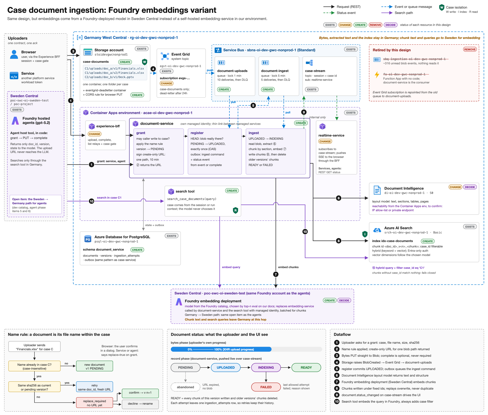
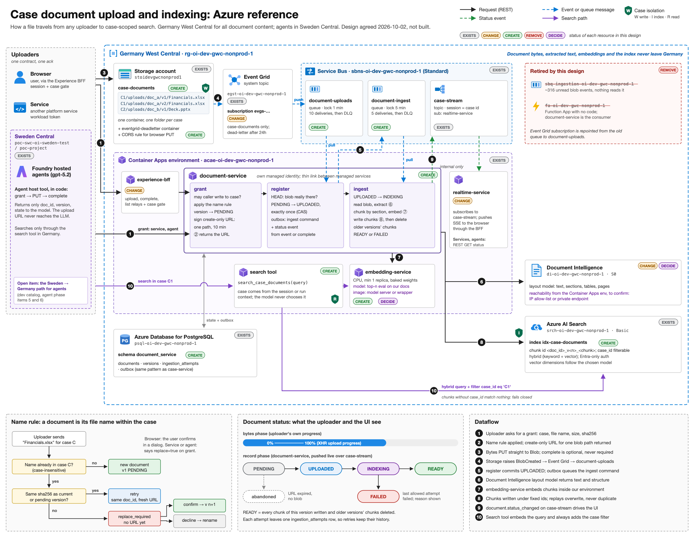

# Document Upload, Indexing, and Parsing with real-time progress Architecture

[View in Confluence](https://bainco.atlassian.net/wiki/spaces/OI30/pages/19899351139)

**Document Ingestion Architecture with Foundry Hosted Embedding Model (Authoritative)**



**Document Ingestion Architecture with self-hosted embedding model in ACA (alternative)**



# Case document upload and indexing: architecture

## Part 1: how it works

### Rules the design rests on

- **A case document is identified by its file name within the case.** Users tell documents apart by name in the UI, so no two files with the same name may exist in one case. Names compare case-insensitively: `Financials.xlsx` and `financials.xlsx` are the same name. The same name again is either a retry (same bytes) or a replace (new version), never a second document.
- **One shared container, one folder per case.** Every blob lives at `case-documents/<case_id>/uploads/<doc_id>/v<n>/<file_name>`. Isolation comes from the path, the chunk's `case_id` and the search filter, not from separate containers.
- **Three uploaders, one ack.** A browser, a service or an agent can upload. The success signal is the storage event, which is the same whoever sent the bytes. An uploader may also call `complete` to go faster, but it is never required.
- **Managed services do the hard parts; document-service owns the thin link between them.** Document Intelligence reads the documents. Azure AI Search stores the chunks and answers searches. document-service chunks the text, gets embeddings from our embedding service, and writes the chunks.
- **Embeddings are computed inside our environment.** Germany West Central cannot host Azure models, so the embedding model runs as a Container App in our environment. Document content never leaves Germany for embedding. The model is chosen by evaluating the top candidates on our own documents.
- **Searches are always scoped to one case.** Every search goes through one search tool, which embeds the query with the same model and adds the case filter from the session or run context. The model never chooses the case.

### The track, end to end

```
     Browser             Service             Agent
   (via the BFF)            │          (host tool in code; the
        │                   │           upload URL never reaches the LLM)
        └───────────────────┼───────────────────┘
                            │ ① REST  grant(case_id, file_name, size, sha256)
                            ▼
 ┌─ document-service ───────────────────────────────────────────────────┐
 │  may this caller write to this case?                                 │
 │  name rule: new doc v1 | retry (reuse) | replace (needs confirm)     │
 │  version row = PENDING                                               │
 │  sign a create-only URL for ONE path under the case (10 min)         │
 │  Postgres: documents · versions · ingestion_attempts · outbox        │
 └─────────────────────────┬────────────────────────────────────────────┘
                           │ ② URL back to the uploader
                           ▼
              ③ REST  PUT bytes straight to Blob
                           │
                           ▼
 ┌─ Storage: case-documents (one shared container) ─────────────────────┐
 │  C1/uploads/doc_a/v1/Financials.xlsx                                 │
 │  C1/uploads/doc_a/v2/Financials.xlsx                                 │
 │  C2/uploads/doc_b/v1/Deck.pptx                                       │
 └─────────────────────────┬────────────────────────────────────────────┘
                           │ ④ BlobCreated, raised by storage itself
                           ▼
      Event Grid system topic → subscription (BlobCreated, case-documents only)
                           │ push, retried up to 24h, then dead-lettered
                           ▼
      Service Bus queue: document-uploads
                           │ pull, document-service receiver (managed identity)
                           ▼
 ┌─ document-service: register(blob path) ──────────────────────────────┐
 │  blob really there? (HEAD) ─► PENDING → UPLOADED, exactly once       │
 │  same transaction: outbox ← ingest command + status event            │
 └─────────────────────────┬────────────────────────────────────────────┘
                           │ ⑤ Service Bus queue: document-ingest
                           ▼
 ┌─ document-service: ingest(doc, version) ─────────────────────────────┐
 │  UPLOADED → INDEXING                                                 │
 │  read blob ───────────► ⑥ Document Intelligence (layout) → text      │
 │  chunk by section, size cap + overlap                                │
 │  embed chunks ────────► ⑦ embedding-service (Container App)          │
 │  write chunks ────────► ⑧ AI Search index, id = doc_v<n>_<chunk>     │
 │  delete chunks of older versions of this doc                         │
 │  INDEXING → READY  (or FAILED with the error)                        │
 │  one ingestion_attempts row per attempt                              │
 └─────────────────────────┬────────────────────────────────────────────┘
                           │ ⑨ status event on case-stream
                           ▼
   realtime-service → SSE → browser progress      services and agents: REST GET status

 SEARCH
   user or agent in case C1 ─► search tool (code, not model)
                                 │ embed query ──► embedding-service
                                 │ ⑩ hybrid query + filter case_id eq 'C1'
                                 ▼
                               AI Search index ─► chunks from case C1 only
```

### Every wire, by transport

| Step  | From → to  | Transport  | Auth  |
|---|---|---|---|
| ① grant  | uploader → document-service  | REST. Browser goes through the Experience BFF relay  | Browser: BFF session + case gate. Service and agent: workload token  |
| ② URL  | document-service → uploader  | REST response  | The URL itself is a create-only user delegation SAS for one blob path (ADR-0033)  |
| ③ PUT  | uploader → Blob storage  | REST, direct to Blob  | The SAS URL  |
| ④ BlobCreated  | storage → Event Grid → Service Bus → document-service  | Event Grid system topic pushes to queue `document-uploads`; document-service pulls  | Event Grid delivers to the queue; document-service receives with its managed identity  |
| optional `complete`  | uploader → document-service  | REST, calls the same `register`  | Same as ①  |
| ⑤ ingest command  | document-service → document-service  | Service Bus queue `document-ingest`, sent from the outbox  | document-service managed identity, sender and receiver  |
| ⑥ extract  | document-service → Document Intelligence  | REST, asynchronous analyze with the layout model, polled until done  | document-service managed identity  |
| ⑦ embed  | document-service → embedding-service  | REST inside the Container Apps environment, batched  | Workload token  |
| ⑧ write and delete chunks  | document-service → AI Search  | REST, index documents API (upload, delete)  | document-service managed identity  |
| ⑨ status  | document-service → realtime-service → browser  | Event on Service Bus topic `case-stream` (session = case id), then SSE through the BFF  | document-service managed identity as sender  |
| ⑩ search  | search tool → embedding-service, then AI Search  | REST, query embedding then hybrid query with `case_id` filter  | Workload token to embedding-service; managed identity to AI Search  |

### Why queues sit on both sides of register

- `document-uploads` (before register). Event Grid push delivery needs an HTTPS endpoint it can reach plus a validation handshake, and document-service is internal-only. The queue buffers while document-service is down or redeploying, and a message that keeps failing lands in the dead-letter queue where it can be seen.
- `document-ingest` (after register). Registering is quick; ingesting takes seconds to minutes (Document Intelligence, embedding, writing). A separate queue keeps the ack fast, gives ingestion its own longer lock and its own retries, and lets a failed ingestion be retried without touching the upload record.
- Delivery on both is at least once. `register` is idempotent, and ingestion writes chunks under fixed ids, so a repeated message overwrites rather than duplicates.
- audit-service, realtime-service and peer-curation-service already work with Service Bus this way.

### The name rule

```
 uploader sends "Financials.xlsx" for case C
          │
          ▼
 does C already have "Financials.xlsx"?
   ├─ no ──────────────────────────────────► new document, v1
   └─ yes ─► same sha256 as current or pending version?
               ├─ yes ─► retry: same doc_id, fresh URL for the same path (or "already have it")
               └─ no ──► answer "replace required"
                           │
                           ├─ uploader confirms replace ─► same document, v<n+1>
                           └─ uploader declines ─────────► nothing happens (rename and retry)
```

A browser asks the user to confirm. A service or agent says whether it means to replace when it calls ①.

### Document status

```
 bytes phase (uploader only)       record phase (document-service, pushed to UI)
 ───────────────────────────       ──────────────────────────────────────────────
 0% ─────────────► 100%  ──►  PENDING ──► UPLOADED ──► INDEXING ──► READY
                                 │                         │
                                 └─ URL expired, no blob   └─► FAILED (error kept per attempt)
                                    (shown as abandoned)
```

- The byte percentage comes from the uploader's own upload progress. Storage does not report it.
- READY means every chunk of that version is written to the index and older versions' chunks are deleted.
- FAILED is set when the last allowed attempt fails. Each attempt writes one `ingestion_attempts` row, so retries keep their history.

### Failure and retry paths

| What goes wrong  | What happens  |
|---|---|
| Network drops during the PUT  | Uploader retries the PUT on the same URL  |
| PUT landed but the response was lost  | A second PUT on a create-only URL returns 403 (observed 2026-09-26). The uploader calls `complete`; `register` finds the blob and marks it UPLOADED  |
| URL expired before the PUT  | `complete` finds no blob; the uploader calls grant again, gets the same doc_id and a fresh URL  |
| Uploader crashes after the PUT  | The storage event registers it anyway  |
| Event and `complete` both arrive  | The compare-and-set lets one through; the other is a no-op  |
| document-service down  | Events and ingest commands wait in their queues  |
| Document Intelligence or embedding-service fails or times out  | The ingest message is abandoned and redelivered; after the last delivery the version goes FAILED and the message is dead-lettered  |
| Ingestion crashes halfway through writing chunks  | Redelivery writes the same chunk ids again, so nothing duplicates  |
| Document Intelligence cannot read the file  | FAILED with its error; the user sees the reason and can replace the file  |
| Event Grid cannot reach the queue for 24h  | The event goes to the dead-letter container instead of vanishing  |

### Case isolation, three points

- **Write:** the URL is signed for exactly one path under one case, so an uploader cannot write into another case.
- **Index:** ingestion sets `case_id` on every chunk from the version record, which came from the grant. Nothing an uploader sends, such as blob metadata, is read for it.
- **Read:** the search tool adds `case_id eq '<case>'` from the session or run context. A chunk without `case_id` matches no filter, so a mistake fails closed. Agents and services search only through this tool.

### Replacing a document

Ingestion of version n writes its chunks, then deletes every chunk of the same `doc_id` with a lower version, in one step. Searches return the new version's content once that step finishes, and never a mix after it.

### The embedding model

- Runs as Container App `embedding-service` inside `acae-oi-dev-gwc-nonprod-1`, on CPU, minimum one replica so queries never wait for a cold start.
- Model weights are baked into the image at a pinned revision and pulled through `docker.bain.dev`. Nothing is downloaded at start-up.
- The model is chosen by evaluating the top candidates against a question set built from our own document workload, measuring retrieval quality and latency on Container Apps CPU.
- Vectors from different models cannot be compared. Each index records the model and revision that produced its vectors; changing model means re-embedding into a new index and pointing the search tool at it.

## Part 2: where it runs and what exists

### Regions

Everything is in Germany West Central except the Foundry agents, which run in Sweden Central because gpt-5.2 is only offered there (owner, 2026-10-01). Document content, extraction, embedding and the index all stay in Germany. Agents reach into Germany for both upload and search. The Foundry memory and knowledge base in Sweden are separate from case documents.

```
 ┌─ Germany West Central · rg-oi-dev-gwc-nonprod-1 ─────────────────────────────────┐
 │                                                                                  │
 │  acae-oi-dev-gwc-nonprod-1 (Container Apps environment)                          │
 │    experience-bff   document-service   realtime-service   search tool            │
 │                          │   ▲   │                ▲            │                 │
 │                          │   │   └─► embedding-service ◄───────┤                 │
 │                          │   │                    │            │                 │
 │      sbns-oi-dev-gwc-nonprod-1: queues document-uploads, document-ingest;        │
 │                                 topic case-stream                                │
 │                          │   ▲                                 │                 │
 │                          │   egst-oi-dev-gwc-nonprod-1 → evgs-oi-dev-gwc-nonprod-1
 │                          │   ▲ BlobCreated                     │                 │
 │   browser / service PUT ─┼─► stoidevgwcnonprod1 / case-documents                 │
 │                          │                                     │                 │
 │                          ├──► di-oi-dev-gwc-nonprod-1 (Document Intelligence)    │
 │                          └──► srch-oi-dev-gwc-nonprod-1 (index) ◄──────────┘     │
 │                                                                                  │
 └──────────────────────────────▲──────────────────────────────▲────────────────────┘
                                │ ① grant, ③ PUT               │ ⑩ search via tool
 ┌─ Sweden Central ─────────────┴──────────────────────────────┴────────────────────┐
 │  poc-swc-oi-sweden-test / poc-project: Foundry hosted agents, gpt-5.2            │
 │  agent host tool: grant → PUT → (optional) complete; search tool calls           │
 └──────────────────────────────────────────────────────────────────────────────────┘
```

The Sweden to Germany path for agents is an open item in the dev catalog (`.local/learning/ref-dev-azure-resources.md`, agent phase items 5 and 6). document-service and the search tool are two more destinations on that same path.

### Resource inventory

Labels: **EXISTS** (use as is), **CHANGE** (exists, needs a change), **CREATE**, **REMOVE**, **DECIDE** (open choice). Names marked *(proposed)* follow the house naming pattern.

#### Germany West Central, `rg-oi-dev-gwc-nonprod-1`

| Resource  | Exact name  | Label  | Notes  |
|---|---|---|---|
| Storage account  | `stoidevgwcnonprod1`  | EXISTS  | Holds `audit`, `evidence`, `company-search`  |
| Blob container for case documents  | `case-documents`  | CREATE  | document-service's configured default (`config.py:160`)  |
| Blob container for Event Grid dead-letters  | `eventgrid-deadletter` *(proposed)*  | CREATE  | Outside `case-documents`, so its writes raise no pipeline events  |
| Blob CORS rule  | on `stoidevgwcnonprod1` blob service  | CREATE  | Allows browser PUT from the app origin  |
| Event Grid system topic  | `egst-oi-dev-gwc-nonprod-1`  | EXISTS  | On `stoidevgwcnonprod1`  |
| Event Grid subscription  | `evgs-oi-dev-gwc-nonprod-1`  | CHANGE  | Sends every BlobCreated in the account to `sbq-ingestion-oi-dev-gwc-nonprod-1`. Needs: subject begins with `/blobServices/default/containers/case-documents/`, endpoint `document-uploads`, dead-letter to `eventgrid-deadletter`  |
| Service Bus namespace  | `sbns-oi-dev-gwc-nonprod-1`  | EXISTS  | Standard tier  |
| Service Bus queue  | `sbq-ingestion-oi-dev-gwc-nonprod-1`  | REMOVE  | About 316 unread messages, most likely our own audit, evidence and company-search blob events. Nothing reads it  |
| Service Bus queue  | `document-uploads` *(proposed)*  | CREATE  | Lock 1 min, max delivery 10, dead-letter on expiry, no sessions  |
| Service Bus queue  | `document-ingest` *(proposed)*  | CREATE  | Lock 5 min, max delivery 5, dead-letter on expiry, no sessions. document-service sends and receives  |
| Service Bus topic  | `case-stream` + subscription `realtime-service`  | EXISTS  | Sessions required, so document-service sends with session id = case id  |
| Function App  | `fa-oi-dev-gwc-nonprod-1`  | REMOVE  | Has no code; document-service is the consumer  |
| Document Intelligence  | `di-oi-dev-gwc-nonprod-1`  | CHANGE  | S0. Public with an IP allow-list, default Deny. Needs private endpoint `pep-di-oi-dev-gwc-nonprod-1` *(proposed)* on `snet-data`, registered in the existing `privatelink.cognitiveservices.azure.com` zone, so document-service reaches it inside the VNet  |
| AI Search service  | `srch-oi-dev-gwc-nonprod-1`  | EXISTS  | Basic tier, 2 replicas, public access on, Entra-only auth  |
| Search index  | `idx-case-documents` *(proposed)*  | CREATE  | Data plane, applied by a deploy step. Vector dimensions follow the chosen model  |
| Container App  | `embedding-service` *(proposed)*  | CREATE  | CPU, min 1 replica, internal ingress, weights baked into the image  |
| Embedding model  | to be chosen  | DECIDE  | Top-n evaluation on our documents  |
| Postgres  | `psql-oi-dev-gwc-nonprod-1`  | EXISTS  |  |
| Postgres schema and role  | `document_service`  | CREATE  |  |
| Container Apps environment  | `acae-oi-dev-gwc-nonprod-1`  | EXISTS  |  |
| Container App  | `document-service`  | CREATE  | Not deployed (catalog finding 10)  |
| Container Apps  | `experience-bff`, `realtime-service`  | CHANGE  | BFF: new relays. realtime-service: accepts the new event type once the contract registers it  |
| User-assigned identity  | `id-document-service-oi-dev-gwc-nonprod-1` *(proposed)*  | CREATE  | Same pattern as the six service identities in DevOps' Terraform  |

#### Sweden Central

| Resource  | Exact name  | Label  | Notes  |
|---|---|---|---|
| Foundry account and project  | `poc-swc-oi-sweden-test` / `poc-project`  | EXISTS  | gpt-5.2 and gpt-4.1. Hosts the agents. A proper Sweden dev resource is an open agent-phase item  |
| Search service and storage  | `poc-swc-oi-sweden-search`, `pocswcoiswedenstorage`  | EXISTS, out of scope  | Experiments; this design does not use them  |

### Identities and roles

| Identity  | Role  | Scope  | Why  |
|---|---|---|---|
| `id-document-service-oi-dev-gwc-nonprod-1`  | Storage Blob Delegator  | `stoidevgwcnonprod1`  | Signing a user delegation SAS is an account-level operation  |
| same  | Storage Blob Data Contributor  | container `case-documents`  | A SAS can grant no more than the signer holds; also HEAD and reading blobs for ingestion  |
| same  | Azure Service Bus Data Receiver  | queue `document-uploads`  | Pull upload events  |
| same  | Azure Service Bus Data Sender and Data Receiver  | queue `document-ingest`  | Send and pull ingest commands  |
| same  | Azure Service Bus Data Sender  | topic `case-stream`  | Publish status changes  |
| same  | Cognitive Services User  | `di-oi-dev-gwc-nonprod-1`  | Call the layout model  |
| same  | Search Index Data Contributor  | `srch-oi-dev-gwc-nonprod-1`  | Write and delete chunks  |
| Search tool's identity  | Search Index Data Reader  | `srch-oi-dev-gwc-nonprod-1`  | Query the index  |
| The identity that runs the deploy step  | Search Service Contributor  | `srch-oi-dev-gwc-nonprod-1`  | Create or update the index definition. If the landing zone's ABAC gap blocks this built-in, use the bespoke `[TLZ] BainContributor` grant as elsewhere  |
| Event Grid system topic `egst-oi-dev-gwc-nonprod-1`  | Whatever delivery wiring the existing subscription uses  | queue `document-uploads`  | Deliver events  |

embedding-service needs no Azure role. It is called only from inside the environment and checks the caller's workload token.

### Open decision

**Embedding model and how embedding-service is packaged.** The model is chosen after a top-n evaluation on our own document workload; the index's vector dimensions and the embedding-service sizing follow from it. Packaging is settled with it: an off-the-shelf model server image (for example Hugging Face text-embeddings-inference) run directly with internal ingress, or a thin governed wrapper that carries the house health, auth and telemetry standards. The repo invariant allows no ungoverned service.
