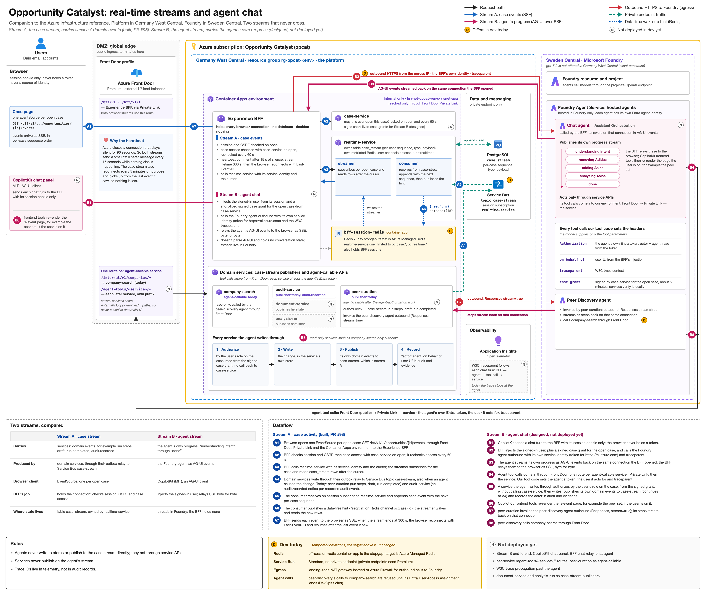

# Chat Assistant Architecture

[View in Confluence](https://bainco.atlassian.net/wiki/spaces/OI30/pages/19899809824)

# Opportunity Catalyst: real-time streams and agent chat

This page explains the diagram "Opportunity Catalyst: real-time streams and agent chat". It is a companion to the Azure infrastructure reference and focuses on one question: how live information reaches a user's screen while they work on a case, both from the platform itself and from the AI assistant.

The platform runs in Azure Germany West Central. The AI agents run in Microsoft Foundry in Sweden Central, because the model they use is offered there and not in Germany West Central.



## The idea in one paragraph

Two kinds of live information flow to the browser, and they are kept deliberately separate. **Stream A, the case stream**, carries what the platform's services did to a case: a peer-selection run started, a step completed, a draft was saved, an action was recorded in the audit trail. **Stream B, the agent stream**, carries what the AI assistant is doing in response to the user's chat: understanding the request, carrying out each step, and reporting back. The services never write to the agent's stream, and the agent never writes to the case stream. Each stream has one owner, so each is simple to reason about and to secure.

## The two streams at a glance

|  | Stream A: case stream  | Stream B: agent stream  |
|---|---|---|
| Carries  | the services' own events, for example run steps, a saved draft, a completed run, an audit record  | the assistant's progress, from "understanding intent" to "done"  |
| Produced by  | the platform's domain services  | the AI agent in Microsoft Foundry  |
| Shown in the browser by  | a live connection per open case  | the chat panel (CopilotKit, an open-source AG-UI client)  |
| Role of the Experience BFF  | holds the connection, checks the user's session and their access to the case  | adds the signed-in user's identity and the signed case grant, and relays the stream  |
| Where state lives  | a per-case event table owned by the real-time service  | conversation threads in Microsoft Foundry  |
| Status  | built and running in the dev environment  | designed; not yet deployed  |

## The building blocks

- **Browser.** Holds only a session cookie. It never holds a security token and is never trusted as the source of who the user is.
- **Azure Front Door.** The single public entrance. It forwards traffic privately (over Private Link) into the platform, which has no public address of its own. A web application firewall policy is attached.
- **Experience BFF (backend for frontend).** The platform's front desk for the web application. It holds every browser connection, checks the user's session, asks the case service whether the user may see a case, and calls the other services on the user's behalf. It keeps no database and makes no business decisions.
- **Case service.** The authority on cases and on who may access them.
- **Real-time service.** Turns the services' events into an ordered, replayable stream per case.
- **Domain services.** Peer curation, audit, company search and, later, document and analysis services. They own their data and publish their own events.
- **Messaging.** Azure Service Bus carries events reliably between services; Redis carries small "something new" signals so live connections wake up quickly.
- **Microsoft Foundry agents.** The chat assistant (Assistant Orchestration) and the peer discovery agent. Each has its own identity in Microsoft Entra ID.

The numbers match the blue markers on the diagram.

1. **A1.** When a user opens a case, the browser opens one live connection for that case through Front Door to the Experience BFF.
1. **A2.** The BFF checks the user's session and asks the case service whether this case is visible to the user. It asks again every 60 seconds while the connection is open, so if access is removed, the stream stops within a minute.
1. **A3.** The BFF asks the real-time service for the case's events, starting after the last event the browser has already seen.
1. **A4.** Whenever a domain service changes something, it records an event in the same database transaction as the change and then publishes it to Service Bus. Today the peer curation service (run steps, draft, run completed) and the audit service (one notice per recorded audit event) publish this way. Changes made at the request of the AI assistant are published in exactly the same way.
1. **A5.** The real-time service receives each event, numbers it in order for its case and stores it.
1. **A6.** It then sends a small "something new" signal through Redis. The signal carries no data; it only wakes the connections watching that case.
1. **A7.** The BFF sends each new event to the browser. Every five minutes the connection ends on purpose and the browser reconnects, picking up after the last event it saw, so nothing is lost.

**Why the heartbeat.** Azure closes a connection that stays silent for 90 seconds. Both streams therefore send a small "still here" message every 15 seconds while nothing else is happening.

A worked example. The user types: "Remove peer Adidas and add peer Asics."

1. **B1.** The chat panel sends the message to the BFF with the session cookie only.
1. **B2.** The BFF adds the signed-in user's identity, taken from its own session, together with a short-lived access grant for the case the user has open, signed by the case service. It then calls the chat agent in Foundry using the BFF's own service identity.
1. **B3.** The agent streams its progress back on that same connection: "understanding intent", "removing Adidas", "adding Asics", "analysing Asics", "done". The BFF relays these messages to the browser unchanged.
1. **B4.** To act, the agent calls the platform's services, entering through Front Door and Private Link like any other caller. Each call carries the agent's own identity, the identity of the user it is acting for and the signed case grant. The AI model only chooses which tool to use and with which inputs; identity and grant are attached by platform code the model cannot change.
1. **B5.** The service that receives the request checks the user's role on the case from the signed grant, without calling back to the case service, makes the change in its own data, publishes its own event to the case stream (Stream A, so the workspace updates) and records "actor: agent, on behalf of user" in the audit trail and evidence records.
1. **B6.** The chat panel's frontend tools then refresh the relevant page, for example the peer set, if the user is looking at it.

The peer discovery agent already follows the same pattern in the dev environment:

1. **B7.** The peer curation service calls the peer discovery agent in Foundry, and the agent streams its steps back on that connection.
1. **B8.** The peer discovery agent looks up companies through Front Door with its own identity.

## Identity and permissions

```
 user signs in ──► BFF knows the user (session) ──► agent receives the user's identity from the BFF
                                                      │
                     platform code attaches: the agent's own identity + "on behalf of user" + case grant
                                                      ▼
 service: is the token valid? is the case grant validly signed and unexpired? does the user's role allow this? ──► act, publish, record
```

- **The user's permission decides what the assistant may do.** The assistant works on the case the user has open, and can read and change only what the user could read and change there themselves (Owner, Contributor or Viewer). Role sharing between users arrives in a later phase; today each user owns the cases in their own account.
- **Permissions travel with the request.** When a chat turn starts, the case service, which is the authority on case roles, issues a short-lived signed grant for the open case (about five minutes). Every service verifies that signature itself, so no service needs to call the case service on each request, and a removed role stops working when the grant expires.
- **The assistant always acts as itself.** It never takes on the user's identity. Every change it makes is recorded as made by the agent on behalf of the user, so "who asked the assistant to remove Adidas?" can always be answered from the audit trail.
- **No secrets in agents.** Agents authenticate with the identity Microsoft Foundry creates for them; no passwords or keys are stored in agent settings.
- **Every service checks every call.** Services accept only valid Entra ID tokens for the platform's API, and the services an agent may call are opened one route at a time at Front Door.
- **Tracing.** A trace identifier follows each chat turn from the BFF through the agent to every service it calls, so engineers can follow a request end to end in the monitoring tools. Traces are for troubleshooting; the audit trail is the record of who did what.

## Design rules

- Agents never write to databases or publish to the case stream directly; they act only through the services' APIs.
- Services never publish on the agent's stream.
- Trace identifiers live in monitoring, not in audit records.
- There is no separate conversation service: the BFF relays the chat, and conversation threads live in Microsoft Foundry.

## Dev environment differences

These are temporary and do not change the target design.

- **Redis.** Azure Managed Redis is not yet available to the subscription in Germany West Central, so a Redis container inside the platform stands in.
- **Service Bus.** The Standard tier is used, without a private endpoint (private endpoints need the Premium tier).
- **Outbound traffic.** Calls to Foundry leave through the landing zone's NAT gateway rather than an Azure Firewall.
- **Agent access.** The peer discovery agent's calls to company search are refused until its identity assignment in Entra ID is completed.

## Glossary

- **SSE (server-sent events).** A standard way for a server to keep sending updates to a browser over one open connection.
- **AG-UI.** An open protocol for streaming an AI agent's progress and interface actions to a web application.
- **CopilotKit.** An open-source (MIT) frontend library that implements AG-UI chat panels and frontend tools.
- **BFF (backend for frontend).** A service dedicated to one kind of client, here the web application.
- **Private Link.** A private connection from Front Door into the platform's network, so the platform needs no public address.
- **Microsoft Foundry.** Microsoft's platform for hosting AI models and agents.
- **Entra ID.** Microsoft's identity service; every user, service and agent has an identity there.
