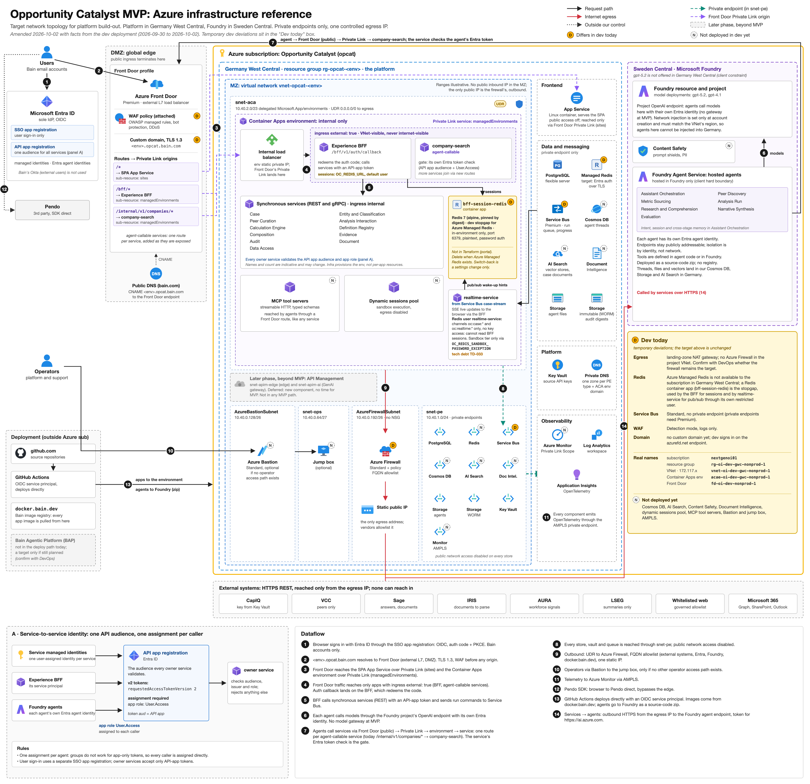
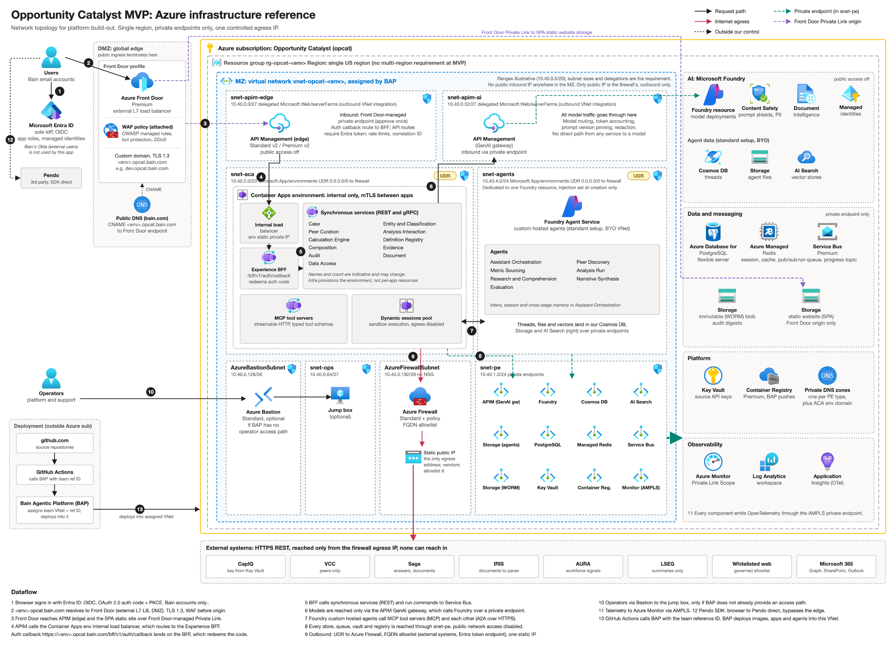

# Deployment Design (AI, Compute, Data, Components - CI/CD)

[View in Confluence](https://bainco.atlassian.net/wiki/spaces/OI30/pages/19705233507)

native-tabscom.atlassian.confluence.nativeTabszyedmuDev Environmentsl1k9oTargetgale0iRevised Dev-Staging (GLS)falsedefaulta08d9908-ff4f-4233-845d-182ce2ccd648

