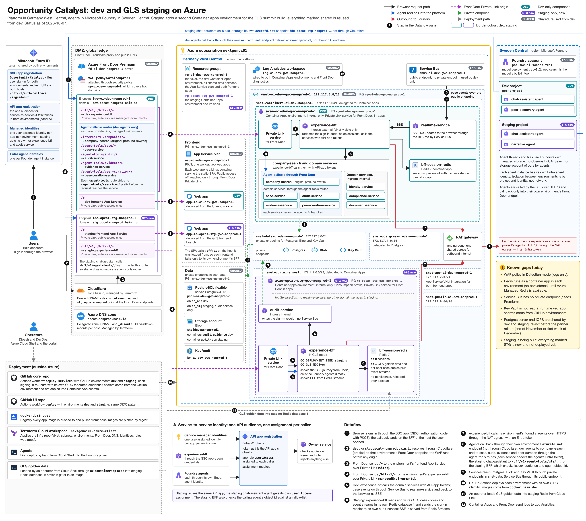

# OC Dev-Staging (GLS) Deployment Tracker

[View in Confluence](https://bainco.atlassian.net/wiki/spaces/OI30/pages/19909279789)

# GLS staging environment

A GLS-only staging environment next to dev, serving the GLS screens on `stg.opcat-nonprod.bain.io` from the GLS branches.
This page records the decisions, tracks every change by workstream, and holds the open questions for Dipesh and Angel.

### Settled (Dipesh and Angel, 2026-10-07)

- Staging is a second Container Apps environment, proposed name `acae-oppcat-stg-gwc-nonprod-1`, in a new subnet of `vnet-oi-dev-gwc-nonprod-1` (workload profiles, delegated to `Microsoft.App/environments`; the subnet size cannot change later).
- It holds only three apps: `experience-bff` (built from `feat/OI3-212-gls-backend`, GLS mode on), its own `bff-session-redis` (GLS data in Redis database 1, no persistence) and `audit-service` (sign-in receipt).
- Shared with dev: Front Door profile `fd-oi-dev-nonprod-1` and its WAF, the VNet, Postgres server `psql-oi-dev-gwc-nonprod-1` (with a separate staging database), Key Vault `kv-oi-dev-gwc-nonprod-1` and Log Analytics `log-oi-dev-gwc-nonprod-1`.
- Edge: `stg.opcat-nonprod.bain.io` on a new Front Door custom domain in the shared profile, with its own `/*` route to the staging frontend and `/bff/v1/*` route to the staging BFF over private link.
- Frontend: a second App Service app, proposed `app-fe-oppcat-stg-gwc-nonprod-1`, on the existing plan `asp-oi-dev-gwc-nonprod-1`, deployed from `feat/OI3-212-gls-frontend`. The SPA calls the BFF on a relative path, so the same build works on either domain.
- Foundry: a separate staging project in Sweden Central with the chat-assistant agent and the narrative agent (no peer-discovery agent). The staging chat-assistant agent calls back only to staging.

### Angel's three points and Dipesh's answers

- Postgres shared server, compute and IOPS: accepted for now. Revisit before the 50+ partner rollout (end of November or first week of December): a BAP-provided or own server, else a separate Postgres server.
- Blob and Service Bus: separated per environment (own containers and queues). GLS mode uses no Service Bus, so staging needs no Service Bus. audit-service still needs its own Blob container now (see the next section).
- Separate subnet: yes, for clean network isolation from the start and room to grow.

### Facts found during scoping

- audit-service needs Blob now, not later. It refuses to start in a deployed tier without Blob sealing. Sharing dev's `audit` container would make every seal pass fail, so staging gets its own container.
- audit-service requires a case-service address in a deployed tier, and staging has no case-service. Plan: a non-resolving placeholder address (`<https://case-service.invalid`)> that GLS mode never calls, recorded as a known gap (open question Q6).
- The staging database needs a new migration target in the core repo. The release tooling accepts only the dev database today. Database roles are server-wide, so staging reuses the dev role names and passwords for this phase (Q8).
- Secrets reach the apps from GitHub Environment secrets, which the deploy copies into Container App secrets. Nothing reads Key Vault at runtime, so staging needs its own `staging` GitHub Environment in each repo.
- The Azure container registry `croidevgwcnonprod1` is not used. Images come from `docker.bain.dev` with a personal credential, so no AcrPull grant is needed.
- DNS for `stg.` is managed by Terraform on both sides: the Azure DNS zone (CNAME `stg` plus TXT `_dnsauth.stg`) and the Cloudflare CNAME through the Cloudflare provider. The certificate is a Front Door managed certificate plus Cloudflare's automatic edge certificate. No ticket for either.
- No new NS delegation ticket: `stg.` is a record inside the already-delegated `opcat-nonprod.bain.io` zone (RITM0634445).
- The staging BFF runs with `OC_DEPLOYMENT_TIER=development`. GLS mode is admitted only in the local and development tiers, and no other behaviour differs (Q5).
- The core deploy workflow already offers `staging` as an environment; no workflow input change is needed. The agent deploy workflow is dev-only and does need one.
- Not needed for GLS staging: `/agent-tools/*` Front Door routes (the staging chat-assistant agent calls `/bff/v1/agent-tools/gls/...` under the BFF route), Service Bus entities, a private DNS zone for an environment default domain, and NSG or UDR entries.
- The narrative agent calls only the model and web search, never our services, so it needs no Entra access ticket and no allow-list entry.
- Free address range for the staging subnet: `172.117.6.0/23` in VNet `172.117.0.0/16`. In use today: `172.117.0.64/26`, `172.117.2.0/24`, `172.117.3.0/24`, `172.117.4.0/24`, `172.117.5.0/24`. A /24 alternative is `172.117.6.0/24`.

## Target state

## Tracker

#### Terraform

| Step  | Change  | Waits for  | Status  | Notes  |
|---|---|---|---|---|
| 1  | `staging.tf` inside module `oi_dev` with naming context `oppcat-stg` and resource group `rg-oppcat-stg-gwc-nonprod-1`  | Confirming which branch the Terraform Cloud workspace applies (open question Q12)  | To do  | A second module instance would duplicate the shared resources. Pattern: `main.tf:11`, `demo_vm.tf:14-16`  |
| 2  | Subnet `snet-containers-stg` = `172.117.6.0/23`, delegated to `Microsoft.App/environments`, service endpoints Storage and KeyVault, appended at the end of the subnet list  | Step 1; check for NSG or route-table policy on new subnets (open question Q13)  | To do  | Copy of `main.tf:137-151`; VNet from `dev.tfvars.json:16`. Size cannot change later  |
| 3  | Container Apps environment `acae-oppcat-stg-gwc-nonprod-1`: internal load balancer, Consumption profile only, shared Log Analytics  | Step 2  | To do  | Copy of `container_apps.tf:18-68`  |
| 4  | Web app `app-fe-oppcat-stg-gwc-nonprod-1` on the existing plan: container on port 8080, health check `/health`, no public access, VNet integration on snet-app, same Front Door access restriction  | Step 1  | To do  | Stays in the dev resource group next to its plan. Copy of `apps.tf:21-41,58-160`  |
| 5  | Staging identities for `experience-bff` and `audit-service`; Managed Identity Operator for the deploy principal; Foundry roles on the staging project  | Step 3; the agent team's staging Foundry project  | To do  | BFF identity: Foundry Agent Consumer plus the custom impersonation role. Deploy principal and Admins group: Foundry Project Manager. Patterns: `service_identities.tf:113-145`, `foundry_agent_rbac.tf:45-95`  |
| 6  | Blob container `audit-stg` and a container-scoped Storage Blob Data Contributor role for the staging audit identity  | Step 5  | To do  | audit-service will not start without it. Role pattern `service_identities.tf:61-65`  |
| 7  | Front Door: new endpoint `fde-oppcat-stg-nonprod-1` in the shared profile, custom domain `stg.opcat-nonprod.bain.io`, two origin groups over private link, routes `/*` and `["/bff/v1", "/bff/v1/*"]`, caching off on the frontend route  | Steps 3 and 4  | To do  | Frontend origin: private link `sites`. BFF origin: private link `managedEnvironments`, host `experience-bff.<staging default domain>`. `frontdoor.tf:22-194`  |
| 8  | Add the staging domain and endpoint to security policy `sp-oi-dev-nonprod-1`  | Step 7  | To do  | A domain missing from the policy bypasses the WAF. `frontdoor.tf:375-396`  |
| 9  | DNS: Azure zone CNAME `stg` and TXT `_dnsauth.stg`; Cloudflare CNAME `stg.opcat-nonprod` (proxied) to the Front Door endpoint  | Step 7  | To do  | The DNS locals hold one host today and need a second. `dns.tf:4-46`, `cloudflare.tf:7-22`, `variables.tf:174-178`  |
| 10  | Outputs for staging: environment id and default domain, identity ids, web app name  | Steps 3, 4 and 5  | To do  | Dipesh needs these for the GitHub environments and the settings files. `outputs.tf:57-65,152-165`  |

The staging database is created by setup SQL (Dipesh), like dev's; no Terraform change.

#### Portal and access

| Step  | Change  | Waits for  | Status  | Notes  |
|---|---|---|---|---|
| 1  | Add redirect URIs `<https://stg.opcat-nonprod.bain.io/bff/v1/auth/callback`> and `<https://stg.opcat-nonprod.bain.io/signed-out`> to the SSO app "Opportunity Catalyst - Dev"  | Nothing; can be filed now  | To do  | On the SSO app, not the Entra API app. Bundle dev's `<https://dev.opcat-nonprod.bain.io/signed-out`,> still unconfirmed. No front-channel logout URL  |
| 2  | `User.Access` on the Entra API app (S2S tokens) for the staging chat-assistant agent's identity  | The agent team's first deploy of the staging chat-assistant  | To do  | The agent identity exists only after that deploy. The narrative agent needs no ticket  |

| Step  | Change  | Waits for  | Status  | Notes  |
|---|---|---|---|---|
| 1  | Add redirect URIs `<https://stg.opcat-nonprod.bain.io/bff/v1/auth/callback`> and `<https://stg.opcat-nonprod.bain.io/signed-out`> to the SSO app "Opportunity Catalyst - Dev"  | Nothing; can be filed now  | To do  | On the SSO app, not the Entra API app. Bundle dev's `<https://dev.opcat-nonprod.bain.io/signed-out`,> still unconfirmed. No front-channel logout URL  |
| 2  | `User.Access` on the Entra API app (S2S tokens) for the staging chat-assistant agent's identity  | The agent team's first deploy of the staging chat-assistant  | To do  | The agent identity exists only after that deploy. The narrative agent needs no ticket  |

| Step  | Change  | Waits for  | Status  | Notes  |
|---|---|---|---|---|
| 1  | Add redirect URIs `<https://stg.opcat-nonprod.bain.io/bff/v1/auth/callback`> and `<https://stg.opcat-nonprod.bain.io/signed-out`> to the SSO app "Opportunity Catalyst - Dev"  | Nothing; can be filed now  | To do  | On the SSO app, not the Entra API app. Bundle dev's `<https://dev.opcat-nonprod.bain.io/signed-out`,> still unconfirmed. No front-channel logout URL  |
| 2  | `User.Access` on the Entra API app (S2S tokens) for the staging chat-assistant agent's identity  | The agent team's first deploy of the staging chat-assistant  | To do  | The agent identity exists only after that deploy. The narrative agent needs no ticket  |

| Step  | Change  | Waits for  | Status  | Notes  |
|---|---|---|---|---|
| 1  | Add redirect URIs `<https://stg.opcat-nonprod.bain.io/bff/v1/auth/callback`> and `<https://stg.opcat-nonprod.bain.io/signed-out`> to the SSO app "Opportunity Catalyst - Dev"  | Nothing; can be filed now  | To do  | On the SSO app, not the Entra API app. Bundle dev's `<https://dev.opcat-nonprod.bain.io/signed-out`,> still unconfirmed. No front-channel logout URL  |
| 2  | `User.Access` on the Entra API app (S2S tokens) for the staging chat-assistant agent's identity  | The agent team's first deploy of the staging chat-assistant  | To do  | The agent identity exists only after that deploy. The narrative agent needs no ticket  |

| Step  | Change  | Waits for  | Status  | Notes  |
|---|---|---|---|---|
| 1  | GitHub sign-in trust (OIDC federated credentials) for the `staging` environment of the core repo and the UI repo  | Nothing  | To do  | Subjects `repo:Bain/nextgen-opportunity-catalyst-core:environment:staging` and `repo:Bain/nextgen-opportunity-catalyst-ui:environment:staging`. Through TSG if it needs an Entra admin  |
| 2  | Deploy rights: core deploy principal on the staging resource group and environment; UI deploy principal on the staging web app  | Terraform steps 3 and 4  | To do  | For example Website Contributor on the web app  |
| 3  | Approve the two new Front Door private link connections (staging environment, staging web app)  | Terraform step 7  | To do  | Terraform does not approve them; dev's were approved by hand  |

| Step  | Change  | Waits for  | Status  | Notes  |
|---|---|---|---|---|
| 1  | Add redirect URIs `<https://stg.opcat-nonprod.bain.io/bff/v1/auth/callback`> and `<https://stg.opcat-nonprod.bain.io/signed-out`> to the SSO app "Opportunity Catalyst - Dev"  | Nothing; can be filed now  | To do  | On the SSO app, not the Entra API app. Bundle dev's `<https://dev.opcat-nonprod.bain.io/signed-out`,> still unconfirmed. No front-channel logout URL  |
| 2  | `User.Access` on the Entra API app (S2S tokens) for the staging chat-assistant agent's identity  | The agent team's first deploy of the staging chat-assistant  | To do  | The agent identity exists only after that deploy. The narrative agent needs no ticket  |

| Step  | Change  | Waits for  | Status  | Notes  |
|---|---|---|---|---|
| 1  | Chat-assistant agent: land the GLS tool changes, plus a staging settings file pointing at the staging host  | Nothing  | To do  | Documented but not yet in the agent's code  |
| 2  | Build the narrative agent, with a staging settings file  | Nothing  | To do  | Does not exist yet; narrative blocks show "unavailable" until it does  |
| 3  | Staging Foundry project in Sweden Central  | Answer to open question Q11 (recommended: under the existing account `poc-swc-oi-sweden-test`)  | To do  | Basic setup, public network, as dev. Angel's Terraform step 5 needs it  |
| 4  | Model `gpt-5.2` usable from the staging project, with quota for two more agents  | Step 3  | To do  | Web search is the model's built-in tool; no connections needed  |
| 5  | First deploy of each staging agent by hand; send each agent's identity id to Dipesh  | Steps 1 to 4; Angel's Terraform step 5 (Foundry roles)  | To do  | Unblocks TSG step 2 and the BFF's agent allow-list  |
| 6  | Check each staging agent can call the model and web search  | Step 5  | To do  | Model access for new agent identities is believed automatic; unverified  |
| 7  | Token test from the staging BFF against the staging agent-tools path  | Step 5; Dipesh's staging BFF redeployed with agent values  | To do  | Use the new endpoint's [azurefd.net](http://azurefd.net) host as the callback host to stay clear of Cloudflare challenges  |

#### Core repo

| Step  | Change  | Waits for  | Status  | Notes  |
|---|---|---|---|---|
| 1  | Agent audience setting fixed to the bare Entra API app id  | Nothing  | Done (ab25b2c on PR #123)  | The old `api://` value would have rejected every chat-assistant tool call  |
| 2  | Dev keeps its full stack: GLS settings removed from dev  | Nothing  | Done (bdbbfad on PR #123)  | Merging PR #123 no longer switches dev to GLS  |
| 3  | Deploy guard: refuse to update an app that sits in a different Container Apps environment  | Nothing  | To do  | Today the deploy finds an app by name and resource group only  |
| 4  | A staging "deploy all" deploys only services that have staging settings  | Nothing  | To do  | Until then, deploy staging one service at a time  |
| 5  | New staging migration target for the audit-service database  | Staging database name (open question Q8)  | To do  | Audit-only release manifest, and a decision by Dipesh extending TD-032 to allow it  |
| 6  | audit-service case-service address for an environment with no case-service  | Open question Q6  | To do  | Placeholder address plus a known-gap record, or a small code change  |
| 7  | Staging settings for the database migration job  | Step 5  | To do  | Points the job at the new staging target  |
| 8  | GitHub environment `staging` in the core repo, with its variables and secrets  | Angel: Terraform outputs and GitHub sign-in trust  | To do  | Variables `ACA_RESOURCE_GROUP`, `ACA_ENVIRONMENT_NAME`, `ACA_INGRESS`. Secrets by name: `AZURE_CLIENT_ID`, `AZURE_TENANT_ID`, `AZURE_SUBSCRIPTION_ID`, `OC_BFF_OIDC_CLIENT_SECRET`, `OC_BFF_REDIS_PASSWORD`, `OC_DATABASE_MIGRATOR_PASSWORD`, `OC_DATABASE_PASSWORD_AUDIT_SERVICE`. Branch policy: the GLS backend branch and `main`  |
| 9  | Staging settings for `audit-service`  | Step 6; Angel: `audit-stg` container and Terraform outputs  | To do  | Staging database and Blob container, staging identity, no Service Bus (else staging consumes dev's events), internal ingress  |
| 10  | Staging settings for `experience-bff`  | Angel: Terraform outputs; staging Redis created (hand steps)  | To do  | `OC_DEPLOYMENT_TIER=staging`, `OC_GLS_MODE=on`, public origin `<https://stg.opcat-nonprod.bain.io`,> staging audit address, staging identity. Other service addresses removed so staging never reaches dev data. Agent addresses and allow-list added later (hand step 9)  |
| 11  | GLS data load commands with staging names  | Staging Redis created (hand steps)  | To do  | The Cloud Shell kit, copied with the staging resource group and app names  |
| 12  | Agent deploy workflow gains a `staging` option, staging agent entries and the narrative agent  | Agent team: first deploy by hand  | To do  | Lets CI take over later agent deploys  |
| 13  | Docs: core deploy README (environments, secrets, release job) and GLS overview  | Nothing  | To do  |  |

Optional, only if the narrative agent must go live before the chat-assistant (open question Q17): let the narrative agent run without the chat settings.

#### UI repo

| Step  | Change  | Waits for  | Status  | Notes  |
|---|---|---|---|---|
| 1  | Replace the quarantined base image `node:22-alpine`  | Nothing  | Done: UI PR #21 for dev)  | Blocked every frontend deploy, dev included. Now the same pinned Debian Node base core uses, non-root, scanned clean  |
| 2  | Leave `VITE_BFF_ORIGIN` unset on `staging`, and remove it from `dev`  | Nothing  | To do  | `dev` still holds `<https://localhost:8000/`,> which the GLS branch's workflow would compile into the bundle  |
| 3  | Bring main's deploy hardening into the GLS branch (security headers, no source maps)  | Nothing  | To do  | Not blocking  |
| 4  | GitHub environment `staging` in the UI repo  | Angel: staging web app and GitHub sign-in trust  | To do  | Variable `AZURE_WEBAPP_NAME=app-fe-oppcat-stg-gwc-nonprod-1`; secrets `AZURE_CLIENT_ID`, `AZURE_TENANT_ID`, `AZURE_SUBSCRIPTION_ID`  |
| 5  | Deploy the GLS frontend branch to staging (manual dispatch)  | Steps 1, 2 and 4  | To do  |  |
| 6  | Cleanup: README "Build and deploy", remove the stray `false` GitHub environment and two unused `dev` variables  | Nothing  | To do  |  |

#### Hand steps (portal and Cloud Shell)

| Step  | Change  | Waits for  | Status  | Notes  |
|---|---|---|---|---|
| 1  | Generate a staging Redis password; store it as GitHub `staging` secret `OC_BFF_REDIS_PASSWORD`  | Core step 8  | To do  | No Key Vault entry needed  |
| 2  | Create `bff-session-redis` in the staging environment  | Step 1; Angel: Terraform step 3  | To do  | `redis:7-alpine` pinned by digest, 0.25 vCPU / 0.5 Gi, one replica, internal TCP on 6379, no persistence, password only  |
| 3  | Postgres setup SQL as the Entra admin group: staging database, grants and schemas for audit-service  | Staging database name (open question Q8)  | To do  | No new roles: roles are server-wide  |
| 4  | Run the staging database migration job (plan, then apply)  | Step 3; core steps 5, 7 and 8; Angel: Terraform step 3  | To do  |  |
| 5  | Deploy `audit-service` to staging  | Step 4; core step 9  | To do  |  |
| 6  | Deploy `experience-bff` to staging  | Steps 2 and 5; core step 10  | To do  | Chat answers 503 and narrative shows "unavailable" until hand step 9  |
| 7  | Load GLS data into staging Redis database 1  | Step 6; core step 11  | To do  | Reload after any Redis restart (no persistence)  |
| 8  | Staging sign-in end to end  | UI step 5; Angel: Terraform steps 7 to 9 and private link approvals; TSG step 1  | To do  | First full check of staging  |
| 9  | Add agent addresses and the chat-assistant allow-list to staging settings, redeploy `experience-bff`  | Agent team step 5; TSG step 2  | To do  | Then the agent team runs its token test  |

## Order of work

1. **Now, in parallel:** Angel starts Terraform steps 1 and 2 and the GitHub sign-in trust; TSG step 1 is filed; the agent team starts steps 1 to 3; Dipesh does core steps 3 to 7 and UI steps 1 to 3.
1. **Infrastructure:** Angel completes Terraform steps 3 to 10, deploy rights and private link approvals.
1. **Staging comes up:** Dipesh sets up both GitHub environments and the settings files, then hand steps 1 to 8 and the UI deploy.
1. **Agents:** the agent team deploys and checks the staging agents; TSG step 2; Dipesh's hand step 9; the agent team's token test.

## Questions to Settle

| ID  | Question  | Recommendation  | Decided by  | Answer  |
|---|---|---|---|---|
| Q1 (first)  | Resource group for the staging environment and its apps?  | A new `rg-oppcat-stg-gwc-nonprod-1`. App names stay the same, and a misconfigured staging deploy cannot touch dev's apps. If one resource group is preferred, prefix the staging apps with `stg-`. The staging web app stays next to its plan  | Angel  | Agreed with the recommendation (Dipesh, 2026-10-07)  |
| Q2 (first)  | Reuse dev's Front Door endpoint, or add `fde-oppcat-stg-nonprod-1` in the shared profile?  | New endpoint. No route clash with dev, an [azurefd.net](http://azurefd.net) host for smoke tests, and a callback host for the staging chat-assistant agent that avoids Cloudflare. Add it to the existing security policy  | Angel  | Agreed with the recommendation (Dipesh, 2026-10-07)  |
| Q3 (first)  | One SSO app registration for dev and staging, or a new one?  | Reuse "Opportunity Catalyst - Dev" for bring-up (two redirect URIs only), accepting that dev role-group members can sign in to staging. If partners at the 50+ rollout must not reach dev, ask for a separate staging SSO app in the same TSG batch  | Dipesh  | Agreed with the recommendation (Dipesh, 2026-10-07)  |
| Q4  | Reuse the Entra API app for service-to-service (S2S) tokens in staging?  | Yes. Isolation comes from the BFF agent allow-list and staging audit-service being internal  | Dipesh  | Yes (Dipesh, 2026-10-07)  |
| Q5  | In staging's `experience-bff` settings file, should `OC_DEPLOYMENT_TIER` say `development` or a new value `staging`? (The `settings/staging/` folder is needed either way.)  | `development`. The BFF allows GLS mode only in the `local` and `development` tiers, so this works with today's code; the only side effects are that the API docs page becomes opt-in and logs label the environment "development". A `staging` value needs a small BFF code change, possible later  | Dipesh  | A new `staging` value, so logs and refusals name the real environment. Done: the BFF accepts `OC_DEPLOYMENT_TIER=staging` and admits GLS mode there (721c447 on PR #123) (Dipesh, 2026-10-07)  |
| Q6  | audit-service case-service address with no case-service in staging?  | Placeholder `<https://case-service.invalid`> with a known-gap record, then confirm audit readiness after the first start  | Dipesh  | Agreed (Dipesh, 2026-10-07)  |
| Q7  | Name of the staging audit Blob container?  | `audit-stg` in the existing storage account, with a container-scoped role  | Angel  | Dipesh agrees; Angel to confirm  |
| Q8  | Staging database name and roles?  | A database such as `oc_stg`, accepting the shared server-wide roles and passwords for the GLS phase; revisit with the Postgres split before the 50+ rollout  | Dipesh  | Agreed (Dipesh, 2026-10-07)  |
| Q9 (first)  | Should dev also run GLS mode?  | No. Move the GLS settings to staging before PR #123 merges  | Dipesh  | Agreed with the recommendation (Dipesh, 2026-10-07)  |
| Q10  | New identities for staging, or reuse dev's?  | New, for `experience-bff` and `audit-service`. Reusing dev's would give staging access to dev's Service Bus subscription and audit container  | Angel  | New identities. Dipesh agrees; Angel to confirm  |
| Q11  | Staging Foundry project under `poc-swc-oi-sweden-test` or a new account?  | Under the existing account for now; plan a proper non-poc account before the partner rollout  | Dipesh  | Agreed (Dipesh, 2026-10-07)  |
| Q12  | Which infra branch does the staging Terraform PR target, and which branch does workspace `nextgenoi01-azure-client` apply?  | Target `feature/oi-dev-phase2-services`; `main` is behind the live state  | Angel  | Yes (Angel, 2026-10-07)  |
| Q13  | Does the shared `virtual-network` module or a landing-zone policy add an NSG, UDR or outbound setting to new subnets?  | Check the module source before the staging subnet is added  | Angel  | Checked the module source directly - it only creates the VNet and subnet resources, no NSG, no route table, no associations. Also cross-checked against the existing dev containers subnet live - confirmed no NSG and no route table attached there either. So no, nothing auto-adds either to new subnets. The staging subnet will come up clean unless we add one ourselves.  - Angel (2026-10-7)   |
| Q14  | Port main's frontend deploy hardening into the GLS branch first?  | Yes, the deploy and server files plus the chart interpreter change, not a full merge  | Dipesh  | Yes (Dipesh, 2026-10-07)  |
| Q15  | Is the shared App Service plan (P0v3, one worker, already hosting the dev frontend and the ingestion Function App) enough for a third app?  | Accept it for GLS staging and watch memory  | Angel  | Dipesh agrees if it serves 30 simultaneous users. It does: the App Service only hands out the static app files; the live streams (SSE) and API calls go to experience-bff on Container Apps, not the App Service. Angel to confirm  |
| Q16  | If `stg.` is the agent callback host, does Cloudflare challenge Foundry's server-to-server calls?  | Avoid it by using the new endpoint's [azurefd.net](http://azurefd.net) host (Q2); otherwise run the token test and add a skip rule for `/bff/v1/agent-tools/*`  | Angel  | Settled by Q2: staging agents call the new staging endpoint's [azurefd.net](http://azurefd.net) host, the same path already tested from dev agents to services, so Cloudflare is not in the path  |
| Q17  | Deploy the chat-assistant and narrative agents together, or narrative alone?  | Together; narrative's token currently depends on the chat settings. a small BFF change removes that if needed  | Dipesh  | Chat-assistant first; the narrative agent joins when the agent team has it ready, in the same PR or a separate branch and PR. No BFF change needed: the coupling only matters if narrative goes live before chat  |
