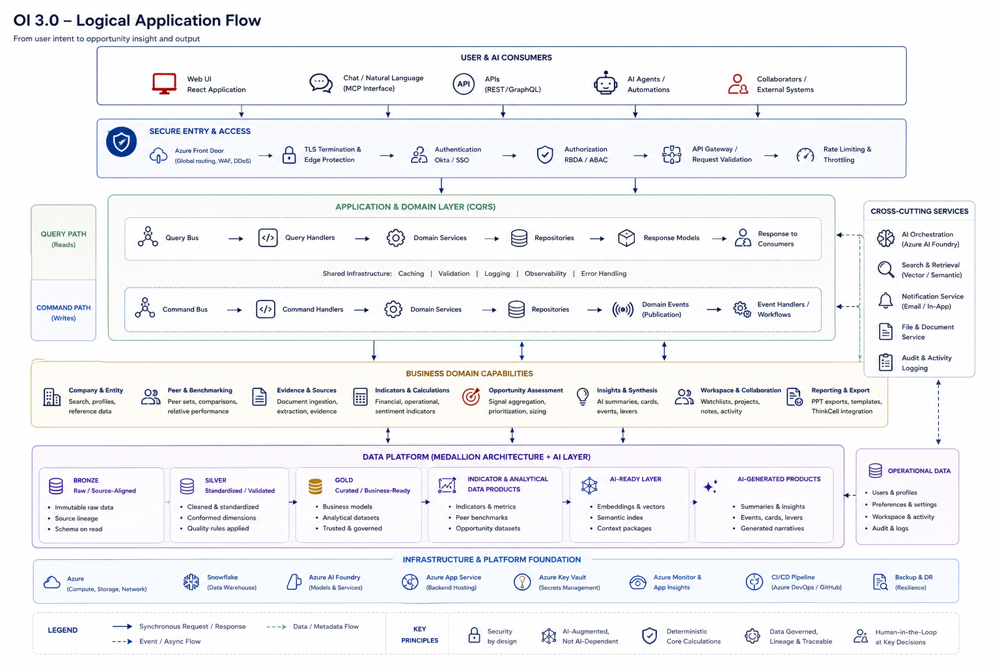

# Logical Application Flows

[View in Confluence](https://bainco.atlassian.net/wiki/spaces/OI30/pages/19705135241)

# Key Application Flows

The Opportunity Indicator (OI) application is designed around a **progressive, agent-assisted analytical workflow** rather than a conventional sequence of independent application requests.

An OI represents a persistent company-level opportunity assessment that evolves through five primary stages:

**Target → Peers → Case for Change → Analysis → Output**

Each stage combines deterministic platform capabilities—such as company resolution, financial calculations, peer benchmarking, data retrieval, and opportunity sizing—with AI-assisted capabilities such as information discovery, evidence synthesis, narrative development, and natural-language interaction.

The user can interact with these capabilities through both the structured application experience and the conversational agent. The underlying business capabilities remain independent of the client and are accessed through governed APIs and MCP-based interfaces.

## 1. OI Creation and Workspace Flow

The OI journey begins from the **Opportunity Indicators dashboard**, which acts as the user's workspace for creating, locating, resuming, and collaborating on opportunity assessments.

A typical flow is:

1. The user opens the OI dashboard.
1. Existing OIs are retrieved based on the user's access rights.
1. Each OI displays its target company, current workflow stage, status, estimated size of prize where available, recent activity, and collaborators.
1. The user either resumes an existing OI or creates a new OI.
1. A new persistent OI workspace is created and associated with the user and appropriate access controls.
1. Subsequent target, peer, evidence, analysis, and output decisions are persisted against this OI.
1. The user can leave and subsequently resume the analysis from its current state.

The OI therefore acts as the **aggregate business object for the analytical workflow**, rather than the application being treated as a collection of independent company screens.

## 2. Target Definition and Analysis Setup Flow

The **Target stage** establishes the company and analytical context that will govern downstream processing.

The application supports both a **Quick Answer** path for rapid initial assessment and a **Full Setup** path for more considered analysis.

A typical full setup flow is:

1. The user enters a company name or ticker.
1. The Company & Entity capability resolves the input to the canonical company record and relevant external identifiers.
1. Available public financial and reference data is identified.
1. The platform determines relevant company metadata such as sector, industry, reporting currency, and market classification.
1. Existing Bain relationship context and relevant prior knowledge may be surfaced where the user is authorized to access it.
1. The user optionally provides additional analytical context, such as:
  - intended audience;
  - opportunity hypothesis or framing;
  - financial ambition;
  - relevant business context;
  - desired peer-set breadth and comparability criteria.
1. The user may upload supporting material such as financial information, P&L extracts, reports, presentations, emails, or other company documentation.
1. Uploaded information is processed and incorporated into the governed evidence set.
1. The platform assesses the available evidence and communicates an analysis-confidence position to the user.
1. Once sufficient context exists, the user proceeds to peer construction.

For a **Quick Answer**, the platform can use the resolved target, available governed data, default peer methodology, and existing OI analytical frameworks to generate a preliminary assessment. The result remains explicitly distinguishable from a fully configured analysis and can subsequently be refined.

## 3. Source Acquisition and Evidence Flow

Source acquisition operates as a **cross-cutting workflow** throughout OI rather than as a one-time ingestion activity.

The evidence set for an OI may include:

- Company filings and annual reports
- Financial and market datasets
- Earnings-call transcripts
- Investor presentations
- Analyst research
- Relevant external market information
- Bain knowledge and prior experience
- User-uploaded documents
- User-provided context

When additional evidence is required:

1. The relevant domain or agent requests information through an approved platform capability.
1. The platform determines whether the information already exists in governed data or an existing OI evidence set.
1. Where required, additional structured or unstructured information is retrieved.
1. Documents and unstructured information are processed through the AI intelligence layer for extraction, classification, entity association, and semantic indexing.
1. Extracted information is linked back to its originating source.
1. Data-quality and confidence metadata are applied where appropriate.
1. The resulting evidence becomes available to downstream indicator, peer, opportunity, and synthesis capabilities.

The user can inspect the **Sources** associated with the analysis and, where supported, refresh information or drill into the evidence underlying an analytical conclusion.

This creates a clear architectural distinction between:

**Source → Evidence → Derived Metric / Signal → Opportunity Conclusion**

rather than treating AI-generated text as an independent source of truth.

## 4. Peer Construction and Validation Flow

Once the target has been established, OI constructs a proposed peer set using company characteristics and analytical comparability criteria.

The attached design explicitly allows the user to inspect why a peer was included, its selection criteria, analyst view, business units, source data, key metrics, and confidence. It also provides a source-audit path for examining the underlying data.
The flow is:

1. The platform retrieves candidate companies from the governed company universe.
1. Peer-selection logic evaluates candidates against configured criteria such as:
  - business model;
  - revenue scale;
  - regional exposure;
  - end market;
  - product mix;
  - growth profile.
1. Relevant financial and operational data is retrieved for each candidate.
1. Required normalization and comparability adjustments are performed deterministically.
1. AI-assisted research may supplement the deterministic screening with analyst views, company disclosures, business-model information, and relevant qualitative evidence.
1. The platform proposes an initial peer set.
1. Each proposed peer includes:
  - rationale for inclusion;
  - comparability criteria;
  - key metrics;
  - source evidence;
  - required adjustments;
  - confidence assessment.
1. Potential comparability issues are surfaced to the user rather than silently ignored.
1. The user can inspect, add, remove, or constrain peers and, where appropriate, isolate relevant business units or segments.
1. The confirmed peer set is persisted as a governed analytical object associated with the OI.
1. The peer set becomes an input to downstream benchmarking, indicator calculation, and opportunity sizing.

This makes peer construction a **human-in-the-loop analytical process**, with the platform proposing and explaining the set while the user retains control over the final analytical population.

## 5. Case for Change Flow

Once the target and peer context are sufficiently established, the platform develops the **Case for Change**.

This stage moves beyond identifying numerical gaps and begins establishing **why the opportunity matters now**.

The prototype shows agent-proposed narratives built from quantitative evidence, company disclosures, analyst information, leadership signals, and other sources—for example benchmarking, trend, growth, and defensive narratives.
The flow is:

1. The platform retrieves relevant target-company indicators, historical trends, peer benchmarks, market evidence, and strategic signals.
1. Deterministic calculations identify material financial or operational gaps.
1. AI capabilities analyze relevant unstructured evidence, including management commentary, filings, analyst research, and other permitted sources.
1. The intelligence layer identifies potential **Case for Change narratives** supported by the available evidence.
1. Each narrative is associated with:
  - supporting metrics;
  - source evidence;
  - relevant management or market signals;
  - confidence or materiality information.
1. The user reviews the proposed narratives.
1. The user may select one or multiple narratives, challenge the recommendation through natural-language interaction, or request alternative framing.
1. The selected Case for Change becomes part of the analytical context for subsequent opportunity prioritization and output generation.

The Case for Change is therefore not simply an AI-generated summary. It is a **business object derived from governed evidence, quantitative signals, and AI-assisted synthesis**.

## 6. Opportunity Analysis and Sizing Flow

The **Analysis stage** converts the validated company context, peer set, evidence, and Case for Change into a prioritized set of actionable opportunities.

The current prototype explicitly presents ranked opportunities, a cost bar, sector-specific KPIs, and a Size of Prize/EBIT bridge, with the ability to inspect and reprioritize individual opportunities.

The flow is:

1. The platform loads the confirmed:
  - target company;
  - analytical context;
  - peer set;
  - financial data;
  - indicators;
  - Case for Change;
  - supporting evidence.
1. Deterministic computation services calculate financial gaps, benchmarks, ratios, ranges, and relevant opportunity-sizing measures.
1. Sector-specific analytical frameworks determine which additional KPIs and benchmarks should be evaluated.
1. Relevant Bain methodologies and benchmarks may be applied where permitted.
1. AI capabilities identify and synthesize additional potential levers that may not be directly represented by conventional benchmarking.
1. Candidate opportunities are assembled and ranked based on factors such as:
  - financial materiality;
  - benchmark gap;
  - evidence strength;
  - analytical confidence;
  - relevance to the Case for Change;
  - applicability of known transformation levers.
1. The platform produces an initial **opportunity shortlist**.
1. For each opportunity, the user can inspect:
  - estimated value;
  - sizing range;
  - calculation methodology;
  - peer benchmark;
  - underlying assumptions;
  - source evidence;
  - confidence;
  - potential value levers;
  - relevant Bain experience;
  - exploratory AI-generated opportunities where applicable.
1. The user can promote, demote, remove, or reintroduce opportunities.
1. Changes to the shortlist trigger recalculation of the overall opportunity view and associated narrative.
1. The resulting shortlist and Size of Prize become governed outputs of the OI analysis.

The analysis therefore remains **interactive rather than one-shot**. The user can challenge assumptions and modify the opportunity set while retaining visibility into the data and reasoning behind the resulting numbers.

## 7. Natural-Language / Agent Interaction Flow

Natural-language interaction is available throughout the OI workflow and operates alongside—not instead of—the structured application.

The Analysis prototype, for example, provides Chat, Log, and Sources alongside the workspace, and allows users to challenge the analysis directly.

A typical agent interaction is:

1. The user submits a natural-language request from the client.
1. The request is passed through the governed MCP/agent interface.
1. The agent receives the user's identity, OI context, current workflow stage, and permitted capabilities.
1. The agent determines which tools or domain capabilities are required.
1. Where deterministic information is required, the agent invokes the appropriate platform API/MCP tool rather than independently calculating the answer.
1. Where evidence is required, the agent invokes governed retrieval capabilities.
1. Relevant structured data, calculations, and source evidence are assembled into context.
1. The AI model performs the required reasoning or synthesis.
1. The resulting response is returned with appropriate source attribution and analytical context.
1. Material agent actions are captured in the OI activity/audit trail where appropriate.

For example:

**User question → Agent → MCP capability → Financial/Peer/Indicator service → Governed data → AI synthesis → Cited response**

This preserves the separation between **probabilistic reasoning** and **authoritative deterministic platform capabilities**.

## 8. Human-in-the-Loop Decision Flow

OI deliberately introduces user decision points at material stages of the analysis.

Examples include:

- Confirming the target
- Selecting analytical context
- Adding supporting documents
- Confirming or modifying the peer set
- Selecting the Case for Change
- Challenging source quality
- Promoting or removing opportunities
- Adjusting analytical assumptions
- Confirming the final shortlist
- Selecting material for output

User decisions are persisted against the OI and can cause affected downstream capabilities to be recalculated.

For example:

**Peer removed → Peer benchmark recalculated → Indicator gap updated → Opportunity sizing updated → Ranking updated → Case narrative refreshed**

The analysis should therefore be treated as a **dependency-aware analytical state**, rather than a set of disconnected pages.

## 9. Provenance and Source-Audit Flow

Traceability is a core requirement of OI because users need to understand not only the conclusion, but also **where a number or statement came from**.

The attached peer workflow explicitly supports source-level inspection and audit, while the analysis exposes underlying sources for KPIs and opportunity calculations.
For material analytical outputs, the architecture should support a trace such as:

**Opportunity → Lever → Indicator / Calculation → Adjusted Data → Raw Data → Source**

and, for AI-derived information:

**AI Insight → Evidence / Context → Source Document → Source Location**

This enables users to distinguish between:

- reported facts;
- calculated values;
- adjusted values;
- estimates;
- Bain benchmarks;
- AI-derived observations;
- exploratory hypotheses.

The provenance model is carried through into downstream reporting wherever practical.

## 10. Collaboration and Activity Flow

An OI is designed as a collaborative analytical workspace rather than a private user session.

The prototypes include sharing, contributor/viewer permissions, collaborators, auto-save, and an activity log across the workflow.

A typical collaboration flow is:

1. An authorized user shares an OI with another user.
1. Appropriate contributor or viewer permissions are assigned.
1. Access is enforced through the platform identity and entitlement layer.
1. Collaborators access the same persisted OI state.
1. Relevant user and agent actions are captured in the activity log.
1. Changes to peer sets, narratives, opportunity selections, sources, and other material analytical decisions are persisted.
1. The latest state becomes available to other authorized collaborators.
1. The OI can subsequently be resumed from the latest saved state.

## 11. Authentication and Authorization Flow

Authentication and authorization operate across every OI interaction rather than as an isolated login workflow.

The high-level flow is:

1. The user accesses the OI client.
1. Authentication is initiated through the approved Bain identity provider.
1. The user receives an authenticated application session/token.
1. The client includes the security context with requests.
1. The platform validates the identity at the service boundary.
1. The user's roles, entitlements, and OI-level permissions are resolved.
1. RBDA and other applicable authorization policies are enforced against requested capabilities and data.
1. Downstream service, data, AI, and agent calls operate using governed workload identities and delegated security context where required.
1. Unauthorized data or tools are excluded before information is made available to the user or agent.

The same authorization model applies whether the request originates from the structured UI, an API, an MCP interaction, or an AI agent.

## 12. Output and Export Flow

The final stage converts the validated OI analysis into reusable client and case-team outputs.

The workflow itself explicitly terminates in an **Output** stage associated with deck/export generation.

The flow is:

1. The user confirms the analytical content to be included.
1. The Reporting & Export capability retrieves the current governed OI state.
1. Required information is assembled from the existing domain capabilities, including:
  - target information;
  - peer benchmarks;
  - Case for Change;
  - opportunity shortlist;
  - Size of Prize;
  - financial calculations;
  - supporting evidence and citations.
1. Export-specific transformation logic maps the analytical objects into the selected output structure.
1. Charts, tables, narratives, and supporting content are generated from the same underlying data products used by the application.
1. Where PowerPoint is required, the appropriate presentation template and ThinkCell integration are applied.
1. The generated output is validated.
1. The resulting artifact is made available to the user.
1. Export activity and relevant version metadata are recorded against the OI.

The export layer does **not independently recalculate financial results or regenerate analytical conclusions**. It consumes the governed outputs of the underlying OI domains, ensuring consistency between what the user sees in the application and what is ultimately communicated externally.

# End-to-End OI Flow

At the highest level, the application flow can therefore be represented as:

**Create / Resume OI**
→ **Define Target & Context**
→ **Acquire & Validate Evidence**
→ **Construct & Confirm Peers**
→ **Develop Case for Change**
→ **Calculate Indicators & Benchmarks**
→ **Identify & Size Opportunities**
→ **Challenge / Refine with Agent**
→ **Confirm Opportunity Shortlist**
→ **Generate Output**

Across every stage:

**Identity & RBDA + Data Governance + Source Provenance + Activity Logging + Collaboration + Security + Observability**

operate as cross-cutting capabilities.

The key architectural characteristic is that OI is not a linear AI-generation pipeline. It is a **persistent, evidence-backed, human-in-the-loop analytical system** in which deterministic financial analysis and AI-assisted intelligence operate together through governed interfaces.

