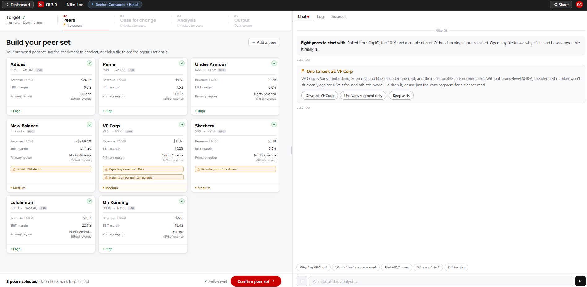

# Screen 02: Peer Review

[View in Confluence](https://bainco.atlassian.net/wiki/spaces/OI30/pages/19710279791)

Stage 2 of 5. Unlocks after the target is resolved in Screen 01. The partner arrives here to review and confirm the benchmark peer set before analysis runs.

The agent proposes an editable default peer set — not a recommendation to accept. The partner can deselect, add, or swap any peer. The peer set question often begins in Screen 01 (partner may have dictated peers already) — those inputs are pre-applied here.

**What is shown on screen:**

● OI context bar (persistent top): shows the OI name and framing context — e.g. "Nike · CFO · $200M · 3 docs". Breadcrumb shows current stage.

● Peer tiles grid: 8 proposed peers displayed as tiles, all pre-selected (checkmark visible). Each tile shows: peer name, ticker, Revenue (FY25Q1), EBIT margin, primary region, and any flags (Reporting structure differs, BU structure differs). Tile badges: "Added by you" (manually added), "BU only — [segment]" (segment-scoped), "Data required" (data gate active). Checkmark tap deselects a peer.

● Peer proactive flag: agent flags peer e.g. VF Corp in the chat without being asked, with three action buttons — Deselect VF Corp / Use Vans segment only / Keep as-is.

● Add a peer button and flow: when Partner opens this, a sheet/drawer appears with a search input and two sections below it. Agent suggestions (Suggested tag): e.g. Decathlon and Columbia Sportswear. Also on the longlist (Candidate tag): e.g. Asics, Mizuno, Amer Sports. Each card shows name, sub-label, reason for consideration, reason for non-inclusion, and data-gate requirements. Footer shows 5 candidates count

● "Confirm peer set" button: locks the peer set and progresses to Stage 3.

● Peer detail panel (opens on tile click): tabbed panel with 8 sections — Why included, Selection criteria, Business units, Analyst view, Key metrics, Data sources, Confidence, Details.

● Target company metrics shown for comparison: e.g. Gross margin 44.6%, SG&A / rev 34.2%, EBIT margin 12.4%.

● Chat panel with Log and Sources tabs. Agent posts the opening message on screen load. Upload files option in the Log area.

● Share modal: Partner can share the OI with others as Contributor or Viewer.

HTML link:

| **Data Displayed**  | **Source**  | **Calculation / Logic**  | **UX / Interaction (Raema)**  | **Agent / System Behaviour (Nikolozi)**  |
| *! MVP/POC Peer set (Noah/Kasia meeting, Aug 11 ): Don’t use CapIQ or VCC peer set. For GLS, we can use table from OI with target and peer set in the “Data sources from Current OI” page*  |
| *! OPEN (RED): LSEG access mechanism unconfirmed. Required for analyst view per peer. Escalate to Dean/Siva.*  |
| *! CONFIRMED (calculations workshop, Noah + Akhil): Three-step adjustment process — (1) Remove non-recurring items, (2) Align line item definitions to target structure, (3) Re-bucket cost items. Always anchor to target reporting structure. Reconciliation check against company reported adjusted EBIT is mandatory.*  |
| *! CONFIRMED (calculations workshop, Akhil): Do NOT use CapIQ pre-computed COGS/SG&A. Cross-check CapIQ figures against company filings (10-K / annual report). Where CapIQ figures do not reconcile to reported figures, use the filing as source of truth.*  |
| *! Confirmed (VCC): Peer median uses latest available value. Exclude if data >1 year stale. ⚠ Confirmed with Akhil: peer median includes Target*  |
| *⚠ Confirmed (Data Dictionary confirmed by Akhil): Peer standardization rule — the TARGET's income statement reporting structure acts as the anchor. All peers must follow the same structure. If a peer cannot be reconciled to target's format, keep at overall EBIT/EBITDA level rather than lower cost/NWC slides.* *⚠ Confirmed (Stephanie): BU scoping impact — if Partner scopes to a BU, most companies only report revenue and EBIT margin at BU level, not gross margin or SG&A. This cascades through all downstream analysis. Design must clearly communicate what metrics become unavailable when BU scoping is selected.* *⚠ Data source hierarchies for this screen — Financial data: CapIQ → 10-K / annual report → LSEG. Qualitative data: LSEG Refinitiv (analyst reports, earnings calls). Exception: BU/segment data follows its own hierarchy (CapIQ Segments screen → 10-K/10-Q → Partner upload) — see BU rows below.* ⚠ *CRITICAL UPDATE (Noah email, Aug 12): VCC's computed P&L and NWC metrics are NOT reliable. For all peer financial data: pull RAW CapIQ data from VCC's Snowflake DB (before VCC adjustments) and apply OI 3.0's own adjustment logic. TSR and share price data from VCC remain usable. Do not import VCC-computed EBIT margins, cost bar breakdowns, SG&A, or NWC metrics for peer benchmarking.* ⚠ *CONFIRMED (Noah/Kasia meeting, Aug 11): For BU peers — it is acceptable to compare a BU to a full company for specific metrics where data is available. Do NOT make up missing metrics. Full company and BU-only peers can coexist in the same peer set. On charts like EBIT and Revenue, show all N companies. On charts like Gross Margin and SG&A, show only the subset with that cost breakdown available — document clearly in UI.*  |
| OI context bar  | OI record (Screen 01 inputs)  | Persistent bar at top of screen showing OI framing context: target name, audience, financial ambition, document count. Example: "Nike · CFO · $200M · 3 docs". Breadcrumb shows current stage (02 Peers) and locks for subsequent stages.  | Displayed at top of screen. Navigation back to Screen 01 available.  | Populated from OI record on screen load: target name, audience, financial ambition, document count. Updates if Partner modifies Screen 01 inputs.  |
| *! PEER TILES — main screen*  |
| NEW ENGINEERING FLAG: Adjustments (three-step process — remove non-recurring items, align line item definitions, re-bucket) run for ALL proposed peers at screen load, before the screen renders. This means 10-K parsing, non-recurring item identification, and adjustment calculations run for all N peers upfront — not deferred to detail panel open. Tile and detail panel show the same adjusted figures throughout.  |
| Peer tiles grid — 8 proposed peers  | Agent (LLM prompt + CapIQ)  | Agent generates peer set via LLM prompt asking for comparable peers based on target and comparability criteria from Screen 01. Agent checks each suggested peer reporting structure compatibility — can a clean COGS/SG&A split be created from public filings? Peers with incompatible structures flagged. Historical OI target/peer set pairs are one available optional reference input. No Bain Claude skill, no VCC. Partner-provided peer sets always override. All 8 pre-selected on load. Agent draws on four sources for peer proposal: (1) LLM first pass on business model and segment comparability, (2) CapIQ Quick Competitor Screen (sector, revenue, geography), (3) CapIQ Segments screen — segment-level comparability, (4) Open web research on closest comparables. All four sources traceable in the Source: to-from flow (Noah Wells, Step 01) More reference on peer set selection on pages 8 to 12 from the Onboarding deck in this page: [https://bainco.atlassian.net/wiki/x/CoDZlwQ](https://bainco.atlassian.net/wiki/x/CoDZlwQ)  | "Tap the checkmark to deselect, or click a tile to see the agent's rationale." All tiles pre-selected with green checkmark. Deselect by tapping checkmark. Tile grid scrollable. Tile click opens detail panel.  | Agent generates peer set via LLM prompt at screen load. Reporting structure compatibility checked per peer. Peers stored in OI record with inclusion rationale, confidence score, and adjustment log.  |
| Peer tile front — name, ticker, revenue, EBIT margin, primary region  | Company filings / Capital IQ  | Each tile shows: (1) peer name, (2) ticker and exchange (e.g. ADS · XETRA), (3) Revenue FY25Q1 — most recent full FY in USD; non-USD converted at FY-average FX rate, (4) EBIT margin — adjusted figure, (5) Primary region with revenue % (e.g. Europe 33% of revenue). All figures are adjusted — same values as shown in detail panel. Cross-check CapIQ figures against company filings (10-K / annual report). Where CapIQ figures do not reconcile to reported figures, use the filing as source of truth.  | Adjusted figures shown on tile — consistent with detail panel. See engineering flag below.  | Data pulled from CapIQ raw line items. Adjustments applied before screen renders — tile and detail panel show the same adjusted figures. Revenue converted to USD at FY-average FX rate.  |
| Peer tile flags — Reporting structure differs / BU structure differs  | Agent (derived from CapIQ + 10-K analysis)  | Two flag types shown on tile where applicable: (1) "Reporting structure differs" — peer reports personnel expenses and D&A as separate line items; synthetic COGS/SG&A cannot be created cleanly. Peer kept at EBIT level only for cost benchmarking. (2) "BU structure differs" — peer has a materially different business unit or segment structure. VF Corp carries both flags. Flags are a signal to Partner to inspect before confirming.  | Flag type determines whether peer is kept at EBIT-only level for cost benchmarking.  | Agent detects flag conditions from CapIQ and 10-K segment disclosures. Peers with Reporting structure differs: kept at EBIT level only — no synthetic COGS/SG&A created. Flags stored per peer in OI record.  |
| Peer tile badges — Added by you / BU only / Data required  | System (derived from peer source and data availability)  | Three badge types: (1) "Added by you" — peer was manually added by Partner rather than proposed by agent. (2) "BU only — [segment name]" — peer is scoped to a specific business unit (e.g. Vans only from VF Corp). (3) "Data required" — peer is in the set but has a data gate active; specific files must be uploaded before full analysis can run for this peer.  | Badge type determines data scope: BU only limits benchmarking to segment-level data; Data required means peer cannot be fully benchmarked until specified files are uploaded.  | manuallyAdded, buOnly, and dataGateRequired flags stored in OI record per peer. buOnly: agent scopes all metrics to segment-level data only. dataGateRequired: peer excluded from full analysis until data gate is satisfied.  |
| Proactive peer flag — agent flags peers with structural issues  | Agent (derived from CapIQ + 10-K)  | Where a peer has a structural issue (e.g. conglomerate structure, incompatible reporting), agent flags this proactively in chat at screen load with a short rationale. Three action options presented: Deselect / Use [segment] only / Keep as-is. Selection determines how the peer data is scoped in OI record.  | Three action options presented: Deselect, Use Vans segment only, Keep as-is. Selection determines how VF Corp data is scoped in OI record.  | On screen load: agent detects flagged:true on VF Corp and surfaces three options. "Use Vans segment only": sets buOnly:true, buLabel:Vans, recalculates all VF Corp metrics using Vans segment data from CapIQ Segments screen. "Deselect": sets deselected in OI record.  |
| "Add a peer" button  | User input → Agent / CapIQ  | Partner can manually add a peer not in the proposed set. Opens a search flow — Partner types company name or ticker, agent resolves and checks comparability, peer added to tile grid with "Added by you" badge.  | Opens search flow — Partner types company name or ticker.  | On add: entity resolution, reporting structure compatibility check, CapIQ metrics fetched, inclusion rationale generated, added to OI record with manuallyAdded:true.  |
| *! PEER DETAIL PANEL — opens on tile click. Eight tabs .*  |
| Detail panel — Why included tab  | Agent (derived)  | Full paragraph-length rationale explaining why this peer was included. Covers: comparability basis (segment overlap, revenue scale, geography), adjustments made, caveats on comparability, prior OI usage.  | Shown by default when detail panel opens.  | Generated at proposal time using LLM over four sources. Stored in OI record per peer. Immutable once peer confirmed.  |
| Detail panel — Selection criteria tab  | Agent (derived)  | Spider chart showing how this peer scores on the six criteria selected in Screen 01: Business model, Revenue scale, Regional exposure, End market & customers, Product mix, Growth profile. Each dimension scored as Strong / Partial / Weak.  | Spider chart shown per peer. Instruction shown: Click any axis or dot to compare across peers.  | Scores (strong / partial / weak) calculated per peer per criterion at proposal time using Screen 01 criteria weights. Stored in OI record per criterion per peer.  |
| Detail panel — Selection criteria tab (additional content)  | Agent (derived) + Company filings / Capital IQ  | [[VIEW 1 — Default, always shown below spider chart]]: (1) Summary insight text generated from stored scores identifying strongest and weakest dimensions and overall comparability takeaway (2) Per-criterion breakdown cards — one per criterion showing: criterion name, match level badge (Strong / Partial / Weak), LLM-generated rationale text explaining the score. [[VIEW 2 — On clicking a spider axis or dot]]: Drill-down panel opens showing: (1) Peer overall match score (Strong / Partial / Weak) with count of peers compared against (e.g. vs 14 peers), (2) Full rationale sentence with actual financial data (e.g. revenue with FX conversion, % within target scale), (3) Sector and sub-sector chips, (4) Revenue by region vs target — stacked bar chart comparing peer regional revenue split vs target regional split, (5) Business unit mix vs target — stacked bar chart comparing peer BU split vs target BU split, (6) All peers ranked — list of all peers in the confirmed set with their overall match level (Strong / Partial / Weak) so Partner can compare this peer against all others.  | View 1: summary insight text + per-criterion breakdown cards always visible below spider chart. View 2: drill-down panel opens on axis or dot click showing overall score, rationale, sector chips, two bar charts (revenue by region vs target, BU mix vs target), and all peers ranked list.  | View 1: spiderInsight() generates summary text from stored scores — no additional data fetch. LLM rationale text per criterion generated at proposal time and stored in OI record. View 2 on click: data already in OI record — peer overall score, rationale, sector/sub-sector labels from CapIQ SIC taxonomy mapping, regional revenue breakdown from CapIQ geographic segments, BU mix from CapIQ Segments screen. All peers ranked list derived from stored match scores across all confirmed peers.  |
| Detail panel — Business units tab  | CapIQ / 10-K (segment disclosure)  | Business unit breakdown for the peer mapped to Nike equivalent BUs. Each BU shown with: name, revenue share %, Nike equivalent BU, and comparability rating (yes / partial / limited).  | Each BU mapped to target segment equivalent with comparability rating (yes / partial / limited).  | BU mapping generated at proposal time from CapIQ Segments screen and 10-K disclosures. Target BU structure used as anchor. Regional breakdown from CapIQ geographic segment data.  |
| Detail panel — Analyst view tab  | LSEG  | Five fields per peer: (1) Bank name — sell-side firm covering the peer, (2) Rating — analyst rating (e.g. Overweight / Neutral / Underweight / Buy), (3) Report date, (4) LLM-extracted key insight from the analyst report relevant to comparability with the target, (5) LLM-extracted management priorities cited in the report. Open full report button links to full LSEG report. Private company fallback: no sell-side coverage message shown, falls back to statutory accounts marked as directional only.  | Private peers: fallback to statutory accounts. Data marked directional.  | Analyst data retrieved from LSEG on panel open. LLM extracts key insight and priorities per report. Private company fallback: statutory accounts. LSEG access TBC — confirm with Siva.  |
| Detail panel — Key metrics tab  | Company filings / Capital IQ  | Four metrics shown per peer alongside Nike target metrics for direct comparison. The Key metrics tab shows POST-ADJUSTMENT figures — not reported. Per-peer metrics: Revenue, Gross margin (adjusted), SG&A / rev (adjusted), EBIT margin (adjusted). The Data sources tab shows the full audit trail from raw CapIQ to adjusted value. Cross-check CapIQ figures against company filings (10-K / annual report). Where CapIQ figures do not reconcile to reported figures, use the filing as source of truth.  | Adjusted figures shown alongside Nike target metrics for direct comparison.  | Metrics pulled from CapIQ raw line items, adjusted per three-step process. Formulas: Gross margin = Gross Profit / Revenue × 100. SG&A / rev = SG&A / Revenue × 100. EBIT margin = EBIT / Revenue × 100. Revenue converted to USD at FY-average FX rate.  |
| Detail panel — Data sources tab (adjustment audit)  | Company filings / Capital IQ  | Three-step adjustment audit per peer per source. Label: "Data sources — tap to see audit." Each source row shows: raw value, adjustment applied, adjusted value, comparability note. Three-step process: (1) Remove non-recurring items (restructuring, impairments, M&A costs, COVID, Russia/Ukraine, gain on asset disposal; keep FX losses). (2) Align line item definitions to target structure. (3) Re-bucket cost items. SBC treatment follows target approach. Proportional fallback if cost line of non-recurring item cannot be identified. Reconciliation check against company reported adjusted EBIT is mandatory.  | Each source row shows: raw value, adjustment applied, adjusted value, comparability note.  | Audit generated at proposal time. Three steps: (1) LLM reads 10-K footnotes and MD&A to identify non-recurring items and cost line impact. (2) Align to target reporting structure. (3) Re-bucket. European peers: LLM detects terminology (underlying, trading, recurring). Reconciliation check: calculated adjusted EBIT vs company reported adjusted EBIT — unexplained delta flagged. All adjustments stored in OI record per peer per line item.  |
| Detail panel — Confidence tab  | Agent (derived)  | Confidence score (%) and confidence level (High / Medium / Low) for this peer. Four confidence factors : (1) Data completeness — % score, (2) Adjustments required — None / 1 made / Medium, (3) Sources cross-checked — Yes (N) / Partial, (4) Comparable model — Yes / Partial. Overall confidence = weighted combination. Label: "Confidence breakdown."  | Overall confidence score shown on tile. Four-factor breakdown in detail panel.  | Confidence score = weighted combination of: data completeness, adjustments required, sources cross-checked, comparable model. Calculated at proposal time. Stored in OI record. Drives peer ranking.  |
| *! CANDIDATES — accessible via Add a peer flow (sheet/drawer), not a standalone panel on the main screen. Two sections: Agent suggestions and Also on the longlist.*  |
| Candidates panel — 5 candidates  | Agent (derived)  | Accessible via the Add a peer flow, not a standalone panel on the main screen. Opening Add a peer shows a sheet/drawer with a search input and two sections: (1) Agent suggestions — peers the agent considered but did not include in the proposed set. (2) Also on the longlist — additional candidates considered. Each card shows: name, sub-label (exchange/country/type), reason for consideration, reason for non-inclusion. Where data is insufficient, a Data required badge is shown. Partner can add any candidate directly from this sheet.  | Accessible via Add a peer flow. Two sections: Agent suggestions and Also on the longlist.  | Generated at proposal time — peers above threshold but excluded for a specific reason. Stored in OI record. On Partner adding a candidate: promoted to peer set, dataGateRequired flag set if applicable.  |
| *! SHARED ELEMENTS — chat panel, log, sources, share modal*  |
| Chat panel + agent opening message  | Agent (LLM)  | Agent posts opening message on screen load summarising the peer set and sources used. Proactive peer flag message follows immediately for any flagged peers. Partner can query any peer, ask for rationale, or request swaps.  |  | Proactive flag triggered by flagged:true on any peer in OI record at screen load.  |
| Log tab — audit trail  | System  | Timestamped log of all actions taken in the OI session. Four actor types: Partner / You, Agent, Collaborator, System. Entries include: project created, target named, peers proposed, flags raised, peer add/remove/confirm actions.  |  | All peer add/remove/confirm actions logged in OI record audit trail.  |
| "Confirm peer set" button  | User input  | Locks the peer set and progresses the OI to Stage 3 (Case for change). Once confirmed, peer set is stored in OI record and used as the benchmark set for all downstream analysis. Partner can return and change peers — only affected downstream modules rerun.  | Locks peer set and progresses OI to Stage 3.  | On confirm: OI record updated with confirmed peer set. Stage 3 unlocked. Downstream modules (Screen 03 angles, Screen 04 levers) triggered. If peer set changed post-confirmation: affected downstream modules invalidated and requeued.  |
| Share modal — Contributor / Viewer roles  | System / User input  | Partner can share the OI with others. Two roles: Contributor (can open and edit at any stage) and Viewer (read-only). Share by adding collaborator name or copying a link.  | Two roles: Contributor (edit) and Viewer (read-only).  | On share: OI access record updated with collaborator and role.  |
