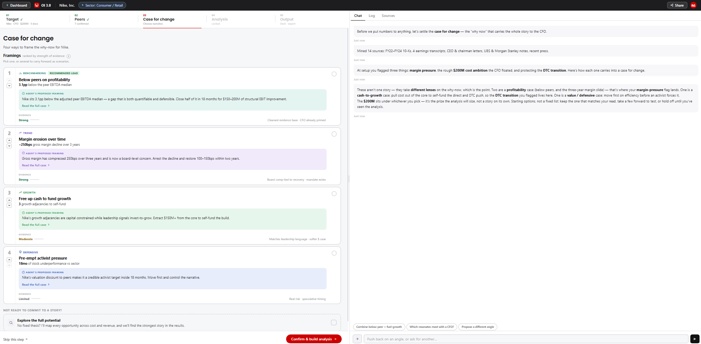

# Screen 03: Case for Change

[View in Confluence](https://bainco.atlassian.net/wiki/spaces/OI30/pages/19710771226)

Stage 3 of 5. Unlocks after the peer set is confirmed in Screen 02. The Partner arrives here to select a narrative framing — the "why now" — before the Analysis runs. The screen opens in chat-first mode. The agent proposes between 2–4 Angle cards (framings), each backed by a headline metric, evidence sources, and leadership signals. The Partner selects one or more Angles, or defers to an open-ended exploration. The confirmed framing is passed to Screen 04 as a constraint that shapes lever prioritisation and narrative.

**What is shown on screen:**

● OI context bar (persistent top): target name, audience, financial ambition, stage breadcrumb.

● Angle tile list (main workspace): 2–4 agent-proposed framings, each showing category tag, title, headline metric + label, agent's proposed framing (takeaway), and Evidence indicator. Agent-ranked by default. Partner can re-order manually.

● Angle detail panel (opens on 'Read the full case ›'): full angle narrative, agent's proposed framing box, ranking rationale, benchmark bar chart, opportunity sizing sniff-test table (bucket / baseline / % uplift / value range, with levers per bucket), source list with expandable referenced passages, and leadership signals.

● Chat panel (right): persistent chat with three tabs — Chat, Log, Sources. Agent sends opening message on screen load with pre-populated suggestion chips.

● 'Explore the full potential' option: defers angle selection; agent runs full-width analysis.

● CTA bar: 'Skip this step' and 'Confirm & build analysis' buttons.

| **Data Displayed**  | **Source**  | **Calculation / Logic**  | **UX / Interaction (Raema)**  | **Agent / System Behaviour (Nikolozi)**  |
| ⚠ *NOTE (Noah/Kasia meeting, Aug 11): TSR and some top-level, top-down data (Black/White/Grey) from VCC are reliable and can be used. Other financial metrics for Case for Change angles must come from raw CapIQ / OI 3.0 own calculations, not VCC-computed metrics*  |
| *! CONFIRMED (to-from flow, Noah Wells, Step 04): Agent builds wide (sizes all candidate opportunities) and presents narrow (3–5 angles that carry the case). A slide is built for every candidate and held — never discarded. Levers are industry-tailored, never generic.*  |
| *! CONFIRMED (to-from flow, Noah Wells, Step 04): Agent surfaces both quantitative sizing AND qualitative weighting per angle — not rank by size of prize alone.*  |
| **OI CONTEXT BAR — persistent top**  |
| OI context bar  | OI record (Screen 01 inputs)  | Persistent bar showing OI framing context: target name, audience, financial ambition, document count. Example: "Nike · CFO · $200M · 3 docs". Breadcrumb shows current stage (03 Case for change) and locks for subsequent stages.  | Displayed at top of screen. Navigation back to Screen 01 available.  | Populated from OI record on screen load. Updates if Partner modifies Screen 01 inputs.  |
| **ANGLE TILES — main screen**  |
| Angle tile — category tag and title  | Agent (LLM-generated)  | Each angle tile shows a category tag (icon + label) and a title. Four category types examples: Benchmarking, Trend, Growth, Defensive. Category tag and title are agent-generated at angle creation time. The top-ranked tile also shows a 'Recommended lead' badge.  |  | Agent assigns category tag and title per angle. Category determines colour scheme applied across the tile. 'Recommended lead' badge shown only on the first tile in current agent order.  |
| Angle tile — headline metric value and label  | Company filings / Capital IQ + peer set (Screen 02)  | Bold numeric value and plain-text label shown on each tile — the quantitative anchor for the angle. Example: Below peers on profitability: 3.1pp / below the peer EBITDA median  | Bold value prominent on tile. Plain-text label below.  | Agent calculates metric from CapIQ data and Screen 02 confirmed peer set. Gap-based metrics use adjusted figures. Stored in OI record per angle.  |
| Angle tile — agent's proposed framing (takeaway)  | Agent (LLM-generated)  | A 1–2 sentence takeaway shown in a bordered box labelled 'Agent's proposed framing'. This is the short version of the full proposal. Examples from prototype: Below peers: 'Nike sits 3.1pp below the adjusted peer EBITDA median — a gap that is both quantifiable and defensible. Close half of it in 18 months for $150–200M of structural EBIT improvement.' 'Read the full case ›' link opens the angle detail panel.  | Framing box shown on each tile. 'Read the full case ›' link opens detail panel.  | Agent generates takeaway text using LLM at angle creation time. Stored per angle in OI record.  |
| Angle tile — Evidence indicator (label + score + bar)  | Agent (derived)  | Evidence label, text value (Strong / Moderate / Limited), and a fill bar shown at the bottom of each tile. Thresholds derived from qs (quantitative signal) score (0–10) stored per angle: qs ≥ 8 → Strong (green); qs ≥ 6 → Moderate (amber); qs < 6 → Limited (grey). qs reflects how defensible the number is from public, sourced data — number of independent sources, whether figures come from filings vs estimates, whether gap is material. A short rank rationale (rankShort) is also shown below the bar — e.g. 'Cleanest evidence base · CFO already primed'.  | Evidence label, text value, and fill bar shown at bottom of tile. Rank rationale text shown below bar.  | Agent calculates qs score per angle at generation time. Score drives Evidence label. Stored in OI record. qs and ls (leverage signal) scores together determine default sort order — angles sorted descending by (qs + ls). TBC with Nikolozi: confirm dynamic scoring algorithm vs hardcoded values in prototype.  |
| Angle tile — selection toggle (select / deselect)  | User input  | Partner taps a checkbox button on the right side of each tile to select or deselect the angle. Multiple angles may be selected to carry forward as scenarios. If all angles are selected, system auto-switches to 'Explore the full potential' mode.  | Toggle button on right side of tile. Selected state shows tile border in angle category colour. Auto-note rendered if all angles selected.  | Selected angles stored in selectedAngles[] array in session state. Passed to Screen 04 as framing constraints on confirm. If all angles selected, deferMode set to 'explore' and selectedAngles[] cleared.  |
| **ANGLE DETAIL PANEL — opens on 'Read the full case ›'**  |
| Angle detail — title and narrative description  | Agent (LLM-generated)  | Detail panel opens showing the angle title (large) and a narrative description paragraph (the angle statement). Examples from prototype: Below peers: 'Nike's EBITDA margin sits below the adjusted peer median — a clear, benchmarkable gap that frames cost and revenue action as closing distance to peers.'  |  |  |
| Angle detail — agent's proposed framing (full proposal)  | Agent (LLM-generated)  | A longer version of the framing proposal, shown in a coloured box labelled 'Agent's proposed framing'. Contains the full narrative case the Partner would make with this angle. Example (Below peers): 'Nike is operating 3.1pp below the adjusted peer EBITDA median — a gap that is both quantifiable and defensible. The CFO has flagged "efficiency" as a priority in every recent earnings call. The case: close half the gap in 18 months by addressing SG&A deleverage and gross margin leakage, generating $150–200M of structural EBIT improvement.'  |  |  |
| Angle detail — ranking rationale ('Why the agent ranked this #N')  | Agent (derived)  | A panel labelled 'Why the agent ranked this #N' shows: rank number, Evidence label (Strong / Moderate / Limited derived from qs), and a text rationale paragraph explaining the rank position. Examples from prototype: #1 Below peers: 'Largest quantifiable gap with the cleanest evidence base. Three independent sources, all public. CFO has named efficiency in every recent call — the client is already primed for this conversation.'  | Panel shown below the full framing proposal in the detail view.  | Agent generates rankWhy text per angle at creation time. Stored in OI record. qs score shown alongside. ls (leverage signal) score used in sort order but not currently displayed separately — confirm with Nikolozi.  |
| Angle detail — benchmark bar chart (quantitative gap)  | Company filings / Capital IQ (EBITDA margin, SG&A %, gross margin — raw line items, OI 3.0 adjustment logic applied) Market data / Capital IQ (EV/EBITDA multiples) Peer set from Screen 02  | Horizontal bar chart labelled 'Where [target] sits — the quantitative gap'. Shows the metric that anchors the angle for target and peers. Target bar highlighted in red. Example charts per angle: Below peers: EBITDA margin % — Adidas 14.2%, Peer median 13.5%, Puma 12.8%, target 10.4%.  | Target bar shown in red. Peer median shown as a distinct row.  | Agent renders chart from Screen 02 adjusted figures stored in OI record. Same adjusted values as Screen 02 peer tiles — must be identical. Financial metrics derived from raw CapIQ line items, not VCC-computed figures.  |
| Angle detail — opportunity sizing sniff-test table  | Company filings / Capital IQ (raw line items for baseline values — OI 3.0 adjustment logic applied) Agent (% uplift ranges derived from Bain Experience Levers file from [https://bainco.atlassian.net/wiki/x/CoDZlwQ](https://bainco.atlassian.net/wiki/x/CoDZlwQ) / Sage comparable OI studies)  | Table labelled 'Opportunity sizing — sniff test' with four columns: Bucket / Baseline / % uplift / Value range. Each row is a cost bucket. Clicking a bucket row expands a lever list beneath it (numbered levers per bucket). Example buckets per angle: Below peers: SG&A/overhead ($5.2B, 3–5%, $156–260M), Gross margin/COGS ($24.4B, 0.5–1%, $122–244M), Marketing spend ($4.1B, 2–4%, $82–164M). This is directional sizing only — full calculation done in Screen 04.  | Table shown below benchmark chart. Each bucket row is clickable to expand its lever list.  | Agent generates sniff-test sizing using CapIQ baseline financials + Bain IP achievable % ranges. % uplift ranges sourced from comparable OI studies on Sage/Iris. Baseline values = adjusted figures from Screen 02 OI record. Passed to Screen 04 as initial lever sizing input — subject to Partner override.  |
| Angle detail — sources list with expandable referenced passages  | Company filings / Capital IQ · LSEG (analyst reports, earnings calls)  | Section labelled 'Sources the analysis draws on'. Each source shown as a row with a short icon label (e.g. 10-K, CapIQ, UBS, CALL, AR, DAY, PRESS, MKT) and a one-line description. Tapping a source row expands it to show: 'Referenced passage' label, the extracted quote used by the agent, and an 'Open full source' button. 'Open full source' opens a modal showing: source label + description, the passage used, and a note that in the full build, this opens the source in Sage with the passage highlighted in context.  | Sources listed below sniff-test table. Each row tap-to-expand shows referenced passage. 'Open full source' opens modal.  | Agent assembles source list per angle at creation time. Referenced passages extracted by LLM from source documents. ⚠ LSEG-sourced passages unavailable if access not confirmed. Source modal in full build opens document in Sage with passage highlighted.  |
| Angle detail — leadership signals  | LSEG (earnings calls, annual reports, investor day, press)  | Section labelled 'Leadership signals'. Bullet list of qualitative signals from management commentary. Each bullet has a coloured dot (angle category colour) and a text signal. Example from prototype: Below peers: 'CFO used the word "efficiency" 11 times on the last two earnings calls'; 'Analysts repeatedly probing the gap to Adidas margins'.  | Bullet list shown below sources. Coloured dot per bullet matches angle category colour.  | Agent extracts leadership signals from LSEG earnings transcripts, annual report CEO/CFO letters, and press. Signals stored per angle in OI record. ⚠ LSEG access TBC — confirm with Siva.  |
| **CHAT PANEL — Chat / Log / Sources tabs**  |
| Chat panel — agent opening message  | Agent (LLM-generated)  | On screen load, agent sends two opening messages to the chat:  1. 'Before we put numbers to anything, let's settle the case for change — the "why now" that carries the whole story to the CFO.'  1. A follow-up message referencing the flags raised in Screen 01 setup (e.g. margin pressure, financial ambition, strategic priorities) and describing how each one maps to a framing angle.  Agent also reports in the side log how many sources were mined (e.g. 'Mined 14 sources: FY22–FY24 10-Ks, 4 earnings transcripts, CEO & chairman letters, UBS & Morgan Stanley notes, recent press.').  | Agent message rendered in chat on screen load.  | Agent generates opening message using OI record inputs from Screen 01 (flags, financial ambition, audience). Sources mined count logged to activity log.  |
| Chat panel — suggestion chips  | System  | Three pre-populated suggestion chips shown in chat panel on screen load: 'Combine below-peer + fuel-growth', 'Which resonates most with a CFO?', 'Propose a different angle'. Tapping a chip sends the label text as a Partner message.  | Chips shown below chat messages. Horizontally scrollable if overflow.  | Chip tap triggers agent response. Agent can re-generate angles, combine framings, or surface additional evidence on request.  |
| Chat panel — Log tab  | System  | Timestamped audit trail of all actions on this OI. Actor types: System (screen opened, data loaded), Agent (angles generated, sources mined), Partner / You (angle selected, re-order applied). Log entries are immutable and persist for the full OI session.  | Log tab accessible from chat panel. Entries colour-coded by actor type.  | Agent writes a log entry on every action: screen open, angle generation, source mine count, Partner selection.  |
| Chat panel — Sources tab  | Company filings / Capital IQ · LSEG · Sage (Glean / Iris) · User upload  | Live list of active data sources. Grouped into four categories: Filings & disclosures, Analyst & market, Bain knowledge, Uploaded. Each source shows: name, description, last updated date. Refresh button per source. Source count shown at top. Partner-uploaded files appear as a separate 'Uploaded files (N)' section above the active sources list.  | Sources tab accessible from chat panel. Refresh button per source. Upload zone at top of Sources tab for file upload.  | Agent maintains source list automatically. Sources added when data is loaded at screen open. Refresh button triggers agent to re-pull latest data from that source.  |
| Chat panel — file upload (Sources tab)  | User upload  | Upload zone in Sources tab. Accepted file types: PDF, Excel, Word, PowerPoint, CSV. Uploaded files show: icon (colour-coded by type), filename, file size, upload date. Per-file actions: View and Delete. Agent confirms upload in chat and folds uploaded content into angle analysis.  | Upload zone shown at top of Sources tab. Uploaded files listed in 'Uploaded files (N)' section. View and Delete buttons per file.  | Uploaded files ingested as LLM context. Agent uses content to supplement or sharpen angle analysis. File added to Sources list automatically.  |
| **SELECTED ANGLE(S) — output to Screen 04**  |
| Selected angle(s) — passed to Screen 04 as framing constraint  | User input  | Partner selects 1 or more angles (or defers to 'Explore the full potential'). Selection is stored and passed to Screen 04. Shapes lever prioritisation, narrative, and slide content in Analysis and Output. Partner can return to Screen 03 and change selection — only affected downstream modules rerun.  | Selection persisted visually (border highlight on tile). CTA button label updates: 1 angle → 'Confirm & build analysis'; 2+ angles → 'Build analysis with N scenarios'; defer → 'Explore full potential'.  | selectedAngles[] array written to OI record on confirm. Screen 04 agent initialised with framing constraints. If deferMode = 'explore', no framing constraint written — agent runs full-width analysis across all opportunity categories.  |
