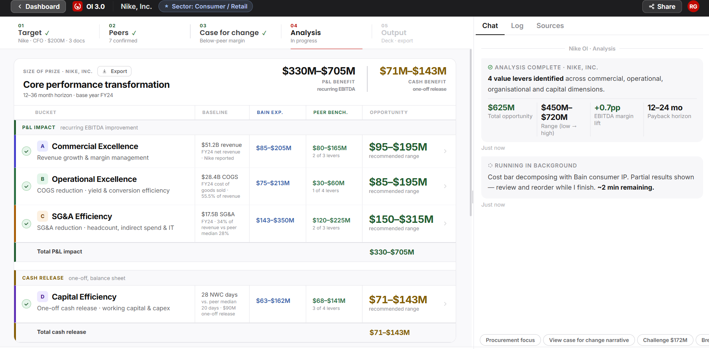
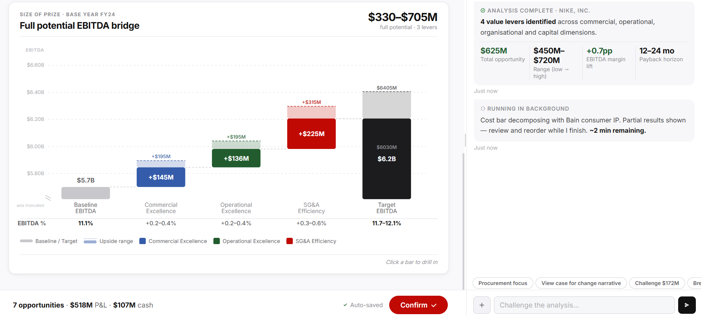

# Screen 04: Analysis

[View in Confluence](https://bainco.atlassian.net/wiki/spaces/OI30/pages/19710705690)

Stage 4 of 5. Unlocks after the Case for Change framing is confirmed in Screen 03. The Partner arrives here to review the full opportunity landscape — a ranked set of value levers sized against the confirmed peer set. The screen opens in workspace mode showing the Core Performance Transformation (CPT) table (4 transformation buckets with 14 sub-levers split into P&L and Cash sections) and the EBITDA bridge waterfall. The Partner can drill into bucket detail (L2 panel) and sub-lever detail (L3 panel), adjust sizing assumptions, and confirm the final Size of Prize before proceeding to Output.

**What is shown on screen:**

● Size of prize card header (persistent top): small label above title, title, P&L benefit range in $M (recurring EBITDA), and Cash benefit range in $M (one-off release, shown in amber).

● Core Performance Transformation (CPT) table: 4 transformation buckets (Commercial Excellence, Operational Excellence, SG&A Efficiency, Capital Efficiency) split into "P&L impact" and "Cash release" sections, each with 14 sub-lever rows. Columns: bucket name/baseline, Bain experience range, peer benchmark range, opportunity $M range. Enable/disable toggle per bucket and sub-lever. Sub-total rows for "Total P&L impact" and "Total cash release".

● EBITDA bridge / waterfall chart: two tabs — EBITDA impact (baseline EBITDA → 3 lever bars → target EBITDA) and Cash (NWC Release + Capex Optimisation → total cash release).

● L2 drill-down panel (click-triggered): opened by clicking a bucket row in the CPT table. Shows same column structure as CPT table (Sub-lever, Baseline, Bain exp., Peer bench., Opportunity) filtered to that bucket's sub-levers, with BU filter chips.

● L3 detail panel (click-triggered): opened by clicking a sub-lever row in L2, or by clicking a bar in the waterfall. Shows: triangulation of the range ("How this range was triangulated"), assumptions ("How the number was built"), further evidence, confidence section, and data source.

● Chat panel — three tabs: Chat (RAG-grounded, suggestion chips, attach), Log (timestamped audit trail, filter chips), Sources (live source list with confidence badges and Refresh buttons).

● Proceed bar: sticky bottom bar with active lever count, total $M, and "Confirm" button to proceed to Screen 05.

HTML:

| **Reference: **Bain experience ranges sourced from Bain IP (Sage / Iris) and/or the Levers Library in Confluence. Confluence link: [https://bainco.atlassian.net/wiki/x/CoDZlwQ](https://bainco.atlassian.net/wiki/x/CoDZlwQ)  |
| **Data Displayed**  | **Source**  | **Calculation / Logic**  | **UX / Interaction (Raema)**  | **Agent / System Behaviour (Nikolozi)**  |
| **WORKSPACE — MAIN VIEW**  |
| Size of prize card header (small label above title, title, P&L benefit range, Cash benefit range)  | Company filings / Capital IQ + Bain IP (Sage / Iris) / Levers Library (Confluence)  | P&L benefit range: sum of opportunity lo/hi values across all enabled non-cash sub-levers. See CPT sub-lever rows for individual opportunity formulas. Cash benefit range: sum of opportunity lo/hi values across all enabled Capital Efficiency sub-levers (DIO + DPO + DSO + Capex). See Capital Efficiency sub-lever rows. Both recalculate on every sub-lever toggle.  | Always visible at top of workspace. P&L and Cash totals shown as separate values side by side. Cash total in amber. Both update dynamically.  | Recalculates P&L and Cash totals separately on every sub-lever toggle. Propagates to the proceed bar and Dashboard SoP card.  |
| **CORE PERFORMANCE TRANSFORMATION (CPT) TABLE**  |
| CPT table section headers ("P&L impact · recurring EBITDA improvement" / "Cash release · one-off, balance sheet")  | N/A — system label  | No calculation — grouping label only. "P&L impact" header rendered before Commercial Excellence, Operational Excellence, and SG&A Efficiency buckets. "Cash release" header rendered before Capital Efficiency bucket.  | Full-width divider rows with coloured left border (green for P&L, amber for Cash). Visible without clicking.  | Rendered from bucket unit type flag in the lever data.  |
| Transformation bucket row (letter badge, bucket name, baseline, Bain exp. range, peer bench. range, opportunity $M range) Example: SG&A Efficiency (Bucket C)  | Company filings / Capital IQ + Bain IP (Sage / Iris) / Levers Library (Confluence)  | **Baseline**: relevant reported cost or revenue figure from Capital IQ for that bucket:  - Commercial Excellence: reported net revenue  - Operational Excellence: reported COGS  - SG&A Efficiency: Adj. SG&A (adjusted for one-off items in Screen 02)  - Capital Efficiency: NWC days (DIO, DPO, DSO) and reported CapEx  **Bain exp. range**: aggregated from sub-lever Bain experience ranges — Bain savings % (from comparable OI on Iris/Sage) × relevant cost base. See sub-lever rows for per-lever logic. **Peer bench. range**: aggregated from sub-lever peer benchmark gaps. Peer medians for Revenue and SG&A metrics confirmed in Screen 02. NWC and CapEx peer medians calculated on Screen 04 from Capital IQ peer data. **Opportunity $M range**: sum of opportunity lo/hi across all enabled sub-levers in the bucket. See sub-lever rows for per-lever formulas.  | Colour-coded left border per bucket. Click to expand/collapse sub-lever rows. Eye icon toggles entire bucket on/off. Uplift % override input per non-cash bucket.  | Eye toggle removes entire bucket contribution from totals. Uplift % override scales all sub-lever opportunity sizes proportionally.  |
| **CPT sub-lever rows (all 14 rendered)**  |
| *Confidence badge (HIGH / MED / LOW) shown beside each sub-lever name indicates how solid the evidence base is for the opportunity sizing. HIGH = strong, solid evidence base. MED = reasonable evidence but partially estimated or inferred. LOW = weak evidence base — highly estimated, limited data, or significant caveats. Definition confirmed with designer.*  |
| Commercial Excellence — Segment & volume growth  | Company filings / Capital IQ + Bain IP (Sage / Iris) / Levers Library (Confluence)  | Opportunity = (peer median revenue growth rate − target revenue growth rate) × target Revenue. Target revenue growth rate and peer median: from Capital IQ, confirmed in Screen 02. Revenue base: reported net revenue from Capital IQ/10-K. Bain exp. range: Bain savings % from comparable consumer goods OI on Iris/Sage × Revenue base. Cross-checked against peer benchmark gap for triangulation.  | Shown inside expanded bucket. Eye icon toggle per sub-lever. Opportunity $M range shown on right. Confidence badge shown. Clickable — opens L2 drill panel.  | Eye toggle includes/excludes sub-lever from bucket and overall totals.  |
| Commercial Excellence — Share of wallet (key accounts)  | Bain IP (Sage / Iris) / Levers Library (Confluence)  | Opportunity = estimated wallet share gap % × estimated key account revenue base. Key account revenue base estimated from Bain IP — no public line item. Wallet share gap estimated from Bain benchmarks for comparable account structures. No peer median available. Bain exp. range: Bain savings % from comparable commercial excellence OI on Iris/Sage × estimated key account base.  | Shown inside expanded bucket. Eye icon toggle per sub-lever. Opportunity $M range shown on right. Confidence badge shown. Clickable — opens L2 drill panel.  | Eye toggle includes/excludes sub-lever from bucket and overall totals.  |
| Commercial Excellence — Pricing & margin management  | Company filings / Capital IQ + Bain IP (Sage / Iris) / Levers Library (Confluence)  | Opportunity = (target DTC discount depth % − peer median DTC discount depth %) × DTC Revenue. Target DTC discount depth and DTC Revenue: from Capital IQ/10-K. Peer median: calculated from peer set DTC data, sourced on Screen 04 from Capital IQ. Bain exp. range: Bain savings % from comparable pricing OI on Iris/Sage × DTC Revenue base.  | Shown inside expanded bucket. Eye icon toggle per sub-lever. Opportunity $M range shown on right. Confidence badge shown. Clickable — opens L2 drill panel.  | Eye toggle includes/excludes sub-lever from bucket and overall totals.  |
| Operational Excellence — Manufacturing & conversion efficiency  | Bain IP (Sage / Iris) / Levers Library (Confluence)  | Opportunity = Bain savings % × estimated manufacturing cost base. Manufacturing cost base estimated from COGS split using Bain IP benchmarks — no public line item. No peer benchmark available. Bain exp. range: Bain savings % from comparable manufacturing OI on Iris/Sage × estimated manufacturing base.  | Shown inside expanded bucket. Eye icon toggle per sub-lever. Opportunity $M range shown on right. Confidence badge shown. Clickable — opens L2 drill panel.  | Eye toggle includes/excludes sub-lever from bucket and overall totals.  |
| Operational Excellence — Direct material cost reduction  | Company filings / Capital IQ + Bain IP (Sage / Iris) / Levers Library (Confluence)  | Opportunity = (target direct material % − peer median direct material %) × COGS. Target direct material % estimated from Capital IQ/10-K COGS disclosures. Peer median: calculated from peer set data, sourced on Screen 04 from Capital IQ. COGS: reported COGS from Capital IQ/10-K. Bain exp. range: Bain savings % from comparable sourcing OI on Iris/Sage × COGS base.  | Shown inside expanded bucket. Eye icon toggle per sub-lever. Opportunity $M range shown on right. Confidence badge shown. Clickable — opens L2 drill panel.  | Eye toggle includes/excludes sub-lever from bucket and overall totals.  |
| Operational Excellence — Freight & logistics optimisation  | Company filings / Capital IQ + Bain IP (Sage / Iris) / Levers Library (Confluence)  | Opportunity = (target freight rate % − peer median freight rate %) × COGS. Target freight rate estimated from Capital IQ/carrier disclosures. Peer median: calculated from peer set data, sourced on Screen 04. COGS: reported COGS from Capital IQ/10-K. Bain exp. range: Bain savings % from comparable supply chain OI on Iris/Sage × COGS base.  | Shown inside expanded bucket. Eye icon toggle per sub-lever. Opportunity $M range shown on right. Confidence badge shown. Clickable — opens L2 drill panel.  | Eye toggle includes/excludes sub-lever from bucket and overall totals.  |
| Operational Excellence — Product cost engineering  | Bain IP (Sage / Iris) / Levers Library (Confluence)  | Opportunity = Bain savings % × COGS base. COGS: reported COGS from Capital IQ/10-K. No peer benchmark available. Partial overlap with direct material lever — flag for MECE review. Bain exp. range: Bain savings % from comparable product cost OI on Iris/Sage × COGS base.  | Shown inside expanded bucket. Eye icon toggle per sub-lever. Opportunity $M range shown on right. Confidence badge shown. Clickable — opens L2 drill panel.  | Eye toggle includes/excludes sub-lever from bucket and overall totals.  |
| SG&A Efficiency — Organisation & headcount  | Company filings / Capital IQ + Bain IP (Sage / Iris) / Levers Library (Confluence)  | Opportunity = (target Adj. SG&A % of revenue − peer median Adj. SG&A % of revenue) × Revenue. Target Adj. SG&A % and peer median: from Capital IQ, confirmed in Screen 02. Adj. SG&A adjusted for one-off items in Screen 02. Revenue: reported net revenue from Capital IQ/10-K. Bain exp. range: Bain savings % (typically 10–20% of SG&A base) from comparable OI on Iris/Sage × Adj. SG&A.  | Shown inside expanded bucket. Eye icon toggle per sub-lever. Opportunity $M range shown on right. Confidence badge shown. Clickable — opens L2 drill panel.  | Eye toggle includes/excludes sub-lever from bucket and overall totals.  |
| SG&A Efficiency — Indirect spend optimisation  | Bain IP (Sage / Iris) / Levers Library (Confluence)  | Opportunity = Bain savings % × estimated indirect spend base. Indirect spend base estimated from non-personnel SG&A excl. IT using Bain IP — no public sub-breakdown. No peer benchmark available. Bain exp. range: Bain savings % from APT Category Navigator / comparable indirect spend OI on Iris/Sage × estimated indirect spend base.  | Shown inside expanded bucket. Eye icon toggle per sub-lever. Opportunity $M range shown on right. Confidence badge shown. Clickable — opens L2 drill panel.  | Eye toggle includes/excludes sub-lever from bucket and overall totals.  |
| SG&A Efficiency — IT rationalisation  | Bain IP (Sage / Iris) / Levers Library (Confluence)  | Opportunity = (target IT % of SG&A − Bain benchmark median IT % of SG&A) × Adj. SG&A. IT spend estimated as % of SG&A using Bain IT function benchmarks — no public line item. Bain benchmark median from comparable IT OI on Iris/Sage. Adj. SG&A: reported from Capital IQ/10-K, adjusted in Screen 02. Bain exp. range: Bain savings % × estimated IT spend base.  | Shown inside expanded bucket. Eye icon toggle per sub-lever. Opportunity $M range shown on right. Confidence badge shown. Clickable — opens L2 drill panel.  | Eye toggle includes/excludes sub-lever from bucket and overall totals.  |
| Capital Efficiency — Inventory & DIO optimisation  | Company filings / Capital IQ  | DIO (target) = (Inventories / COGS) × 365. DIO (peer median) = median DIO across confirmed peer set, calculated on Screen 04 from Capital IQ peer data. Opportunity = (target DIO − peer median DIO) × COGS / 365. One-time cash release — not recurring savings. Inventories and COGS: from Capital IQ/10-K.  | Shown inside expanded bucket. Eye icon toggle per sub-lever. Opportunity $M range shown on right. Confidence badge shown. Clickable — opens L2 drill panel.  | Eye toggle includes/excludes sub-lever from bucket and overall totals.  |
| Capital Efficiency — DPO extension  | Company filings / Capital IQ  | DPO (target) = (Trade Payables / COGS) × 365. Use trade payables excl. allowances. DPO (peer median) = median DPO across confirmed peer set, calculated on Screen 04 from Capital IQ peer data. Opportunity = (peer median DPO − target DPO) × COGS / 365. One-time cash release. Trade Payables and COGS: from Capital IQ/10-K.  | Shown inside expanded bucket. Eye icon toggle per sub-lever. Opportunity $M range shown on right. Confidence badge shown. Clickable — opens L2 drill panel.  | Eye toggle includes/excludes sub-lever from bucket and overall totals.  |
| Capital Efficiency — DSO acceleration  | Company filings / Capital IQ  | DSO (target) = (Trade Receivables / Revenue) × 365. Use gross trade receivables excl. allowances. DSO (peer median) = median DSO across confirmed peer set, calculated on Screen 04 from Capital IQ peer data. Opportunity = (target DSO − peer median DSO) × Revenue / 365. One-time cash release. Trade Receivables and Revenue: from Capital IQ/10-K.  | Shown inside expanded bucket. Eye icon toggle per sub-lever. Opportunity $M range shown on right. Confidence badge shown. Clickable — opens L2 drill panel.  | Eye toggle includes/excludes sub-lever from bucket and overall totals.  |
| Capital Efficiency — Capital project excellence  | Company filings / Capital IQ + Bain IP (Sage / Iris) / Levers Library (Confluence)  | Opportunity = Bain savings % × reported CapEx. CapEx: reported CapEx from Capital IQ/10-K. No peer benchmark available for project delivery savings. Bain exp. range: Bain savings % from comparable capex optimisation OI on Iris/Sage × reported CapEx base.  | Shown inside expanded bucket. Eye icon toggle per sub-lever. Opportunity $M range shown on right. Confidence badge shown. Clickable — opens L2 drill panel.  | Eye toggle includes/excludes sub-lever from bucket and overall totals.  |
| CPT table sub-total rows ("Total P&L impact" / "Total cash release")  | N/A — system computed  | "Total P&L impact": sum of opportunity lo/hi across all enabled non-cash sub-levers (Commercial Excellence + Operational Excellence + SG&A Efficiency buckets). "Total cash release": sum of opportunity lo/hi across all enabled Capital Efficiency sub-levers (DIO + DPO + DSO + Capex). Must match the corresponding P&L and Cash values in the card header.  | Full-width rows. Green for P&L, amber for Cash.  | Recalculates on every sub-lever toggle. Values must match card header totals.  |
| **EBITDA BRIDGE / WATERFALL CHART**  |
| Tab toggle ("EBITDA impact" / "Cash")  | N/A — system label  | No calculation — display toggle only. EBITDA impact tab: renders P&L lever waterfall (Commercial Excellence, Operational Excellence, SG&A Efficiency). Cash tab: renders cash release waterfall (NWC Release, Capex Optimisation).  | Active tab underlined. Toggle switches chart view instantly.  | Loads correct lever dataset on tab switch.  |
| *EBITDA impact tab*  |
| Baseline EBITDA bar  | OI record (Screen 02) + Company filings / Capital IQ  | EBITDA = Adj. EBIT + D&A. Adj. EBIT = Revenue − Adj. COGS − Adj. SG&A − R&D (residual approach — ensures stack reconciles to Revenue). All four inputs sourced from Capital IQ/10-K. Adj. COGS and Adj. SG&A adjusted for one-off items in Screen 02. Consistency check: Adj. EBIT / Revenue should reconcile to the EBIT margin % shown in Screen 02 peer tiles for the target company. D&A: sourced from Capital IQ/10-K on Screen 04 — not in Screen 02.  | Leftmost bar. Labelled "Baseline EBITDA FY[xx]". Y-axis anchored to this value.  | Reads baseline EBITDA from OI record. Chart y-axis auto-computed from baseline + sum of lever high values.  |
| *Commercial Excellence bar — sum of sub-lever contributions*  |
| Segment & volume growth component  | Company filings / Capital IQ + Bain IP (Sage / Iris) / Levers Library (Confluence)  | Contribution = opportunity base value for this sub-lever. Formula: (peer median revenue growth rate − target revenue growth rate) × Revenue. Same value as CPT sub-lever row above — not recalculated.  | Stacked into Commercial Excellence bar. Visible on bar drill.  | Value read from CPT sub-lever data. Same as CPT table.  |
| Share of wallet component  | Bain IP (Sage / Iris) / Levers Library (Confluence)  | Contribution = opportunity base value for this sub-lever. Formula: Estimated wallet share gap % × estimated key account revenue base. Same value as CPT sub-lever row above — not recalculated.  | Stacked into Commercial Excellence bar. Visible on bar drill.  | Value read from CPT sub-lever data. Same as CPT table.  |
| Pricing & margin management component  | Company filings / Capital IQ + Bain IP (Sage / Iris) / Levers Library (Confluence)  | Contribution = opportunity base value for this sub-lever. Formula: (target DTC discount depth % − peer median DTC discount depth %) × DTC Revenue. Same value as CPT sub-lever row above — not recalculated.  | Stacked into Commercial Excellence bar. Visible on bar drill.  | Value read from CPT sub-lever data. Same as CPT table.  |
| *Operational Excellence bar — sum of sub-lever contributions*  |
| Manufacturing & conversion efficiency component  | Bain IP (Sage / Iris) / Levers Library (Confluence)  | Contribution = opportunity base value for this sub-lever. Formula: Bain savings % × estimated manufacturing cost base. Same value as CPT sub-lever row above — not recalculated.  | Stacked into Operational Excellence bar.  | Value read from CPT sub-lever data. Same as CPT table.  |
| Direct material cost reduction component  | Company filings / Capital IQ + Bain IP (Sage / Iris) / Levers Library (Confluence)  | Contribution = opportunity base value for this sub-lever. Formula: (target direct material % − peer median direct material %) × COGS. Same value as CPT sub-lever row above — not recalculated.  | Stacked into Operational Excellence bar.  | Value read from CPT sub-lever data. Same as CPT table.  |
| Freight & logistics optimisation component  | Company filings / Capital IQ + Bain IP (Sage / Iris) / Levers Library (Confluence)  | Contribution = opportunity base value for this sub-lever. Formula: (target freight rate % − peer median freight rate %) × COGS. Same value as CPT sub-lever row above — not recalculated.  | Stacked into Operational Excellence bar.  | Value read from CPT sub-lever data. Same as CPT table.  |
| Product cost engineering component  | Bain IP (Sage / Iris) / Levers Library (Confluence)  | Contribution = opportunity base value for this sub-lever. Formula: Bain savings % × COGS base. Same value as CPT sub-lever row above — not recalculated.  | Stacked into Operational Excellence bar.  | Value read from CPT sub-lever data. Same as CPT table.  |
| *SG&A Efficiency bar — sum of sub-lever contributions*  |
| Organisation & headcount component  | Company filings / Capital IQ + Bain IP (Sage / Iris) / Levers Library (Confluence)  | Contribution = opportunity base value for this sub-lever. Formula: (target Adj. SG&A % of revenue − peer median Adj. SG&A % of revenue) × Revenue. Same value as CPT sub-lever row above — not recalculated.  | Stacked into SG&A Efficiency bar.  | Value read from CPT sub-lever data. Same as CPT table.  |
| Indirect spend optimisation component  | Bain IP (Sage / Iris) / Levers Library (Confluence)  | Contribution = opportunity base value for this sub-lever. Formula: Bain savings % × estimated indirect spend base. Same value as CPT sub-lever row above — not recalculated.  | Stacked into SG&A Efficiency bar.  | Value read from CPT sub-lever data. Same as CPT table.  |
| IT rationalisation component  | Bain IP (Sage / Iris) / Levers Library (Confluence)  | Contribution = opportunity base value for this sub-lever. Formula: (target IT % of SG&A − Bain benchmark median IT % of SG&A) × Adj. SG&A. Same value as CPT sub-lever row above — not recalculated.  | Stacked into SG&A Efficiency bar.  | Value read from CPT sub-lever data. Same as CPT table.  |
| Target EBITDA bar  | OI record (Screen 02) + Company filings / Capital IQ  | Target EBITDA = Baseline EBITDA + sum of opportunity base values across all enabled EBITDA sub-levers (Commercial Excellence + Operational Excellence + SG&A Efficiency). Lo: Baseline EBITDA + sum of opportunity lo values. Hi: Baseline EBITDA + sum of opportunity hi values.  | Rightmost bar. Labelled "Target EBITDA". Value shown above bar.  | Computed from baseline EBITDA + sum of all enabled EBITDA sub-lever base values. Updates on sub-lever toggle.  |
| Waterfall chart header (small label above title, title, total prize range, sub-label)  | N/A — system computed  | Total prize range: sum of opportunity lo/hi across all enabled EBITDA sub-levers. Lever count: count of enabled EBITDA lever groups. Both recalculate on lever change.  | Shown above chart. Updates dynamically.  | Recalculates prize range and lever count on any sub-lever change.  |
| Waterfall chart legend  | N/A — system label  | Static labels and colours per lever type: Commercial Excellence (blue), Operational Excellence (green), SG&A Efficiency (red). No calculation.  | Shown below chart.  | Rendered from lever type style definitions.  |
| *Cash tab*  |
| *Cash waterfall starts from zero (no baseline bar) — shows a build-up of one-off cash releases from the Capital Efficiency bucket only. One-time liquidity release — not recurring savings.*  |
| *NWC Release bar — sum of DIO + DPO + DSO sub-lever contributions*  |
| DIO optimisation component  | Company filings / Capital IQ  | Contribution = opportunity base value for this sub-lever. Formula: (target DIO − peer median DIO) × COGS / 365. Target DIO = (Inventories / COGS) × 365. Inventories and COGS: from Capital IQ/10-K. Peer median DIO: calculated on Screen 04 from Capital IQ peer data. Same value as CPT sub-lever row above — not recalculated.  | Stacked into NWC Release bar.  | Value read from CPT Capital Efficiency sub-lever data. Same as CPT table.  |
| DPO extension component  | Company filings / Capital IQ  | Contribution = opportunity base value for this sub-lever. Formula: (peer median DPO − target DPO) × COGS / 365. Target DPO = (Trade Payables / COGS) × 365. Use trade payables excl. allowances. Trade Payables and COGS: from Capital IQ/10-K. Peer median DPO: calculated on Screen 04 from Capital IQ peer data. Same value as CPT sub-lever row above — not recalculated.  | Stacked into NWC Release bar.  | Value read from CPT Capital Efficiency sub-lever data. Same as CPT table.  |
| DSO acceleration component  | Company filings / Capital IQ  | Contribution = opportunity base value for this sub-lever. Formula: (target DSO − peer median DSO) × Revenue / 365. Target DSO = (Trade Receivables / Revenue) × 365. Use gross trade receivables excl. allowances. Trade Receivables and Revenue: from Capital IQ/10-K. Peer median DSO: calculated on Screen 04 from Capital IQ peer data. Same value as CPT sub-lever row above — not recalculated.  | Stacked into NWC Release bar.  | Value read from CPT Capital Efficiency sub-lever data. Same as CPT table.  |
| Capex Optimisation bar  | Company filings / Capital IQ + Bain IP (Sage / Iris) / Levers Library (Confluence)  | Contribution = opportunity base value for Capital project excellence sub-lever. Formula: Bain savings % × reported CapEx. CapEx: reported CapEx from Capital IQ/10-K. Same value as CPT sub-lever row above — not recalculated.  | Shown as a separate bar alongside NWC Release.  | Value read from CPT Capital Efficiency sub-lever data. Same as CPT table.  |
| Total cash release bar  | N/A — system computed  | Total cash release = sum of opportunity base values across all Capital Efficiency sub-levers (DIO + DPO + DSO + Capex). Lo: sum of opportunity lo values. Hi: sum of opportunity hi values. Must match Cash benefit range shown in card header.  | Rightmost bar in Cash tab. Shown in amber. Total value labelled.  | Computed as sum of all enabled Capital Efficiency sub-lever base values. Must match card header Cash total.  |
| Cash chart header and legend  | N/A — system computed / label  | Title: "Cash release opportunity". Total cash range: sum of opportunity lo/hi across all enabled Capital Efficiency sub-levers. Legend labels: NWC release (DIO, DSO, DPO) (amber), Capex optimisation (purple), Total cash (grey). No calculation for legend.  | Shown above and below chart. Header updates dynamically.  | Recalculates on any Capital Efficiency sub-lever change.  |
| **WATERFALL DRILL-DOWN (clicking a bar in the waterfall chart)**  |
| *Opened by clicking a lever bar in the EBITDA bridge or Cash waterfall. Replaces the chart with a sub-lever bar chart above and a panel below.*  |
| Sub-lever bar chart (one bar per sub-lever + Category total bar)  | N/A — system computed  | Bar height per sub-lever = opportunity base value for that sub-lever (same as CPT table). Category total bar = sum of all sub-lever base values. Hi cap shown as lighter extension = opportunity hi value. Clicking a sub-lever bar opens the L3 detail panel for that sub-lever.  | Chart shown above the panel. Each bar labelled with sub-lever name and base value $M. Bars are clickable.  | Renders from sub-lever opportunity base/hi values. Same values as CPT table — not recalculated.  |
| "How we arrived at this range" panel (Summary / Bain experience / Peer benchmarking tabs)  | Company filings / Capital IQ + Bain IP (Sage / Iris) / Levers Library (Confluence)  | Panel header: "How we arrived at this range", source count (e.g. "2 independent sources triangulated"), total recommended range ($[lo]M–$[hi]M). Three tabs: — Summary (default): overall rationale text explaining how sources triangulate to the recommended range. — Bain experience: source label, Bain experience range ($[lo]M–$[hi]M), and rationale text (e.g. "Summed across N sub-levers, Bain programme benchmarks support $[lo]–$[hi]M. Each sub-lever range drawn from comparable consumer engagements."). — Peer benchmarking: source label, peer benchmark range ($[lo]M–$[hi]M), and rationale text. Tab count matches number of evidence sources available.  | Section shown below the chart. Tabs: Summary (default), Bain experience, Peer benchmarking.  | Renders from lever triangulation data. Where only one source available, only one evidence tab shown.  |
| Sub-lever table (Sub-lever, Baseline, Bain exp., Peer bench., Confidence, Size of prize)  | Company filings / Capital IQ + Bain IP (Sage / Iris) / Levers Library (Confluence)  | Table shown below the triangulation panel. One row per sub-lever. Columns: — Sub-lever: colour dot, name, source tag (e.g. "CapIQ FY24 · Bain consumer IP") — Baseline: relevant cost or revenue figure (e.g. "FY24 net revenue", "DTC discount depth vs peer median 22%") — Bain exp.: Bain experience range ($[lo]M–$[hi]M). "—" where not available. — Peer bench.: peer benchmark range ($[lo]M–$[hi]M). "—" where not available. — Confidence: badge (Medium / High) — Size of prize: opportunity range ($[lo]M–$[hi]M) Footer row: Total — aggregate Bain exp., peer bench., uplift note, total size of prize. Same baseline, Bain exp., peer bench., confidence, and opportunity values as CPT table. Clicking a row opens L3 detail panel.  | "Click a row to interrogate the assumption" hint shown at bottom right. Clicking a row opens L3 detail.  | Renders from sub-lever data. Same values as CPT table and CPT bucket drill.  |
| **CPT BUCKET DRILL-DOWN (clicking a bucket row in the CPT table)**  |
| *Opened by clicking a bucket row in the CPT table. Replaces workspace default view. Shows same column structure as CPT table scoped to that bucket sub-levers, with BU filter chips.*  |
| Bucket drill header (bucket letter badge, bucket name, total opportunity range)  | N/A — system computed  | Bucket letter badge and name: from lever data. Total opportunity range: sum of opportunity lo/hi across all visible sub-levers in the bucket, scaled by active BU filter. Same aggregation as CPT bucket row.  | Header shown at top of bucket drill panel.  | Total range recalculates when BU filter changes.  |
| BU filter chips (All / Footwear / Apparel / Equipment / Converse)  | User input  | Multi-select chip selector rendered at the top of the bucket drill panel. Filters sub-lever rows to show only those applicable to the selected BU. When active, opportunity sizes scaled by BU revenue weight.  | "All" selected by default. Active chip highlighted. Warning shown that most companies only report revenue and EBIT margin at BU level.  | Scales opportunity sizes by BU revenue weight. Dims non-applicable sub-levers. Totals recalculate on change.  |
| Column headers (Sub-lever, Baseline, Bain exp., Peer bench., Opportunity)  | N/A — system label  | Static column labels. Same columns as CPT table. No calculation.  | Column header strip shown above sub-lever rows.  | Static render.  |
| **CPT bucket drill sub-lever rows (all 14)**  |
| *Each sub-lever row shows: eye toggle, confidence badge, sub-lever name, source tag, Baseline value, Bain exp. range, Peer bench. range, Opportunity range. Clicking opens L3 detail panel.*  |
| Commercial Excellence — Segment & volume growth (bucket drill row)  | Company filings / Capital IQ  | Baseline: "FY24 net revenue" — reported net revenue from Capital IQ/10-K.  | Row shows: eye toggle, confidence badge, name, source tag, Baseline, Bain exp. range, Peer bench. range, Opportunity range. Clickable — opens L3 detail panel.  | Eye toggle includes/excludes sub-lever from totals. Clicking row opens L3 detail.  |
| Commercial Excellence — Share of wallet (bucket drill row)  | Bain IP (Sage / Iris) / Levers Library (Confluence)  | Baseline: "Estimated top-200 account base" — estimated from Bain IP. No public line item.  | Row shows: eye toggle, confidence badge, name, source tag, Baseline, Bain exp. range, Peer bench. range, Opportunity range. Clickable — opens L3 detail panel.  | Eye toggle includes/excludes sub-lever from totals. Clicking row opens L3 detail.  |
| Commercial Excellence — Pricing & margin management (bucket drill row)  | Company filings / Capital IQ  | Baseline: "DTC discount depth vs peer median 22%" — from Capital IQ/10-K DTC data.  | Row shows: eye toggle, confidence badge, name, source tag, Baseline, Bain exp. range, Peer bench. range, Opportunity range. Clickable — opens L3 detail panel.  | Eye toggle includes/excludes sub-lever from totals. Clicking row opens L3 detail.  |
| Operational Excellence — Manufacturing & conversion efficiency (bucket drill row)  | Bain IP (Sage / Iris) / Levers Library (Confluence)  | Baseline: estimated manufacturing cost base — from COGS split using Bain IP benchmarks. No public line item.  | Row shows: eye toggle, confidence badge, name, source tag, Baseline, Bain exp. range, Peer bench. range, Opportunity range. Clickable — opens L3 detail panel.  | Eye toggle includes/excludes sub-lever from totals. Clicking row opens L3 detail.  |
| Operational Excellence — Direct material cost reduction (bucket drill row)  | Company filings / Capital IQ  | Baseline: COGS base — from Capital IQ/10-K. Direct material % estimated from COGS disclosures.  | Row shows: eye toggle, confidence badge, name, source tag, Baseline, Bain exp. range, Peer bench. range, Opportunity range. Clickable — opens L3 detail panel.  | Eye toggle includes/excludes sub-lever from totals. Clicking row opens L3 detail.  |
| Operational Excellence — Freight & logistics optimisation (bucket drill row)  | Company filings / Capital IQ  | Baseline: COGS base — from Capital IQ/10-K. Freight rate estimated from Capital IQ/carrier disclosures.  | Row shows: eye toggle, confidence badge, name, source tag, Baseline, Bain exp. range, Peer bench. range, Opportunity range. Clickable — opens L3 detail panel.  | Eye toggle includes/excludes sub-lever from totals. Clicking row opens L3 detail.  |
| Operational Excellence — Product cost engineering (bucket drill row)  | Bain IP (Sage / Iris) / Levers Library (Confluence)  | Baseline: total COGS base — from Capital IQ/10-K. Bain savings % applied to full COGS.  | Row shows: eye toggle, confidence badge, name, source tag, Baseline, Bain exp. range, Peer bench. range, Opportunity range. Clickable — opens L3 detail panel.  | Eye toggle includes/excludes sub-lever from totals. Clicking row opens L3 detail.  |
| SG&A Efficiency — Organisation & headcount (bucket drill row)  | Company filings / Capital IQ  | Baseline: Adj. SG&A — from Capital IQ/10-K, adjusted in Screen 02. Displayed as total Adj. SG&A $M and % of revenue.  | Row shows: eye toggle, confidence badge, name, source tag, Baseline, Bain exp. range, Peer bench. range, Opportunity range. Clickable — opens L3 detail panel.  | Eye toggle includes/excludes sub-lever from totals. Clicking row opens L3 detail.  |
| SG&A Efficiency — Indirect spend optimisation (bucket drill row)  | Bain IP (Sage / Iris) / Levers Library (Confluence)  | Baseline: estimated indirect spend base — from non-personnel SG&A excl. IT using Bain IP. No public sub-breakdown.  | Row shows: eye toggle, confidence badge, name, source tag, Baseline, Bain exp. range, Peer bench. range, Opportunity range. Clickable — opens L3 detail panel.  | Eye toggle includes/excludes sub-lever from totals. Clicking row opens L3 detail.  |
| SG&A Efficiency — IT rationalisation (bucket drill row)  | Bain IP (Sage / Iris) / Levers Library (Confluence)  | Baseline: estimated IT spend as % of Adj. SG&A — from Bain IT function benchmarks. No public line item.  | Row shows: eye toggle, confidence badge, name, source tag, Baseline, Bain exp. range, Peer bench. range, Opportunity range. Clickable — opens L3 detail panel.  | Eye toggle includes/excludes sub-lever from totals. Clicking row opens L3 detail.  |
| Capital Efficiency — Inventory & DIO optimisation (bucket drill row)  | Company filings / Capital IQ  | Baseline: target DIO in days — calculated as (Inventories / COGS) × 365. Inventories and COGS from Capital IQ/10-K.  | Row shows: eye toggle, confidence badge, name, source tag, Baseline, Bain exp. range, Peer bench. range, Opportunity range. Clickable — opens L3 detail panel.  | Eye toggle includes/excludes sub-lever from totals. Clicking row opens L3 detail.  |
| Capital Efficiency — DPO extension (bucket drill row)  | Company filings / Capital IQ  | Baseline: target DPO in days — calculated as (Trade Payables / COGS) × 365. Use trade payables excl. allowances.  | Row shows: eye toggle, confidence badge, name, source tag, Baseline, Bain exp. range, Peer bench. range, Opportunity range. Clickable — opens L3 detail panel.  | Eye toggle includes/excludes sub-lever from totals. Clicking row opens L3 detail.  |
| Capital Efficiency — DSO acceleration (bucket drill row)  | Company filings / Capital IQ  | Baseline: target DSO in days — calculated as (Trade Receivables / Revenue) × 365. Use gross trade receivables excl. allowances.  | Row shows: eye toggle, confidence badge, name, source tag, Baseline, Bain exp. range, Peer bench. range, Opportunity range. Clickable — opens L3 detail panel.  | Eye toggle includes/excludes sub-lever from totals. Clicking row opens L3 detail.  |
| Capital Efficiency — Capital project excellence (bucket drill row)  | Company filings / Capital IQ  | Baseline: reported CapEx — from Capital IQ/10-K. Displayed as total CapEx $M and % of revenue.  | Row shows: eye toggle, confidence badge, name, source tag, Baseline, Bain exp. range, Peer bench. range, Opportunity range. Clickable — opens L3 detail panel.  | Eye toggle includes/excludes sub-lever from totals. Clicking row opens L3 detail.  |
| Bucket drill total row  | N/A — system computed  | Sum of opportunity lo/hi across all visible and enabled sub-levers in the bucket (respecting BU filter). Same value as CPT bucket row total.  | Shown at bottom of bucket drill panel.  | Recalculates on BU filter change or sub-lever toggle.  |
| **L3 DETAIL PANEL (sub-lever level)**  |
| *Opened by clicking a sub-lever row in the waterfall drill table, a sub-lever bar in the waterfall chart, or a sub-lever row in the CPT bucket drill. Shows full detail for a single sub-lever.*  |
| L3 main chart — peer benchmark chart or Bain IP range bar (shown above panel content, depending on evidence available for the sub-lever)  | Company filings / Capital IQ + peer set (Screen 02) for peer chart; Bain IP (Sage / Iris) / Levers Library (Confluence) for Bain IP range bar  | Two variants: — Peer benchmark chart: bar chart showing the sub-lever metric (e.g. % LTM growth) for target company and each peer. Target bar highlighted dark. Peer median shown as red dashed line. Top quartile shown as lighter dashed line. Same adjusted peer figures as Screen 02 — not recalculated on Screen 04. — Bain IP range bar: horizontal track showing Bain experience range (lo · median · hi). Median shown as labelled marker. Nike assumption shown as diamond marker — midpoint of the uplift % range applied to the baseline. Description text shown below track. "Bain IP" badge shown top right.  | Chart shown above panel content. Peer chart used where peer benchmark evidence exists. Bain IP range bar used where no peer data is available (e.g. Share of wallet, Manufacturing efficiency)..  | Renders peer comparison chart from Screen 02 adjusted peer figures where peer evidence exists. Falls back to Bain IP range bar from Bain experience data where no peer data available. Same peer figures as Screen 02 — not recalculated.  |
| L3 header (sub-lever name, source tag, prize range, uplift note, baseline value)  | Company filings / Capital IQ + Bain IP (Sage / Iris) / Levers Library (Confluence)  | Sub-lever name and source tag: from lever data (e.g. "CapIQ FY24 · Bain consumer IP"). Prize range: opportunity lo/hi. Uplift note: uplift % applied. Baseline: same value as Baseline column in drill tables.  | Header shown at top of L3 panel.  | Populated from sub-lever data.  |
| "How this range was triangulated" (overall rationale card + one source card per evidence type)  | Company filings / Capital IQ + Bain IP (Sage / Iris) / Levers Library (Confluence)  | Overall rationale card: recommended range, number of sources, and explanation of how sources triangulate. Source cards (one per evidence type): — Bain experience: range $[lo]M–$[hi]M from comparable OI on Iris/Sage × relevant cost base, with rationale text. — Peer benchmarking: range $[lo]M–$[hi]M from peer benchmark gap × relevant base, with rationale text. Available only where peer data exists. — Best year (self-benchmark): where applicable.  | Section labelled "How this range was triangulated". Overall rationale card first, then one source card per evidence type.  | Renders from sub-lever evidence data. Where only one source available, rationale notes single-source estimate.  |
| "How the number was built" assumptions (Baseline, Uplift applied [editable], Bain experience range, Peer benchmark range, Sized opportunity)  | Company filings / Capital IQ + Bain IP (Sage / Iris) / Levers Library (Confluence)  | Baseline (read-only): same value as Baseline column in drill tables. Uplift applied (editable): on Apply, opportunity resized as: new opportunity = (new uplift % / old uplift %) × old opportunity lo/hi. Bain experience range (read-only): Bain savings % range × relevant cost base. Peer benchmark range (read-only): peer benchmark gap × relevant base. Shown as "no peer data" where not available. Sized opportunity (read-only): final opportunity lo/hi for this sub-lever.  | Editable rows show Overwrite button — clicking reveals input + Apply button.  | On Apply, resizes opportunity. Updates CPT table, waterfall, SoP totals, and proceed bar. Logs override in Log tab.  |
| "Further evidence" (additional evidence sources not shown in the main chart)  | Company filings / Capital IQ + Bain IP (Sage / Iris) / Levers Library (Confluence)  | Shows evidence not already rendered in the chart. For sub-levers with both peer and Bain IP evidence, chart shows one type and this section shows the other. Evidence formats: — Bain experience: range bar (lo · median · hi) with "Range across Bain programmes" label. — Peer benchmarking: horizontal bar chart of peer values. — Best year (self-benchmark): historical year bars.  | Section labelled "Further evidence". One card per additional evidence source.  | Renders only evidence not already shown in the chart.  |
| Confidence section (badge + headline + detail rationale)  | N/A — system computed  | Confidence badge: HIGH / MED / LOW — set per sub-lever. Indicates how solid the evidence base is. Headline: short summary of confidence basis. Detail rationale: fuller explanation and what would improve confidence.  | Confidence badge shown with label. Headline and detail shown below.  | Populated from sub-lever confidence and confRationale fields.  |
| Data source box  | Company filings / Capital IQ + Bain IP (Sage / Iris) / Levers Library (Confluence)  | Static text listing specific data sources and any peer exclusion notes (e.g. structural outliers removed in Screen 02). Should reference the comparable OI or benchmark used for Bain experience ranges. Shown with "PRELIMINARY — validate with partner before client" disclaimer.  | Source box at bottom of L3 panel.  | Populated from sub-lever source field.  |
| SG&A benchmark chart (target vs peers on SG&A metric)  | Company filings / Capital IQ + peer set (Screen 02)  | Rendered only for SG&A bucket sub-levers (except ZBB and Shared services sub-levers). Shows Adj. SG&A % of revenue for target vs confirmed peer set. Peer values: same adjusted figures as Screen 02 — not recalculated on Screen 04.  | Section labelled "SG&A benchmark · Nike vs peers". Shown below data source box for applicable SG&A sub-levers only.  | Renders from Screen 02 OI record peer data. Same adjusted figures — not recalculated.  |
| **CHAT PANEL — CHAT / LOG / SOURCES TABS**  |
| Chat tab (agent messages, Partner messages, typing indicator, suggestion chips, attach button)  | Company filings / Capital IQ + Bain IP (Sage / Iris) / Levers Library (Confluence) + OI record  | RAG retrieval scope: all sub-lever values and calculation inputs, Bain experience ranges from Sage/Iris (comparable OI references per sub-lever), cost bar sub-breakdown. Suggestion chips shown in workspace mode: "Procurement focus", "View case for change narrative", "Challenge $[x]M", "Break down NWC", "Move IT higher".  | Agent messages on left, Partner on right. Typing indicator while processing. Suggestion chips below input. Attach button in input row.  | Uses retrieved context to: explain assumptions and formulas, recalculate on benchmarking approach switch, update lever values when Partner adjusts assumptions via chat (confirmed by Stephanie), surface Bain cases from Sage/Iris.  |
| Log tab (timestamped audit trail — System / Agent / Partner / Collaborator)  | System  | Each entry records: actor type, action description, timestamp. Four actor types: System, Agent, Partner/You, Collaborator. Entries immutable once written.  | Entries in reverse chronological order. Filter chips: All, Partner, Agent, Collaborator, Overrides & assumptions, Flags & warnings.  | Agent automatically records every action — data loads, value updates, assumption overrides, sub-lever toggles. Collaborator actions also recorded.  |
| Sources tab (source name, detail, last updated, confidence badge, Refresh button)  | Company filings / Capital IQ + Bain IP (Sage / Iris) + LSEG + Partner-uploaded files  | Confidence badge (High/Medium): based on data recency, source reliability, and whether figures are reported or estimated (reported Capital IQ = high; inferred Bain IP = medium). Refresh: re-pulls latest data and re-evaluates confidence. Note: raw financial line items pulled from Capital IQ. Sourcing hierarchy: Capital IQ → 10-K / annual report → NULL. LSEG used for qualitative signals only — not as financial fallback.  | Source count at top. Sources grouped by category with coloured dot. Uploaded files appear automatically.  | Maintains source list automatically. Confidence badge updated on Refresh. Refresh re-fetches from Capital IQ and flags any benchmark changes vs Screen 02 confirmed values.  |
| **PROCEED BAR**  |
| Proceed bar (summary label + "Confirm" button)  | N/A — system computed  | Label: count of enabled sub-levers + sum of opportunity base values across all enabled sub-levers. Both recalculate on sub-lever toggle.  | Always visible at bottom. "Auto-saved" shown in grey. "Confirm" navigates to Screen 05.  | Label updates on any lever change. Confirm persists confirmed lever set to OI record and navigates to Screen 05.  |
