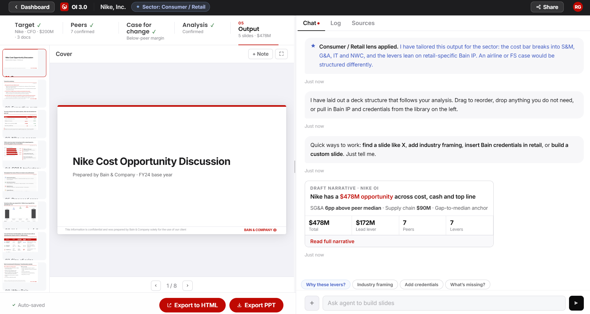

# Screen 05: Output & Deck Builder

[View in Confluence](https://bainco.atlassian.net/wiki/spaces/OI30/pages/19710705698)

Stage 5 of 5. Unlocks after the Partner confirms the lever set in Screen 04. The Partner arrives here to review, edit, and export the CEO-ready opportunity discussion deck. The screen opens in slide review mode: a two-column layout with the slide canvas on the left and the chat panel on the right.

**What is shown on screen:**

- Slide canvas: slide thumbnail sidebar (left strip), main slide canvas (16:9, Bain-styled slides), slide title toolbar with Note and Fullscreen buttons, review flag card (agent-raised, amber), slide prev/next navigation with count.

- CEO deck (GLS prototype — 8 slides): Cover, Executive summary, Peer position, SG&A trajectory, Proposed approach, Value waterfall, Size of prize, Why Bain. Each slide renders: title, red horizontal line beneath title, body content (table / bar chart / assertion bullets), confidence label top-right where applicable, source footnote, Bain confidentiality footer.

- Chat panel (right column): Chat tab (RAG-grounded agent messages, suggestion chips, attach, draft narrative card, talking points card), Log tab (timestamped audit trail with filter chips), Sources tab (live source list with confidence badges and Refresh).

- Proceed bar: sticky bottom bar with auto-saved label, Export PPT button, Export to HTML button.

HTML:

| **Data Displayed**  | **Source**  | **Calculation / Logic**  | **UX / Interaction (Raema)**  | **Agent / System Behaviour (Nikolozi)**  |
| **⚠ **Slide canvas renders a fixed illustrative CEO deck in the GLS prototype. In production, slides are generated from the confirmed Screen 04 data model.  |
| **⚠ **Sticky notes: confirmed priority feature (UX workshop). No sticky note UI rendered in current prototype — design and implementation approach TBC with Joanna / Raema.  |
| **⚠ **Deck Builder view (slide library, drag-to-reorder, Bain slides from Sage panel) is not rendered in the current prototype (view-11, display:none, commented "removed for MVP"). Documented separately as future state. Not in GLS scope.  |
| **SLIDE CANVAS**  |
| Slide sidebar (thumbnail strip)  | System (slide set)  | Thumbnails rendered from the active slide set. One thumbnail per slide. Active slide highlighted.  | Left strip of thumbnails. Click to jump to slide. Active slide highlighted. Thumbnails render a mini version of each slide.  | Builds thumbnail strip from same slide data used for main canvas. Active index tracked and highlighted.  |
| Slide canvas (main slide display)  | Analysis output (Screen 04) + Company filings / Capital IQ + Bain IP (Sage / Iris)  | Active slide rendered in canvas. In production: slide content drawn from confirmed Screen 04 data model. In GLS prototype: fixed illustrative CEO deck rendered from hardcoded slide data.  | Full-width slide canvas, 16:9 aspect ratio. Slides rendered as styled HTML. Fullscreen button available. Note button adds a note overlay.  | Renders active slide via render() function. Fullscreen toggle and note overlay driven by agent-injected state.  |
| Slide title (toolbar above canvas)  | System (slide set)  | Title string from each slide definition. Updated on navigation.  | Displayed in toolbar above canvas. Updates on slide change.  | Reads slide title from active slide set and updates toolbar element.  |
| Review flag (amber card, slide-specific)  | Agent (LLM-generated)  | Agent detects inconsistencies between slide content and confirmed Analysis data model — e.g. lever order on a slide differs from confirmed ranking. Generates a flag with slide reference, issue description, and action buttons.  | Rendered in chat panel as amber flag card with slide reference, issue description, and two action buttons (e.g. "Reorder" / "Keep order"). Partner selects resolution.  | Agent compares slide content against confirmed Analysis output on deck generation. Flags raised proactively. Also, agent catches any deviations within the slide outputs, using a specific set of instructions (skill.md) file. Agent executes Partner resolution choice and records action in Log.  |
| Slide navigation (prev / next buttons + slide count)  | System (session state)  | Current slide index and total slide count. Displayed as "N / total". Prev/next buttons decrement/increment index with wraparound.  | Navigation strip below canvas. Prev/next arrow buttons. Slide count shown (e.g. "1 / 8").  | Updates current slide index on button press. Wraps at boundaries.  |
| **CEO DECK SLIDES — STRUCTURE (GLS: 8 slides)**  |
| Slide 1 — Cover Company name and engagement title (large), prepared-by line (Bain & Company · FY[N] base year), Bain confidentiality footer.  | OI record (Screen 01) + System  | Company name and engagement context from OI record. Base year from analysis date. No financial data on this slide.  | Full-bleed cover layout. Thin red bar at top of slide. Title large. Prepared-by line small.  | Populated from OI record on deck generation. Base year resolved from most recent fiscal year / YTD, interim period (last 3,6,9 months) in confirmed data.  |
| Slide 2 — Executive summary Confidence label top-right (e.g. DRAFT — not yet confirmed by Partner). Red horizontal line beneath slide title. 3–4 red bold assertion bullets each with 2 black sub-bullets. Bain confidentiality footer.  | Analysis output (Screen 04) + Company filings / Capital IQ + Bain IP (Sage / Iris)  | LLM synthesis of confirmed Analysis output. Assertions cover: performance inflection signal, near-term margin risk, strategic direction, total opportunity ($M lo–hi range across 4 levers). Sub-bullets drawn from Screen 04 confirmed values.  | Assertions in red bold. Sub-bullets in black. Editable via chat. Partner can request rewrites.  | Agent generates exec summary on entering Screen 05. Regenerates if Partner changes lever set or sizing in Screen 04. Confidence label set to DRAFT until Partner confirms.  |
| Slide 3 — Peer position Confidence label top-right (OUTSIDE-IN — based on external benchmarking). Red horizontal line beneath slide title. Comparison table: Measure / Target / Peer median. Rows: 3-year TSR, SG&A % revenue, SG&A vs revenue growth (CAGR gap), NWC days. Agent-generated insight callout box below table. Bain confidentiality footer.  | Company filings / Capital IQ + Analysis output (Screen 04)  | 3-year TSR: compound return, target vs peer median. SG&A % revenue: adjusted SG&A / revenue, target and peer median. SG&A CAGR gap: target SG&A CAGR minus revenue CAGR vs peer median equivalent. NWC days: target NWC days vs peer median. All figures adjusted (non-recurring items stripped, Screen 02 methodology). Peer median from confirmed peer set. Callout box: agent-generated insight (1–2 sentences) identifying the most significant finding from the peer metrics on this slide — e.g. the target's TSR rank within the peer set, what is driving the performance gap (multiple compression vs earnings weakness), and whether the pattern signals a structural problem or a soft period. Data inputs: the peer metrics already rendered on the slide. Framed as the "so what" for a CFO audience.  | Table header row in red. Target column values in red bold. Peer median values in green. Callout box beneath table — styled as a highlighted panel, not a data cell.  | Reads adjusted metrics from confirmed Screen 02 / Screen 04 data model. Must not recalculate peer metrics from scratch — values identical to Screen 02 confirmed figures. Callout insight generated by LLM from the rendered peer metrics on deck generation. Regenerates if peer set or lever values change.  |
| Slide 4 — SG&A trajectory Confidence label top-right (OUTSIDE-IN). Red horizontal line beneath slide title. Horizontal bar chart: SG&A % revenue by year, target in red, peer median as green vertical marker. 3 callout boxes (bold assertion heading + grey sub-text). Source footnote.  | Company filings / Capital IQ + Analysis output (Screen 04)  | SG&A % revenue: target and peer median for each year in the analysis window (e.g. FY21–FY24). SG&A CAGR vs revenue CAGR over the window. Year-by-year gap widening (pp). Peer median from confirmed peer set (Screen 02).  | Bar represents target SG&A %. Green vertical marker represents peer median for that year. Callout boxes to the right with bold assertion heading and grey sub-text. Source footnote auto-generated.  | Reads SG&A % time series from Capital IQ. Peer median values from Screen 02 confirmed data model. Callout box assertion text generated by LLM from underlying values.  |
| Slide 5 — Proposed approach Red horizontal line beneath slide title. 4 rows, each with a lettered circle badge (A/B/C/D), bucket name in bold, and grey descriptive sub-text. Bain confidentiality footer.  | Analysis output (Screen 04) + Bain IP (Sage / Iris)  | Four transformation buckets from Screen 04 CPT table: Commercial Excellence (A), Operational Excellence (B), SG&A Efficiency (C), Capital Efficiency (D). Each with colour-coded circle badge and descriptive sub-text drawn from confirmed sub-levers.  | Each row has a lettered circle badge (colour per bucket: A=blue, B=green, C=red, D=amber), bold bucket name, grey sub-text with lever examples. Layout stacks vertically. Editable via chat.  | Reads confirmed bucket set from Screen 04. Sub-text generated by LLM from confirmed sub-lever names. Circle badge colours assigned by bucket per convention.  |
| Slide 6 — Value waterfall (EBITDA bridge) Confidence label top-right (DIRECTIONAL — indicative sizing, not yet validated). Red horizontal line beneath slide title. Waterfall bar chart: baseline EBITDA → lever bars → full-potential EBITDA. EBITDA margin % row beneath bars. One-off cash callout in amber box. Assumptions in grey box. Source footnote.  | Analysis output (Screen 04) + Company filings / Capital IQ  | Baseline EBITDA: from most recent fiscal year, reported. Lever bars: opportunity $M per bucket (mid-point of lo–hi range from Screen 04). Full-potential EBITDA: baseline + sum of lever mid-points. EBITDA % row: baseline margin %, per-lever pp uplift range, full-potential margin range. One-off cash shown separately below chart — not added to EBITDA bar (does not carry an earnings multiple). Assumptions: % of peer gap closed, pricing recovery, NWC days reduction.  | Waterfall bars colour-coded by bucket. EBITDA % row beneath bars. One-off cash callout in amber box. Assumptions in grey box. Partner can request scenario adjustments via chat.  | Reads confirmed Screen 04 opportunity values. Baseline EBITDA from Capital IQ (adjusted). Full-potential computed as baseline + sum of enabled lever mid-points. Assumptions text generated from confirmed Screen 04 sizing inputs.  |
| Slide 7 — Size of prize table Confidence label top-right (OUTSIDE-IN). Red horizontal line beneath slide title. 5-column table: circle badge, Value lever, Baseline, Potential uplift, Opportunity $M, Example levers. Total row in red. Source footnote.  | Analysis output (Screen 04) + Company filings / Capital IQ + Bain IP (Sage / Iris)  | One row per transformation bucket (A/B/C/D). Baseline: relevant cost or revenue figure from Capital IQ for that bucket. Potential uplift: % improvement range. Opportunity $M: lo–hi range from confirmed Screen 04 sub-lever outputs. Example levers: named sub-levers from confirmed Screen 04 lever set. Total row: sum of lo and hi ranges across all enabled buckets, displayed as "$[lo]–[hi]M Recurring" with one-off cash shown separately in italic. Source footnote references CapIQ, company reports, Bain benchmarking.  | Table header in red. Rows alternate white/grey. Circle badges colour-coded by bucket. Total row in red bold. One-off cash shown in italic below total. Source footnote auto-generated.  | Reads confirmed Screen 04 opportunity lo/hi values per bucket. Baseline figures from Capital IQ. Example levers pulled from confirmed sub-lever names. Total computed by summing enabled bucket ranges.  |
| Slide 8 — Why Bain Red horizontal line beneath slide title. Two-column layout: Bain APT description (bullet list, red) and "Still the same Bain" (bullet list, grey). Source placeholder footnote.  | Bain IP (Sage / Iris)  | Bain Accelerated Performance Transformation (APT) description: standard Bain content, queried from Sage and inserted with limited customisation. "Still the same Bain" column: standard Bain positioning language.  | Two-column layout. Left: APT bullet list in red. Right: Bain positioning bullet list in grey. Editable via chat.  | Agent queries Sage for relevant Bain credentials and APT description at deck generation. Minimal customisation for GLS — sector-specific credentials surfaced where available.  |
| **SLIDE FOOTER (ALL SLIDES)**  |
| Source footnote (per slide)  | Derived from data provenance log  | Auto-generated from data sources used in that slide. Lists Capital IQ, company reports, Bain benchmarking as applicable. Confidence label not shown on slide footer — shown in Sources tab only.  | Auto-populated in footer area of each slide. Partner can edit via chat.  | Agent generates footnote from data provenance log on deck generation. Re-generates if slide content changes.  |
| Bain confidentiality footer  | System  | Fixed text: "This information is confidential and was prepared by Bain & Company solely for the use of our client." Page number in red on the right (Bain & Company ⊕ [n]).  | Rendered at bottom of every slide. Not editable.  | Inserted automatically on all slides. Page number increments from 1.  |
| **CHAT PANEL — CHAT / LOG / SOURCES TABS**  |
| Chat tab (agent messages, Partner messages, typing indicator, suggestion chips, attach button)  | Analysis output (Screen 04) + Bain IP (Sage / Iris) + Partner-uploaded files  | RAG retrieval scope: full confirmed Screen 04 data model (all sub-lever values, sizing inputs, peer benchmarks), Sage slide library indexed by sector / topic / lever type, source footnotes and data provenance per slide, exec summary draft and slide text. Retrieval triggered by Partner slide request or question. Suggestion chips shown in prototype: "Why these levers?", "Industry framing", "Add credentials", "What's missing?"  | Agent messages on left, Partner on right. Typing indicator while processing. Suggestion chips below input. Attach button in input row for file upload — uploaded files appear in Sources tab automatically.  | Uses retrieved context to: add, edit, or remove slides on Partner instruction; rewrite exec summary or slide text; search Sage slide library; answer questions about why a number appears on a slide; make final narrative adjustments before export. Slide changes recorded in Log.  |
| Draft narrative card (in chat, expandable)  | Analysis output (Screen 04)  | LLM synthesis: answer-first headline with total opportunity $M, 4 KPI tiles (total $M, lead lever $M, peer count, lever count), expandable full narrative with lever breakdown badges (green for leading levers, amber for supporting). Narrative uses P&L framing anchored to peer median.  | Rendered as a card in the chat panel. Headline and KPI tiles visible by default. "Read full narrative" / "Close narrative" toggle expands body. Lever badges shown in expanded view.  | Agent generates narrative on entering Screen 05. Lever badges drawn from confirmed Screen 04 lever set and opportunity values. Regenerates if lever set changes.  |
| Talking points card (in chat, audience-specific)  | Analysis output (Screen 04) + Bain IP (Sage / Iris)  | LLM-generated set of talking points anchored to the total $M and peer benchmark. Framed for the meeting context set in Screen 01 (e.g. CFO). "View points" button expands full list.  | "Talking points · [meeting context]" label. Brief description sentence. "View points" button. Rendered as a message card in chat.  | Generated on deck build. Meeting context (CFO / CEO / Board) read from Screen 01 target setup. Talking points anchored to confirmed Screen 04 values.  |
| Log tab (timestamped audit trail — Agent / Partner / System / Collaborator)  | System  | Each entry records: actor type, action description, timestamp. Four actor types: System, Agent, Partner/You, Collaborator. Entries immutable once written. Filter chips: All, Partner, Collaborator, Agent, Overrides, Flags.  | Entries in reverse chronological order. Colour-coded dot per actor type (red = Partner, green = Agent, grey = System). Filter chips at top. Actor label + action text + timestamp per entry.  | Agent automatically records every action — deck generation, slide changes, narrative rewrites, source refreshes, lever overrides. Collaborator actions also recorded. Log persists for full OI session.  |
| Sources tab (source name, detail, last updated, confidence badge, Refresh button)  | Company filings / Capital IQ + Bain IP (Sage / Iris) + LSEG + Partner-uploaded files  | Sources shown: Capital IQ (financial data), company annual reports / 10-K filings, Bain experience benchmarks, peer company filings (one row per adjusted peer), LSEG (qualitative signals only — not a financial fallback), Partner-uploaded files. Confidence badge (High / Medium): High = reported Capital IQ or filed data; Medium = estimated or inferred figures. Source count shown at top.  | Source count at top (e.g. "7 active sources"). One row per source: icon, name, detail line, last updated date, confidence badge. Uploaded files shown separately above main list. Refresh button per source.  | Maintains source list automatically. Sources added when data is loaded and when Partner uploads files via chat attach. Refresh re-pulls latest data from Capital IQ and re-evaluates confidence. Flags any benchmark changes vs Screen 02 confirmed values.  |
| **PROCEED BAR**  |
| Proceed bar (auto-saved label + export buttons)  | System  | Auto-saved status shown. Two export actions: "Export PPT" (generates PPTX file) and "Export to HTML" (browser-renderable version). Both shown as red primary buttons. Bain internal format retains full working detail, confidence flags, and source audit. Client-ready format strips internal notes and softens language (agent action on export).  | "Auto-saved" label in grey with green check. Export buttons right-aligned. Sticky at bottom of screen throughout Screen 05.  | "Export PPT" triggers PPTX generation from confirmed slide set. "Export to HTML" generates standalone HTML version. Agent confirms format (Bain internal vs client-ready) and delivers file. Client-ready export removes confidence flags, strips internal notes, softens language for external audience — flagged for Partner sign-off before sending.  |
