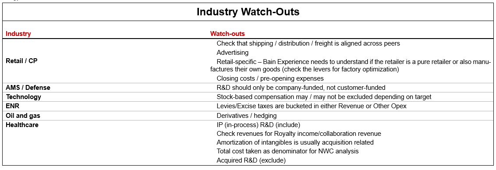

# Data sources from Current OI

[View in Confluence](https://bainco.atlassian.net/wiki/spaces/OI30/pages/19727482890)

**A. Industry Watch-Outs**

**B. These 3 files are:**

1. **Past OI peer excel which has the target OI’s and their peers covered**
1. **Industry/Sector Map they use in A1 OI**
1. ** Levers Library which is a compendium of various Bain experience profiles across different target companies under different sectors**

**C. Claude skill **that builds a Bain-formatted Excel workbook that walks a company's official GAAP profit figures to its adjusted EBIT/EBITDA, line by line, sourced from official filings. It directly supports the peer benchmarking logic in OI 3.0 — specifically the adjustment methodology in Screen 02 and Screen 04, where reported peer financials need to be normalised before comparison. Ensures the adjusted baseline is traceable, tied out to published figures, and defensible to Partners**:**

**D. A full universe of companies that Noah wants to be able to use in GLS / MVP milestone**

**E. Files with adjustment formula (used by Akhil in the Data Calculations discussion during workshop)**

**F. Examples of what "look good" for cost bar breakdowns and some of the nuances between industries **

**G. Opportunity Indicator Onboarding Deck**
