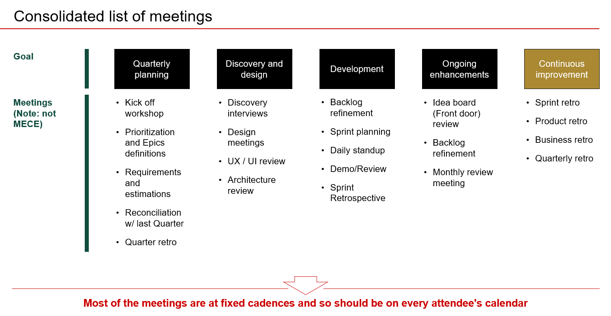
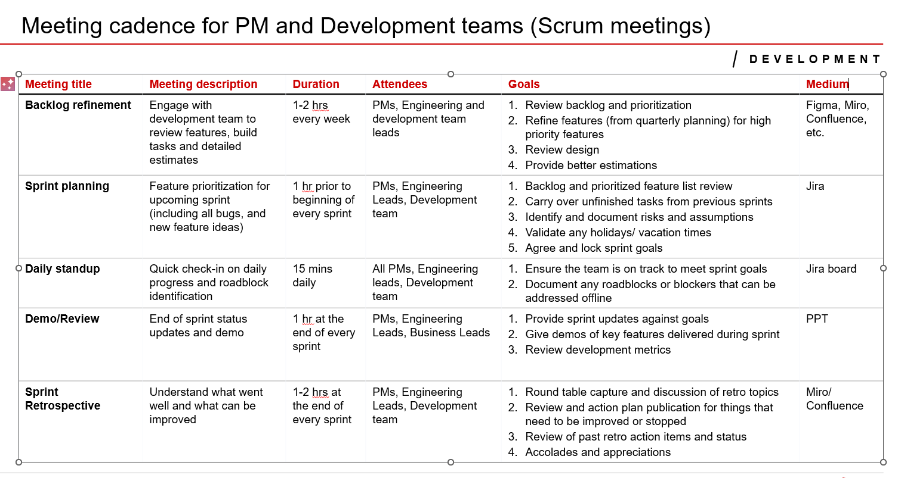
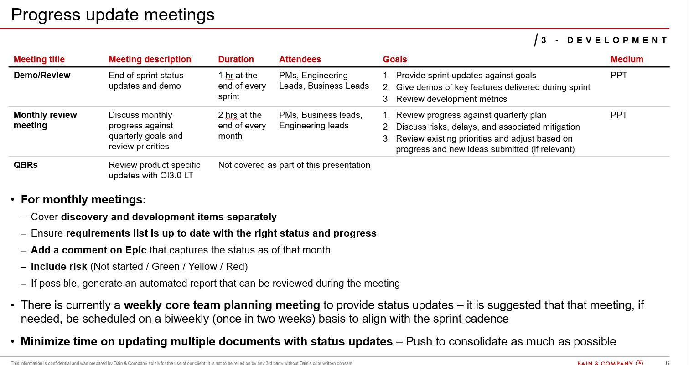

# Meetings overview

[View in Confluence](https://bainco.atlassian.net/wiki/spaces/OI30/pages/19618889880)

Discovery one off

| **Meeting**  | **Goal**  | **Attendees**  | **Duration **  | **Agenda owner**  |
|---|---|---|---|---|
| Kick off  | Vision overview  | Stakeholders Bain Bain Tech LT SN team  | 1h  | Kasia  |
| UX discovery review  | Review of findings of UX discovery and user interviews  | Stakeholders Bain Tech LT SN representatives Keep the group up to 7 people to keep it efficient  | 1h  | Joanna  |
| Data overview  | What we know about data so far  | Bain Tech LT SN representatives  | 1h  | Michelle  |

Re-occuring Scrum Meetings

| **Meeting**  | **Attendees**  | **Cadence**  | **Agenda owner**  |
|---|---|---|---|
| Daily stand up  | SN + Bain  | Alternating morning APAC +9am UK  | Scrum Master from SN  |
| Planning  | SN + Bain  | every two weeks 1h  | Scrum Master  |
| Grooming  | SN + Bain  | every two weeks 1h  | Scrum Master  |
| Prioritisation  | SN + Bain  | every two weeks 1h  | Scrum Master  |
| Retro  | SN + Bain  | every two weeks 1h  | Scrum Master  |
| Jira tickets review  | PM + Scrum Master + Architect  | once a week  | Scrum Master  |

For discussion:

