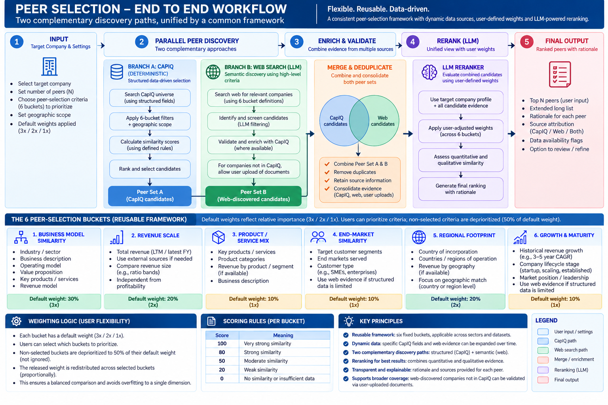

# Peer Selection Capability

[View in Confluence](https://bainco.atlassian.net/wiki/spaces/OI30/pages/19809534070)

## **Peer selection methodology overview**

The methodology is designed to be **reusable across different companies, sectors, and future CapIQ datasets**. The high-level peer-selection framework remains stable, while the specific underlying fields and evidence can evolve as richer data becomes available.

- The framework uses six peer-selection buckets: Business Model Similarity, Revenue Scale, Product / Service Mix, End-Market Similarity, Regional Footprint, and Growth & Maturity.
- Each bucket has a **default weight**, but users can define which buckets they want to prioritize.
- Selected criteria receive more weight, while non-selected criteria are **deprioritized rather than ignored**, preserving a balanced comparison.
- The current CapIQ Excel files provide the initial field set, but the numerical and categorical fields within each bucket can be enriched over time without changing the overall methodology.
- Peer discovery combines a deterministic CapIQ-based approach andGenAI/web search ranking, followed by enrichment and reranking to produce the final peer set.

For further context, please refer to “End-to-end workflow (diagram)” / “Practical application - Peer Selection & Ranking” chapters.

## End-to-end workflow (diagram)



## Practical application - Peer Selection & Ranking

## 1. Overall approach

The peer-selection methodology uses a **fixed six-bucket comparability framework**, while the underlying evidence, user priorities, and data sources remain dynamic.

The six peer-selection buckets are:

1. Business Model Similarity
1. Revenue Scale
1. Product / Service Mix
1. End-Market Similarity
1. Regional Footprint
1. Growth & Maturity

The methodology now uses **two parallel peer-discovery approaches**:

**A. CapIQ deterministic peer selection**

Uses structured CapIQ data and mapped hierarchical fields to calculate deterministic similarity scores across the six buckets.

**B. LLM + web peer discovery**

Uses the six high-level peer-selection buckets directly to identify relevant peers through web search. This route is not dependent on the exact CapIQ column structure.

The two peer sets are subsequently **combined, enriched and reranked** to produce the final peer recommendation.

# 2. Default weights

The starting weights remain:

| Bucket  | Relative importance  | Default weight  |
|---|---|---|
| Business Model Similarity  | 3x  | 30%  |
| Revenue Scale  | 2x  | 20%  |
| Product / Service Mix  | 1x  | 10%  |
| End-Market Similarity  | 1x  | 10%  |
| Regional Footprint  | 2x  | 20%  |
| Growth & Maturity  | 1x  | 10%  |
| **Total**  | **10x**  | **100%**  |

These weights represent the default case when the user prioritizes **all six criteria**.

# 3. Dynamic weighting based on user selection

The user can select any combination of the six criteria.

A criterion that is not selected is **not ignored**.

Instead, it is **deprioritized by reducing its default weight by 50%**.

For example:

- Business Model: 30% → 15%
- Revenue: 20% → 10%
- Product Mix: 10% → 5%
- End Market: 10% → 5%
- Regional Footprint: 20% → 10%
- Growth & Maturity: 10% → 5%

The weight released from the non-selected criteria is redistributed across the criteria the user did select, **proportionally to their original default weights**.

This ensures that:

>

User selection changes emphasis, not eligibility.

All six dimensions continue to influence the final peer result.

### Example: user selects only Business Model Similarity

All other buckets are reduced to 50% of their default weights:

| Bucket  | Adjusted weight  |
|---|---|
| Business Model Similarity  | **65%**  |
| Revenue Scale  | 10%  |
| Product / Service Mix  | 5%  |
| End-Market Similarity  | 5%  |
| Regional Footprint  | 10%  |
| Growth & Maturity  | 5%  |
| **Total**  | **100%**  |

Business Model therefore becomes significantly more important, but the other dimensions continue to act as safeguards against selecting peers that are clearly inappropriate on scale, geography, product mix or maturity.

If all six criteria are selected, no criteria are deprioritized and the model returns to the original **30 / 20 / 10 / 10 / 20 / 10** weights.

# 4. User defines the peer-selection context

The process begins on the Target Setup screen.

The user provides:

- Target company
- Requested number of peers
- Peer-selection criteria / priorities
- Geographic scope

The selected geographic scope is used to constrain the relevant candidate universe.

This is separate from **Regional Footprint similarity**, which assesses how comparable the operating footprints of the target and peer are.

# 5. Path A: Deterministic CapIQ peer selection

The first peer-discovery path uses CapIQ exclusively.

## 5.1 Build target CapIQ profile

Start from the target company’s CapIQ ID and retrieve the structured fields mapped to the six peer-selection buckets.

The exact CapIQ fields may evolve as the dataset becomes richer, but the six peer-selection buckets remain fixed.

Conceptually:

**CapIQ fields → six standardized buckets → deterministic similarity scores**

Examples include:

- Business descriptions and industry hierarchy → Business Model Similarity
- Revenue → Revenue Scale
- Business segments and segment revenue → Product / Service Mix
- Target segment / relevant segment information → End-Market Similarity
- Geographic segments and geographic revenue → Regional Footprint
- Revenue growth, margins and development information → Growth & Maturity

## 5.2 Generate CapIQ candidate universe

Apply:

**Six bucketed comparability metrics + geographic scope**

to the available CapIQ universe.

The objective is to generate a structured candidate list without requiring LLM interpretation.

## 5.3 Deterministic bucket scoring

Each candidate receives a score for the relevant structured CapIQ evidence.

Use the existing simple similarity scale:

| Score  | Meaning  |
|---|---|
| 100  | Very strong similarity  |
| 80  | Strong similarity  |
| 50  | Moderate similarity  |
| 20  | Weak similarity  |
| 0  | No similarity / unavailable data  |

The underlying calculation should remain deterministic wherever possible.

For example:

**Revenue Scale**

Candidate Revenue ÷ Target Revenue
→ similarity band
→ bucket score

**Product / Service Mix**

Business-segment revenue overlap
→ similarity band
→ bucket score

**Regional Footprint**

Geographic exposure overlap
→ similarity band
→ bucket score

The adjusted user weights are then applied to the six bucket scores.

This produces:

>

**Peer Set A: CapIQ deterministic peers**

The score and underlying field-level evidence remain fully traceable.

# 6. Path B: LLM + web peer discovery

The second path operates independently from the CapIQ candidate-selection engine.

Instead of searching based on specific CapIQ fields, the LLM searches using the **meaning of the six high-level buckets**.

For example:

### Business Model Similarity

Search for companies with comparable:

- operating models
- monetization models
- value propositions
- channel models
- customer relationships
- manufacturing / service structures

### Product / Service Mix

Search for companies offering comparable:

- product categories
- service categories
- portfolio structure
- segment mix

### End-Market Similarity

Search for companies serving comparable:

- customer groups
- industries
- use cases
- customer segments

### Regional Footprint

Search for companies operating across comparable markets.

### Growth & Maturity

Consider:

- growth trajectory
- company lifecycle
- market position
- scaling versus established business characteristics

The web-search methodology therefore searches for companies that are **conceptually comparable to the target**, rather than companies that merely happen to match a particular CapIQ field.

This produces:

>

**Peer Set B: LLM / web-discovered peers**

# 7. Validate and enrich web-discovered peers with CapIQ

Once Peer Set B has been identified, the system attempts to match each web-discovered company back to CapIQ.

### Company available in CapIQ

If the company can be identified in CapIQ:

- retrieve the relevant structured CapIQ information;
- populate the six buckets where available;
- attach the CapIQ ID;
- retain the web evidence that led to the peer being identified.

The result becomes:

>

**LLM-discovered + CapIQ-enriched peer**

This is important because web search provides strong semantic discovery, while CapIQ provides standardized structured evidence for validation and comparison.

## 7.1 Company not available in CapIQ

A company identified through web search should **not automatically be discarded simply because it cannot be located in CapIQ**.

Instead:

>

The user can upload a custom document for further validation.

Examples could include:

- company annual reports
- investor presentations
- company profiles
- private-company information
- other validated business documents

The uploaded evidence can then be used to validate the company across the six peer-selection buckets.

Such companies should remain clearly flagged as:

>

**Web-discovered / non-CapIQ peer**

with the evidence source shown to the user.

This is particularly relevant for private companies or companies with incomplete CapIQ coverage.

# 8. Combine Peer Set A and Peer Set B

At this stage the system has two candidate pools:

### Peer Set A

Deterministically selected from CapIQ using structured fields.

### Peer Set B

Semantically identified through LLM/web search and subsequently enriched with:

- CapIQ where available; or
- user-provided validation documents where CapIQ is unavailable.

The two pools are combined and duplicates are resolved.

A company may therefore appear through both mechanisms.

This is a useful signal rather than a problem:

>

A company independently identified by both CapIQ and web search has both structured and semantic evidence supporting its relevance.

# 9. LLM reranking

The combined peer universe is passed to the reranker.

The reranker receives:

- Target-company information
- Peer Set A
- Peer Set B
- CapIQ evidence
- Web evidence
- User-uploaded validation evidence where applicable
- User-adjusted bucket weights

The reranker evaluates the combined evidence using the same six standardized peer-selection buckets.

Its purpose is **not to replace the deterministic CapIQ score**.

Rather, it adds a second layer that can:

- identify peers missed by structured screening;
- interpret narrative and qualitative evidence;
- enrich the rationale behind CapIQ-selected peers;
- resolve differences between structured and semantic evidence;
- rerank the combined candidate pool according to the user’s priorities.

For example, a company may score strongly in CapIQ because of industry, revenue and geography, while web evidence shows that its actual operating model is materially different from the target.

Conversely, web search may identify an excellent business-model peer whose structured CapIQ classification differs slightly from the target.

The reranker allows both types of evidence to be considered.

# 10. Final peer output

The final output contains:

- Ranked Top N peers
- Extended long list
- Peer origin:
  - CapIQ
  - Web
  - Both
- Evidence sources
- Six-bucket comparison
- Data availability / missing-data flags
- Rationale for selection

The rationale should reflect the criteria the user prioritized.

For example, if the user has strongly prioritized Business Model:

>

Strong peer because both companies operate comparable asset-light B2B platforms with similar customer propositions and channel structures. Revenue and geographic footprint are also reasonably comparable, although less influential in this selection.

If Revenue + Regional Footprint are prioritized:

>

Strong peer because the company operates at a comparable revenue scale and has a highly similar North America / Europe / APAC footprint. Business-model similarity is positive but not the primary reason for its position.

# 11. Missing data

Missing information and user preference remain separate concepts.

### User does not prioritize a criterion

The criterion remains active, but:

>

**its default weight is reduced by 50%.**

Its weight is not reduced to zero.

### Data cannot be found

The criterion retains its applicable adjusted weight.

For the CapIQ deterministic score:

>

**Missing data = 0 + Missing Data flag**

The weight is not redistributed simply because the evidence is missing.

For the final combined workflow, the system can still attempt to obtain evidence through:

- web search;
- CapIQ enrichment;
- user-uploaded documents.

If the evidence remains unavailable after all applicable sources have been checked, the missing-data flag remains visible.

# 12. End-to-end workflow

```
TARGET SETUP
Target company
+ Number of peers
+ Comparability criteria
+ Geographic scope
        |
        v
------------------------------------------------
|                                              |
|                                              |
v                                              v

PATH A                                        PATH B

CAPIQ                                         LLM / WEB SEARCH
6 bucketed structured metrics                6 high-level buckets
+ geographic scope                           + geographic scope
        |                                              |
        v                                              v
Candidate universe                            Web candidate universe
        |                                              |
        v                                              v
Deterministic scoring                         Peer Set B
        |                                              |
        v                                              v
Peer Set A                                    CAPIQ MATCH?
                                                       |
                                              +--------+--------+
                                              |                 |
                                             YES                NO
                                              |                 |
                                              v                 v
                                       Add CapIQ evidence   User may upload
                                                          validation document
                                              |                 |
                                              +--------+--------+
                                                       |
                                                       v

                             COMBINE PEER SET A + PEER SET B
                                           |
                                           v
                                   REMOVE DUPLICATES
                                           |
                                           v
                                      LLM RERANKER
                                           |
                        Target + all peers + evidence
                             + adjusted user weights
                                           |
                                           v
                                   FINAL PEER SET
                                      + LONG LIST
                                      + RATIONALE
```

# Key rules

### Fixed buckets, dynamic evidence

The six peer-selection buckets remain fixed.

The exact structured fields, web evidence and validation sources underneath them can evolve.

### CapIQ and web search are complementary

Web search is **not simply a fallback for missing CapIQ information**.

Both approaches independently contribute to candidate discovery.

### Structured search + semantic search

CapIQ provides:

- scale
- standardization
- deterministic calculation
- traceability

Web search provides:

- semantic business-model understanding
- qualitative evidence
- discovery beyond structured classifications
- broader private-company coverage

### User priority ≠ exclusion

Not-selected criteria remain part of the model at **50% of their default weight**.

### Missing ≠ deprioritized

Missing evidence does not change the applicable criterion weight.

### Web-only peers can remain eligible

A company does not need to exist in CapIQ to remain a potential peer.

Where CapIQ coverage is unavailable, user-uploaded documents can provide additional validation.

### Reranking is the final synthesis layer

The reranker brings together:

>

**structured CapIQ similarity + semantic web discovery + user priorities**

to generate the final peer set.
