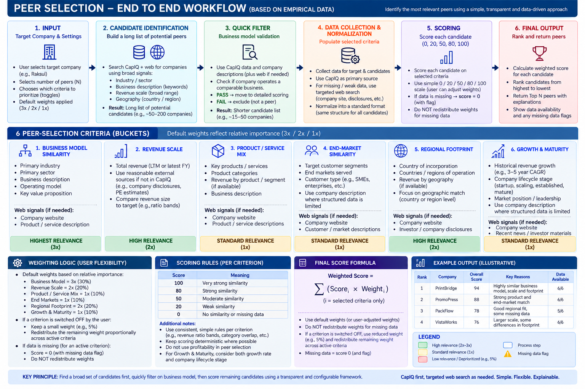

# Peer Selection Capability

[View in Confluence](https://bainco.atlassian.net/wiki/spaces/OI30/pages/19809534070)

## **Overall Approach (for sprint 1 & 2, before API access)**

Due to CapIQ data availability, for now, we can proceed with the **existing CapIQ Excel extracts, ** converting them into a **Parquet-based dataset indexed by CapIQ ID** rather than waiting for API access or building a full taxonomy upfront. The workflow has two stages: **(1) identify the most relevant peer candidates within the CapIQ universe using OpenAI-powered search**, and **(2) consolidate available CapIQ fields into a fixed set of peer-selection buckets aligned with the latest Figma UI/UX, then calculate a comparable peer score and rank them by relevance in a descending order**. The underlying metrics remain dynamic: **CapIQ is the primary data source**, and where required information for a specific company/bucket is missing or insufficient, the engine selectively triggers **web search as a fallback**. This keeps the methodology consistent while minimizing unnecessary web-search cost and latency.

*Output: Top N (user input) peer recommendations on the user with justification on the rationale for selection*

Please take a look at the underlying logic below:

## End-to-end workflow

*IMPORTANT NOTE: THE WEIGHT IN THE ONE-PAGER CARRY AN ILLUSTRATIVE IMPORTANCE.*

*USER SETTING THE CUSTOM WEIGHTS NOT TO BE ALLOWED NOW.*



## A practical use-case with this system of peer selection & ranking

**Example target: Raksul Inc.**
User asks: **“Find the 3 most relevant peers for Raksul.”**

The methodology has a fixed peer-selection framework, while the criteria prioritized by the user, underlying metrics, and data sources are dynamic.

**Default principle:** the six peer-selection buckets do not have equal importance. Each bucket starts with a simple relative importance factor - (weights are directional).

| Bucket  | Relative importance  | Starting weight  |
|---|---|---|
| Business Model Similarity  | 3x  | 30%  |
| Revenue Scale  | 2x  | 20%  |
| Product / Service Mix  | 1x  | 10%  |
| End-Market Similarity  | 1x  | 10%  |
| Regional Footprint  | 2x  | 20%  |
| Growth & Maturity  | 1x  | 10%  |
| **Total**  | **10x**  | **100%**  |

The calculation is simply:

**Bucket Weight = Bucket Importance Points ÷ Total Importance Points**

For example:

**Business Model = 3 ÷ 10 = 30%**

This provides differentiated starting weights without introducing a complicated weighting algorithm.

# 1. User defines the peer-selection context

The user selects the target company and configures which peer-selection criteria matter most through the toggles in the Peer Set Selection Context screen.

The six available buckets are:

1. Business Model Similarity
1. Revenue Scale
1. Product / Service Mix
1. End-Market Similarity
1. Regional Footprint
1. Growth & Maturity

### Starting weights

| Bucket  | User Selection  | Starting Weight  |
|---|---|---|
| Business Model  | ON  | 30%  |
| Revenue Scale  | ON  | 20%  |
| Product Mix  | ON  | 10%  |
| End Markets  | ON  | 10%  |
| Regional Footprint  | ON  | 20%  |
| Growth & Maturity  | ON  | 10%  |

### What happens if the user switches a bucket OFF?

A bucket switched OFF is **deprioritized, not ignored**.

For the initial methodology, use a simple rule:

**Deprioritized bucket = 5% residual weight**

The remaining weight is redistributed proportionally across the buckets the user has prioritized.

For example, if **End Markets** is switched OFF:

| Bucket  | Treatment  | Adjusted Weight  |
|---|---|---|
| Business Model  | Priority  | 31.7%  |
| Revenue Scale  | Priority  | 21.1%  |
| Product Mix  | Priority  | 10.6%  |
| End Markets  | Deprioritized  | 5.0%  |
| Regional Footprint  | Priority  | 21.1%  |
| Growth & Maturity  | Priority  | 10.6%  |
| **Total**  |  | **100%**  |

The objective is that a user choice changes the emphasis of peer selection without making one potentially useful dimension completely disappear.

**Important:** Business Model continues to act as the eligibility gate regardless of its final ranking weight. Its toggle changes ranking emphasis, not the initial eligibility test.

# 2. Build the target profile

Start with the target's CapIQ ID and retrieve the latest available information from the CapIQ dataset.

For Raksul, this could produce:

| Bucket  | Example target information  |
|---|---|
| Business Model  | Online B2B commercial printing platform  |
| Revenue Scale  | ~$440m revenue  |
| Product Mix  | Printing, packaging, promotional products  |
| End Markets  | SMEs, marketing teams, e-commerce businesses  |
| Regional Footprint  | Primarily Japan  |
| Growth & Maturity  | Strong historical growth; established/scaling market participant  |

The comparison buckets are standardized, but the evidence underneath them does not need to come from one fixed field.

This gives us:

**Fixed buckets + dynamic underlying metrics / evidence**

### Important changes

**Revenue Scale**

Revenue is assessed independently from profitability.

We intentionally do **not** use EBITDA margin or other profitability measures when deciding whether a company is an appropriate peer.

This avoids selecting companies simply because they currently have similar profitability to the target, which could create survivorship bias and reduce the range of performance improvement opportunities identified later in Opportunity Catalyst.

Revenue can come from:

**CapIQ first → credible alternative source if CapIQ is insufficient**

For example, this could include company disclosures, investor materials, credible third-party estimates, or private-equity/company estimates for private businesses.

**Regional Footprint**

The question is not whether two companies are equally diversified.

The question is:

**“Do the companies operate in comparable geographic markets?”**

Country-level or broader regional information is sufficient.

For example:

Japan
North America
Western Europe
APAC

State-level or other sub-country detail is generally unnecessary.

**End Markets**

End-market information does not always require a dedicated structured CapIQ field.

Where appropriate, the system can derive useful evidence from the company's business description and other descriptive information.

**Growth & Maturity**

Growth should not be assessed purely by comparing Revenue CAGR.

The bucket considers both:

**Growth trajectory + company lifecycle / maturity**

For example:

Startup / early-stage
Scaling / emerging
Transitioning into profitability
Established market participant
Developed market leader
Mature / low-growth business

Historical revenue growth remains an important signal, but it is only one part of this bucket.

# 3. Identify the candidate universe

Search the CapIQ database first to create a broad pool of potentially relevant companies.

Use available signals such as:

**Industry + Sector + Business Description + Geography + Revenue Scale**

The objective here is not to identify the final peers.

It is simply to reduce the overall company universe to a manageable set of plausible candidates.

For example:

**10,000 companies → 75 potential candidates**

These companies are still candidates, not peers.

Where a specifically identified private company is not sufficiently covered by CapIQ, credible outside sources can later be used to populate missing information.

# 4. Run the business-model eligibility check

Before spending compute on full enrichment and scoring, determine whether each candidate fundamentally operates a comparable business.

The core question is:

**“Does this company actually operate a comparable business to Raksul?”**

Use CapIQ information first, including the business description, supplemented by lightweight semantic/web validation where CapIQ is insufficient.

Example:

| Candidate  | Business  | Decision  |
|---|---|---|
| PrintBridge  | Online B2B printing  | ✓ Pass  |
| PromoPress  | Printing + promotional products  | ✓ Pass  |
| VistaWorks  | Online customized printing  | ✓ Pass  |
| PackFlow  | Packaging + printing platform  | ✓ Pass  |
| RailBuild  | Rail transportation  | ✕ Reject  |

This prevents a company from becoming a peer simply because its revenue happens to resemble the target.

For example:

**75 candidates → 15 eligible candidates**

Only these candidates proceed to detailed enrichment and scoring.

Business Model therefore has **two roles**:

1. **Eligibility gate** — fundamentally different companies are removed.

1. **Ranking criterion** — among eligible companies, stronger business-model similarity receives more weight.

# 5. Dynamically populate the peer-selection buckets

Now the system evaluates the six peer-selection buckets for every eligible candidate, while respecting the user's priority settings.

For every candidate and every bucket, it asks:

**Do we have sufficient, relevant and recent information in CapIQ?**

If yes → use CapIQ.

If no → trigger targeted enrichment for that company and that specific bucket.

Example:

| Bucket  | CapIQ Availability  | System Action  |
|---|---|---|
| Business Model  | ✓ Strong  | Use CapIQ  |
| Revenue Scale  | ✓ Strong  | Use CapIQ  |
| Product Mix  | △ Weak  | → Targeted web search  |
| End Markets  | △ Can derive from description  | → Use description / targeted search if needed  |
| Regional Footprint  | ✓ Strong  | Use CapIQ  |
| Growth & Maturity  | △ Partial  | → Enrich maturity / lifecycle evidence  |

The web is therefore not queried for every company and every field.

It acts as an intelligent fallback layer:

**CapIQ first → available descriptions / structured evidence → targeted external source where required**

This reduces unnecessary cost and latency while allowing the methodology to adapt to differences in data availability.

# 6. Handle missing data

After CapIQ and the targeted fallback have both been attempted, some information may still be unavailable.

The rule remains:

**Missing bucket = 0 points + Missing Data flag**

We do not redistribute its weight simply because information cannot be found.

For example, assume the default weights:

| Bucket  | Weight  |
|---|---|
| Business Model  | 30%  |
| Revenue Scale  | 20%  |
| Product Mix  | 10%  |
| End Markets  | 10%  |
| Regional Footprint  | 20%  |
| Growth & Maturity  | 10%  |

If Revenue remains unavailable:

**Revenue Scale Score = 0**

Its **20% remains part of the calculation**.

The other bucket weights do not increase.

This prevents missing information from accidentally making the evidence we happen to have more important.

# 7. Distinguish missing data from user choices

This distinction remains critical.

### User switches a bucket OFF

The criterion is intentionally **deprioritized**.

It remains part of the peer-selection model, but receives only a small residual weight.

For the initial implementation:

**Deprioritized bucket = 5%**

The remaining weights are redistributed proportionally according to the original 3x / 2x / 1x importance ratios.

### User keeps a bucket prioritized, but data cannot be found

The criterion remains fully weighted.

It receives:

**0 points + Missing Data flag**

Its weight is **not redistributed**.

Example:

| Bucket  | Status  | Weight  | Treatment  |
|---|---|---|---|
| Business Model  | ON + available  | 30%  | Score normally  |
| Revenue Scale  | ON + missing  | 20%  | 0 + flag  |
| Product Mix  | ON + available  | 10%  | Score normally  |
| End Markets  | ON + available  | 10%  | Score normally  |
| Regional Footprint  | ON + available  | 20%  | Score normally  |
| Growth & Maturity  | ON + available  | 10%  | Score normally  |

This keeps two concepts separate:

**User preference ≠ Data availability**

# 8. Convert evidence into simple similarity scores

For available information, continue using the deliberately simple scoring scale:

| Score  | Meaning  |
|---|---|
| 100  | Very strong similarity  |
| 80  | Strong similarity  |
| 50  | Moderate similarity  |
| 20  | Weak similarity  |
| 0  | No similarity or data unavailable*  |

The system separately retains the reason for a 0 so that **“not similar”** and **“missing data”** remain distinguishable.

The underlying calculations can still be deterministic where appropriate.

For example:

### Revenue Scale

**Candidate Revenue ÷ Target Revenue → similarity band → score**

Revenue only.

Profitability is deliberately excluded from peer selection.

### Product Mix

**Product / service overlap → similarity band → score**

### End Markets

**Customer / end-market overlap → similarity band → score**

Evidence may come from structured fields or company descriptions.

### Regional Footprint

**Country / regional operating-footprint overlap → similarity band → score**

The objective is geographic comparability, not similarity in the degree of diversification.

### Growth & Maturity

Use a combination of:

**Growth trajectory + lifecycle stage**

For example, two companies could have different exact CAGR figures but still receive a high similarity score if both are established market leaders growing at comparable rates.

Likewise, a rapidly growing startup and a rapidly growing mature market leader should not automatically receive a high score merely because their historical growth rates happen to match.

The result is then mapped back to:

**0 / 20 / 50 / 80 / 100**

This avoids false precision such as an unexplained AI-generated **73/100**.

# 9. Apply differentiated weights

Instead of equal weighting, the starting methodology uses relative importance points:

| Bucket  | Importance  | Weight  |
|---|---|---|
| Business Model  | 3x  | 30%  |
| Revenue Scale  | 2x  | 20%  |
| Product Mix  | 1x  | 10%  |
| End Markets  | 1x  | 10%  |
| Regional Footprint  | 2x  | 20%  |
| Growth & Maturity  | 1x  | 10%  |

The formula is:

**Weight = Importance Points ÷ Sum of Importance Points**

Therefore:

**3 + 2 + 1 + 1 + 2 + 1 = 10**

Business Model:

**3 / 10 = 30%**

Revenue:

**2 / 10 = 20%**

Product:

**1 / 10 = 10%**

And so on.

This makes the methodology easy to configure later.

For example, if we decide Business Model should become 4x rather than 3x, we only change its importance points and normalize the weights again.

# 10. Calculate score and data availability

Assume the default starting weights.

| Bucket  | Weight  | Peer A  | Peer B  |
|---|---|---|---|
| Business Model  | 30%  | 100  | 80  |
| Revenue Scale  | 20%  | 0 ⚠ Missing  | 80  |
| Product Mix  | 10%  | 100  | 80  |
| End Markets  | 10%  | 80  | 80  |
| Regional Footprint  | 20%  | 80  | 80  |
| Growth & Maturity  | 10%  | 100  | 80  |

### Peer A

Weighted score:

**(100 × 30%)

- (0 × 20%)
- (100 × 10%)
- (80 × 10%)
- (80 × 20%)
- (100 × 10%)**

= **74**

Data availability: **5/6**

⚠ Revenue unavailable after CapIQ + targeted fallback.

### Peer B

**(80 × 30%)

- (80 × 20%)
- (80 × 10%)
- (80 × 10%)
- (80 × 20%)
- (80 × 10%)**

= **80**

Data availability: **6/6**

Peer B therefore ranks above Peer A.

This is intentional.

Peer A's strong scores in the available categories do not receive additional weight simply because Revenue is missing.

# 11. Rank and return the requested peers

Once every eligible candidate has:

Bucket scores
Priority-adjusted weights
Overall score
Data-availability information
Missing-data flags

…the system ranks candidates from highest to lowest.

Example:

| Rank  | Candidate  | Score  | Data Available  | Flag  |
|---|---|---|---|---|
| 1  | PrintBridge  | 94  | 6/6  | –  |
| 2  | PromoPress  | 88  | 6/6  | –  |
| 3  | PackFlow  | 78  | 5/6  | ⚠ 1 missing bucket  |
| 4  | VistaWorks  | 76  | 6/6  | –  |

If the user asks for three peers, return the **Top 3**.

The user therefore sees both:

**How similar is this company?**

and

**How much evidence do we actually have behind that score?**

# The complete workflow in one view

```
USER SELECTS TARGET + NUMBER OF PEERS
                    ↓
        USER SETS CRITERIA / TOGGLES
                    ↓
         STARTING PRIORITY WEIGHTS
      BM 30% | REV 20% | PRODUCT 10%
      END 10% | REGION 20% | G&M 10%
                    ↓
       DEPRIORITIZED CATEGORY?
             ↙             ↘
           YES              NO
            ↓                ↓
       RETAIN AT 5%      KEEP PRIORITY
       RESIDUAL WEIGHT      WEIGHT
             ↘             ↙
              NORMALIZE WEIGHTS
                    ↓
              TARGET CAPIQ PROFILE
                    ↓
          SEARCH CAPIQ PEER UNIVERSE
                    ↓
           BROAD CANDIDATE LIST
                    ↓
        BUSINESS MODEL ELIGIBILITY
              ↙               ↘
            FAIL              PASS
              ↓                 ↓
           REMOVE        ELIGIBLE CANDIDATES
                               ↓
                     CHECK SIX BUCKETS
                               ↓
                   ┌────────────┴────────────┐
                   ↓                         ↓
              SUFFICIENT                 MISSING /
             CAPIQ DATA                  WEAK / STALE
                   ↓                         ↓
               USE CAPIQ              TARGETED FALLBACK
                   │                         ↓
                   │                   DATA FOUND?
                   │                    ↙       ↘
                   │                  YES       NO
                   │                   ↓         ↓
                   └──────────────→ USE DATA    0 + FLAG
                               ↓
                      SCORE SIX BUCKETS
                       0 / 20 / 50 / 80 / 100
                               ↓
                    APPLY PRIORITY WEIGHTS
                               ↓
                  NO REDISTRIBUTION FOR
                       MISSING DATA
                               ↓
                 FINAL SCORE + DATA AVAILABILITY
                               ↓
                        RANK CANDIDATES
                               ↓
                          RETURN TOP N
```

# Key rules

**Fixed framework, dynamic execution.**
The six available peer-selection buckets are standardized, while user priorities, underlying metrics, evidence, and data sources can change dynamically.

**Business Model matters most.**
It remains the mandatory eligibility gate and starts with the highest ranking weight at **30%**.

**Revenue Scale, not profitability.**
Revenue similarity is useful for identifying economically comparable businesses. Profitability is deliberately excluded so peer selection does not bias the later opportunity-identification process toward companies already performing similarly.

**Regional Footprint, not diversification.**
We compare where companies operate at country or broader regional level rather than whether they are equally diversified.

**Growth includes maturity.**
Growth rate is only one signal. The methodology also considers whether the company is a startup, scaling business, emerging profitable company, established player, or mature market leader.

**Priority ≠ exclusion.**
A criterion switched OFF by the user is deprioritized to a small residual weight rather than completely removed from the methodology.

**Missing ≠ deprioritized.**
If a prioritized criterion cannot be populated after available source fallbacks, it receives **0 + Missing Data flag**. Its weight is not redistributed.

**CapIQ first, targeted fallback second.**
CapIQ remains the preferred data source. External evidence is used selectively when CapIQ information is missing, weak, stale, or insufficient—particularly for qualitative categories or private-company revenue.

**Simple scoring, explainable ranking.**
Each bucket uses the same **0 / 20 / 50 / 80 / 100** similarity scale, and the final score is the weighted sum of those bucket scores.
