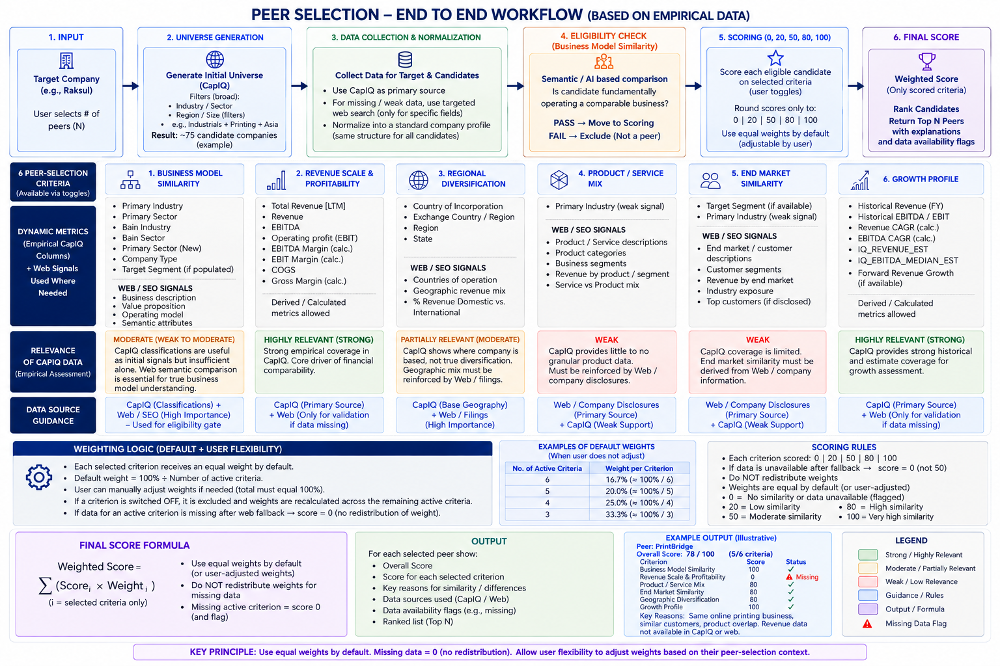

# Peer Selection & Ranking

[View in Confluence](https://bainco.atlassian.net/wiki/spaces/OI30/pages/19809534070)

## **Overall Approach (for sprint 1 & 2, before API access)**

Due to CapIQ data availability, for now, we can proceed with the **existing CapIQ Excel extracts, ** converting them into a **Parquet-based dataset indexed by CapIQ ID** rather than waiting for API access or building a full taxonomy upfront. The workflow has two stages: **(1) identify the most relevant peer candidates within the CapIQ universe using OpenAI-powered search**, and **(2) consolidate available CapIQ fields into a fixed set of peer-selection buckets aligned with the latest Figma UI/UX, then calculate a comparable peer score**. The underlying metrics remain dynamic: **CapIQ is the primary data source**, and where required information for a specific company/bucket is missing or insufficient, the engine selectively triggers **web search as a fallback**. This keeps the methodology consistent while minimizing unnecessary web-search cost and latency.

*Output: Top N (user input) peer recommendations on the user with justification on the rationale for selection*

Please take a look at the underlying logic below:

## End-to-end workflow



## **A practical use-case with this system of peer selection & ranking**

**Example target: Raksul Inc.**
User asks: **“Find the 3 most relevant peers for Raksul.”**

The methodology has a **fixed peer-selection framework**, while the criteria selected by the user, underlying metrics, and data sources are dynamic.

**Default principle: every active peer-selection bucket has equal importance.**

## 1. User defines the peer-selection context

The user selects the target company and configures which peer-selection criteria matter through the **toggles in the Peer Set Selection Context screen**.

The six available buckets are:

- Business Model Similarity
- Revenue Scale & Profitability
- Product / Service Mix
- End-Market Similarity
- Geographic Similarity
- Growth Profile

### **Weighting: equal across all active buckets**

All buckets selected by the user receive equal weight.

If all six are selected:

| Bucket  | User Selection  | Weight  |
|---|---|---|
| Business Model  | ON  | **16.7%**  |
| Revenue & Profitability  | ON  | **16.7%**  |
| Product Mix  | ON  | **16.7%**  |
| End Markets  | ON  | **16.7%**  |
| Geography  | ON  | **16.7%**  |
| Growth  | ON  | **16.7%**  |

If the user selects only four buckets, each receives:

**25%**

If the user selects only three:

**33.3%**

Therefore:

>

**Default Weight = 100% ÷ Number of Active Buckets**

Importantly:

>

**A bucket switched OFF by the user is different from a bucket that is ON but has missing data.**

## 2. Build the target profile

Start with the target's **CapIQ ID** and retrieve the latest available information from the CapIQ dataset.

For Raksul, this could produce:

| Bucket  | Example target information  |
|---|---|
| Business Model  | Online B2B commercial printing  |
| Revenue & Profitability  | ~$440m revenue; ~9% EBITDA margin  |
| Product Mix  | Printing, packaging, promotional products  |
| End Markets  | SMEs, marketing teams, e-commerce  |
| Geography  | Primarily Japan  |
| Growth  | ~14% historical revenue CAGR  |

The comparison buckets are standardized, but the **metrics underneath them do not need to be fixed**.

For example, Revenue & Profitability might use Revenue + EBITDA Margin where available, while another company could use alternative relevant metrics based on availability.

This gives us:

>

**Fixed buckets + dynamic underlying metrics**

## 3. Identify the candidate universe

Search the **CapIQ database first** to create a broad pool of potentially relevant companies.

Use available signals such as:

**Industry + Sector + Business Description + Geography + Scale**

The objective here is **not to identify the final peers**. It is simply to reduce the overall CapIQ database to a manageable universe of plausible candidates.

For example:

**10,000 companies → 75 potential candidates**

These companies are still **candidates, not peers**.

## 4. Run the business-model eligibility check

Before spending compute on full enrichment and scoring, determine whether each candidate fundamentally operates a comparable business.

The core question is:

>

**“Does this company actually operate a comparable business to Raksul?”**

Use CapIQ information first, supplemented by lightweight semantic/web validation where CapIQ is insufficient.

Example:

| Candidate  | Business  | Decision  |
|---|---|---|
| PrintBridge  | Online B2B printing  | ✓ Pass  |
| PromoPress  | Printing + promotional products  | ✓ Pass  |
| VistaWorks  | Online customized printing  | ✓ Pass  |
| PackFlow  | Packaging + printing platform  | ✓ Pass  |
| RailBuild  | Rail transportation  | ✕ Reject  |

This prevents a company from becoming a peer simply because its Revenue or EBITDA happens to resemble the target.

For example:

**75 candidates → 15 eligible candidates**

Only these candidates proceed to detailed enrichment and scoring.

**Business Model therefore acts as the eligibility gate, but this does not mean it automatically receives a higher scoring weight.**

Once a candidate passes the gate, Business Model is treated equally with the other active buckets by default.

## 5. Dynamically populate the active peer-selection buckets

Now the system evaluates **only the buckets activated by the user**.

For every active bucket and every candidate, it asks:

>

**Do we have sufficient, relevant and recent information in CapIQ?**

**If yes → use CapIQ.**

**If no → trigger targeted web search for that company and that specific bucket.**

For example:

| Active Bucket  | CapIQ Availability  | System Action  |
|---|---|---|
| Business Model  | ✓ Strong  | Use CapIQ  |
| Revenue & Profitability  | ✓ Strong  | Use CapIQ  |
| Product Mix  | △ Weak  | → Targeted web search  |
| End Markets  | ✕ Missing  | → Targeted web search  |
| Geography  | ✓ Strong  | Use CapIQ  |
| Growth  | ✓ Strong  | Use CapIQ  |

The web is therefore **not queried for every company and every field**.

It acts as an intelligent fallback layer:

>

**CapIQ first → Web only where required**

This reduces unnecessary cost and latency while allowing the methodology to adapt to differences in data availability.

## 6. Handle missing data

After CapIQ and the targeted web fallback have both been attempted, some information may still be unavailable.

The rule is:

>

**Missing active bucket = 0 points + Missing Data flag**

We **do not redistribute its weight** to the other buckets.

For example, assume the user selected all six criteria.

Each criterion therefore carries **16.7%**.

If Revenue & Profitability remains unavailable:

**Revenue & Profitability Score = 0**

Its **16.7% remains part of the calculation**.

The other five buckets remain at **16.7% each**.

This prevents missing information from accidentally increasing the importance of the criteria where data happens to be available.

## 7. Distinguish missing data from user choices

This distinction is critical.

### User switches a bucket OFF

The criterion is intentionally excluded from the peer-selection context.

Weights are then **recalculated equally across the criteria intentionally selected by the user**.

For example:

**6 selected → 16.7% each**
**5 selected → 20% each**
**4 selected → 25% each**
**3 selected → 33.3% each**

### User switches a bucket ON, but data cannot be found

The criterion remains part of the calculation.

It receives:

>

**0 points + Missing Data flag**

Its weight is **not redistributed**.

Example:

| Bucket  | Status  | Weight  | Treatment  |
|---|---|---|---|
| Business Model  | ON + available  | 20%  | Score normally  |
| Revenue  | ON + missing  | 20%  | **0 + flag**  |
| Product Mix  | ON + available  | 20%  | Score normally  |
| End Markets  | ON + available  | 20%  | Score normally  |
| Geography  | OFF  | -  | Excluded  |
| Growth  | ON + available  | 20%  | Score normally  |

Five buckets were intentionally selected, so each carries **20%**.

Revenue being missing does **not** cause the other four to increase to 25%.

## 8. Convert evidence into simple similarity scores

For available information, use a deliberately simple scoring scale:

**0 / 20 / 50 / 80 / 100**

| Score  | Meaning  |
|---|---|
| **100**  | Very strong similarity  |
| **80**  | Strong similarity  |
| **50**  | Moderate similarity  |
| **20**  | Weak similarity  |
| **0**  | No similarity or data unavailable*  |

The system separately retains the reason for a 0 so that **“not similar”** and **“missing data”** remain distinguishable.

The underlying calculations can still be deterministic.

For example:

**Revenue**

`Candidate Revenue ÷ Target Revenue → similarity band → score`

**Growth**

`Difference in Revenue CAGR → similarity band → score`

**Product Mix**

`Product overlap → similarity band → score`

This avoids false precision such as an unexplained AI-generated **73/100**.

## 9. Apply equal weights across the user's selected buckets

The methodology is:

>

**Every bucket intentionally selected by the user has equal weight.**

### Examples

| Active Buckets  | Default Weight per Bucket  |
|---|---|
| 6  | **16.7%**  |
| 5  | **20.0%**  |
| 4  | **25.0%**  |
| 3  | **33.3%**  |

The formula is:

>

**Default Bucket Weight = 1 ÷ Number of User-Selected Buckets**

## 10. Calculate score and data availability

Assume the user selects **all six buckets**.

Each bucket therefore carries approximately **16.7%**.

| Bucket  | Weight  | Peer A  | Peer B  |
|---|---|---|---|
| Business Model  | 16.7%  | 100  | 80  |
| Revenue & Profitability  | 16.7%  | **0 ⚠ Missing**  | 80  |
| Product Mix  | 16.7%  | 100  | 80  |
| End Markets  | 16.7%  | 80  | 80  |
| Geography  | 16.7%  | 80  | 80  |
| Growth  | 16.7%  | 100  | 80  |

### Peer A

Approximately:

`(100 + 0 + 100 + 80 + 80 + 100) ÷ 6`

**= 76.7**

Data availability: **5/6**

⚠ Revenue & Profitability unavailable after CapIQ + web fallback.

### Peer B

`(80 + 80 + 80 + 80 + 80 + 80) ÷ 6`

**= 80**

Data availability: **6/6**

Peer B therefore ranks above Peer A.

This is intentional.

Peer A's five strong criteria **do not receive additional weight simply because its sixth criterion is missing**.

## 11. Rank and return the requested peers

Once every eligible candidate has:

- Bucket scores
- Active weights
- Overall score
- Data-availability information
- Missing-data flags

…the system ranks candidates from highest to lowest.

Example:

| Rank  | Candidate  | Score  | Data Available  | Flag  |
|---|---|---|---|---|
| **1**  | PrintBridge  | **94**  | 6/6  | -  |
| **2**  | PromoPress  | **88**  | 6/6  | -  |
| **3**  | PackFlow  | **78**  | 5/6  | ⚠ 1 missing bucket  |
| 4  | VistaWorks  | **76**  | 6/6  | -  |

If the user asks for **three peers**, return the Top 3.

The user therefore sees both:

>

**How similar is this company?**

and

>

**How much evidence do we actually have behind that score?**

# The complete workflow in one view

```
USER SELECTS TARGET + NUMBER OF PEERS
                    ↓
       USER SELECTS CRITERIA / TOGGLES
                    ↓
       EQUAL WEIGHTS APPLIED ACROSS ACTIVE BUCKETS
                    ↓
             TARGET CAPIQ PROFILE
                    ↓
         SEARCH CAPIQ PEER UNIVERSE
                    ↓
          BROAD CANDIDATE LIST
                    ↓
       BUSINESS MODEL ELIGIBILITY
             ↙               ↘
           FAIL              PASS
             ↓                 ↓
          REMOVE        ELIGIBLE CANDIDATES
                               ↓
                    CHECK ACTIVE BUCKETS
                               ↓
                  ┌────────────┴────────────┐
                  ↓                         ↓
             SUFFICIENT                 MISSING /
            CAPIQ DATA                  WEAK / STALE
                  ↓                         ↓
              USE CAPIQ              TARGETED WEB
                  │                     SEARCH
                  │                         ↓
                  │                   DATA FOUND?
                  │                    ↙       ↘
                  │                  YES       NO
                  │                   ↓         ↓
                  └──────────────→ USE DATA    0 + FLAG
                               ↓
                     SCORE ACTIVE BUCKETS
                      0 / 20 / 50 / 80 / 100
                               ↓
                     APPLY WEIGHTS
                 (EQUAL BY DEFAULT)
                               ↓
                 NO REDISTRIBUTION FOR MISSING
                               ↓
                 FINAL SCORE + DATA AVAILABILITY
                               ↓
                         RANK CANDIDATES
                               ↓
                           RETURN TOP N
```

## Four key rules

1. **Fixed framework, dynamic execution.** The six available peer-selection buckets are standardized, while the buckets activated by the user, underlying metrics and data sources can change dynamically.
1. **Equal weighting** Every bucket selected by the user receives equal weight by default: 6 buckets = 16.7% each, 5 = 20%, 4 = 25%, etc.
1. **CapIQ first, web as a targeted fallback.** Web search is triggered only where CapIQ information is missing, weak or stale-not as the default source.
1. **OFF ≠ Missing.** A bucket intentionally switched **OFF** is excluded before weights are calculated. A bucket switched **ON** but still unavailable after fallback receives **0 + a Missing Data flag**, and **its weight is never redistributed to the remaining buckets**.
