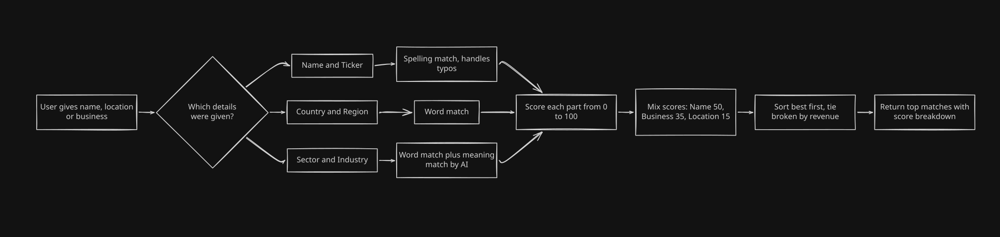
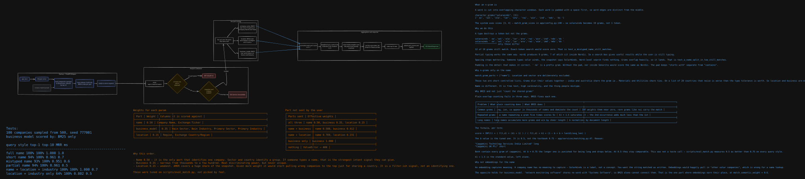
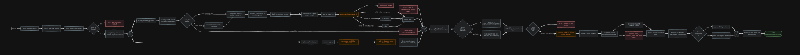

# Present working-- Technical details

[View in Confluence](https://bainco.atlassian.net/wiki/spaces/OI30/pages/19849609338)

# Present working — Technical details

>

**Scope.** This page documents the peer-selection backend: how a company is matched from a name, how peers are discovered from two independent sources, how the two sets are merged and verified, and how the result is ranked. The diagrams in Architecture diagrams give the shape of the system; the sections after them are the detailed walkthroughs.

## Architecture diagrams

Six diagrams describe the system at increasing levels of detail. The first two are the plain-English views; the last four progressively zoom in on the same `POST /peers/discover` request path.

All six are attached as SVG, so they stay sharp at any zoom — several are very wide (up to 12,000 px) and are meant to be opened full-screen rather than read inline.

### Figure 1 — What the backend does, end to end


**What it shows.** The whole request in one line: `user` → `FastAPI POST /peers/discover` → `peer_discovery`, which fans out into the **two searches** that run side by side — a **web search** (agent calls) and a **deterministic search** over our own snapshot. Their results are combined at `merge by cap_id`, handed to `analyse_many` (a `ThreadPool` running **8 at a time**) which produces `analysis peer 1`, `analysis peer 2` … `analysis peer n to 10`, and finally `rerank by comparability`.

**Why it matters.** This is the mental model for everything below. Two independent sources of peers, one merge, one analysis pass, one ranking.

**Design rules, as stated on the diagram:**

- **Own-DB breadth** — the deterministic search covers our own database
- **Web reach** — the agent widens the search past our database
- **Verified IDs** — every company the agent recommends is checked
- **Truth wins** — we overwrite the agent where we hold the truth
- **Isolated calls** — one analysis call per company
- **Concurrent** — those calls run concurrently
- **Read-only runtime** — nothing is written at request time

### Figure 2 — Company lookup, in plain English



**What it shows.** The non-technical version of the company matcher. The user gives a name, a location or a business description; the matcher branches on **which details were given** and scores each part with a different technique:

| Part given  | How it is matched  |
|---|---|
| Name and Ticker  | Spelling match, handles typos  |
| Country and Region  | Word match  |
| Sector and Industry  | Word match plus meaning match by AI  |

Each part is scored **0 to 100**, the parts are mixed with fixed weights — **Name 50, Business 35, Location 15** — results are **sorted best first, tie broken by revenue**, and the top matches are returned **with a score breakdown**.

**Why it matters.** This is the diagram to show a non-engineer. Figure 3 is the same process with the algorithms named.

### Figure 3 — The matching engine: n-grams, BM25 and weights



**What it shows.** The full technical treatment of company matching, covering the startup path (FastAPI lifespan → load snapshot → build one BM25 index per part), request validation, per-part scoring, and aggregation into the response.

The three scoring parts:

| Part  | Scored over  |
|---|---|
| `company_name`  | BM25 over character 3–4 grams on Company Name and Ticker  |
| `location`  | BM25 over word tokens on Region and Country  |
| `business_model`  | BM25 over word tokens on Sector and Industry  |

Aggregation: normalise each part score to `0..1` → weighted sum (name 0.50, business 0.35, location 0.15) → **renormalise the weights over the parts that actually matched** → sort by score descending, tie-break on Revenue descending → take top N rows → attach `part_scores` and signals → `200 MatchResponse`.

**Why it matters.** This diagram also carries the *reasoning*, which is the part that is hard to recover from code alone:

- **What an n-gram is** — a word is padded then cut into overlapping character windows, so word edges stay distinct from the middle.
- **Why n-grams only on the name** — `match_gram_parts = ["name"]`. Location and sector are short, controlled lists where grams blur values together; name is free text, high cardinality, and the thing people actually mistype.
- **Why BM25 and not plain gram counting** — IDF kills common grams, `k1 = 1.5` saturates repeated grams, and `b` normalises for document length.
- **Why **`b = 0.5` and not the textbook 0.75 — measured, not chosen by taste.
- **Why not embeddings for the name** — a company name is a label, not a concept. Embeddings belong on `business_model`, at `match_semantic_weight = 0.6`.
- **Effective weights** when only some parts are sent, and the measured accuracy table per query style.

### Figure 4 — Peer discovery at runtime, with the funnel counts


**What it shows.** The `POST /peers/discover` request path annotated with **the number of companies surviving each stage**, which is what makes this diagram worth reading:

- **Agent branch** — `foundry.ask_agent` proposes peer names → is the response parseable? (fenced JSON, prose to be scraped, or nothing readable → `agent_error`, 0 peers) → candidate names (**25**) → `resolve`, dropping fabricated `cap_id`s (**18**).
- **Deterministic branch** — vector the target on the criteria columns → `candidate_pool` narrowed to same sector and region (**500 → 47**) → rank by distance, keep `max_peers` (**20**).
- **Merge and analysis** — merge by `cap_id`, agent peers first (**31**) → `analysis_limit` (**10**) → `analyse_pair`, one Foundry call per peer → rerank into group 0 (has comparability, high to low) and group 1 (merge order kept) → `PeerDiscoveryResponse`, HTTP 200.

**Why it matters.** It shows where the funnel actually narrows, and that counts and errors are **always returned, never thrown**.

### Figure 5 — The same path at function-call level



**What it shows.** Figure 4 redrawn with the real function names and every error branch: `router: discover_peers` → `peer_discovery.discover` → `cap_id found?` (no → **HTTP 404 unknown cap_id**) → target snapshot row loaded *before any network call* → fan out → `build_discovery_prompt` → Foundry call 1 → `parse_candidates` → shortlist each name via `matching.match` → `build_resolution_prompt` → Foundry call 2 → `parse_matches` → `resolve` (verify every `cap_id`; fabricated ones dropped, nulls go to `unresolved`) → merge → `analyse_pair` → rerank → `PeerDiscoveryResponse`.

**Why it matters.** This is the debugging diagram — it names the function to open for any stage, and shows the two failure exits: **HTTP 503 scores not built** when the deterministic side has no scores, and **HTTP 503** only when *both* sides failed.

### Figure 6 — The four stages, drawn as lanes


**What it shows.** The most complete drawing, explicitly divided into four numbered stages:

1. **Agent side** — peers from the web, *never raises*. Discovery prompt → Foundry call 1 → parse candidates (deduped, capped at `discovery_max_names` 25) → shortlist each name via `matching.match` top 10 → resolution prompt → Foundry call 2 picks one `cap_id` or null → `resolve` checks every `cap_id` against the shortlist it was actually offered.
1. **Deterministic side** — peers from the snapshot, *never raises*. `columns_for(criteria)` → vector target → `candidate_pool` filtered on categorical columns → rank by distance, keep `max_peers`, carrying `distance`, `similarity` and `shared_columns`. `FileNotFoundError` (company scores not built) → 0 peers and `deterministic_error` set.
1. **Merge, keyed by **`cap_id` — insert every agent peer with `agent_recommended = true`; deterministic-only peers after. Where both sides found the same company, **keep the agent entry and its flag, then add **`distance`, `similarity` and `shared_columns`.
1. **Analysis and reranking** — take the first `analysis_limit` peers (10 — merge order decides who makes the cut) → `analyse_many` on a `ThreadPool` with `workers = min(analysis_workers 8, peer count)` → one Foundry call per peer → a failure costs only that peer (`analysis` None, `analysis_error` set) → peers past the limit stay **unanalysed, not dropped** → stable sort into group 0 (has comparability, high to low) and group 1 (behind every analysed peer, merge order kept).

**Why it matters.** The "never raises" annotation on stages 1 and 2 is the key contract: each side degrades to zero peers plus an error field. Only when **both** fail does the endpoint return **HTTP 503 scores not built**.

## How the top 10 search results reach the LLM, and why that call exists

### The code path

`app/services/peer_discovery.py:460-466`:

```py
shortlists = [shortlist(peer["name"]) for peer in web_peers]   # 25 names -> 25 lists of 10
chosen = foundry.ask_agent(build_resolution_prompt(web_peers, shortlists))
matches = parse_matches(chosen, len(web_peers))
peers, unresolved = resolve(web_peers, shortlists, matches, cap_id, max_peers)
```

`shortlist()` is a name-only match capped at 10, set by `discovery_candidate_limit` in `config.py:95`:

```py
hits, _ = matching.match(name=name, limit=get_settings().discovery_candidate_limit)
```

Name only, and that is deliberate. Passing `business_model` would fire one Azure embeddings call per candidate name. Passing `location` would hurt too: a web-sourced "USA" scored against the snapshot's "United States" pushes the right company down the list, not up.

Each hit is flattened into a pipe row — `cap_id | name | ticker | country | sector` — and all 25 blocks go into one prompt:

```text
COMPANY 1
  found on the web as: Acme Quantum Widgets Inc
  ticker: NYSE:AQW
  country: United States
  what we found: makes industrial sensors
  CANDIDATES
    IQ4417 | Acme Quantum Widgets, Inc. | NYSE:AQW | United States | Industrials
    IQ9912 | Quantum GmbH | XTRA:QTM | Germany | Industrials
    ...
```

### Why the call exists

`match()` can give recall. It cannot decide identity.

Scores are min-max normalised per query — every part score is divided by the best score for that query. So the top hit always comes back at 1.000, even when the company is not in the snapshot at all.

Search "Acme Quantum Widgets Inc" against a snapshot that has never hea comes back at 1.000. A genuine match also scores 1.000. No thresholdseparates the two.

So the work is split:

| Step  | Job  | it suits that step  |
|---|---|---|
| `match()`  | Narrow 22k companies to 10  | Fast, cheap, deterministicight company somewhere in the ten  |
| LLM call 2  | Pick which of the 10, or none  | It sees name, ticker, coune, so it can tell a parent from a subsidiary — or say none of them fits  |

The prompt makes "none" an explicitly correct answer:

```text
- A parent, a subsidiary in a different country, or a similarly named d
  company is NOT a match. Answer null.
- Answer null when none of the candidates is the company. That is a cor
```

Without those lines the model picks the closest row every time — which ch() already has.

### Why one call and not 25

One prompt covers every name. Cost and latency are one call instead of the companies together, which helps it avoid assigning the same `cap_id` to two different names.

Companies are numbered rather than keyed by name, because names carry commas, quotes and non-ASCII characters that make them unreliable to match back from the JSON reply.

### The guardrail on the answer

`resolve()` does not trust the reply. For each company it rebuilds the se actually offered:

```py
offered = {hit["cap_id"] for hit in shortlists[ordinal - 1]}
if cap_id and cap_id not in offered:
    logger.warning("agent returned cap_id %s for %r, which was not on i
    cap_id = None
```

An invented `cap_id` is dropped and that name goes to `unresolved`.

This is the whole point of showing a shortlist. It turns an open-ended question — "what is this company's ID?", where a hallucination is undetectable — into a closed multiple choice, where a hallucination is simply a value outside the oft mechanically.

Two benefits:

1. No wrong CAP ID gets returned
1. It fixes the inflated score

## The deterministic side — details

**Code:** `app/services/similarity.py`, `app/services/normalisation.py`, `app/criteria.py`, `scripts/build_scores.py`.

No model, no network. Same input gives the same output every time.

### Step 0 — offline build

`scripts/build_scores.py` runs once and writes two files:

| File  | Contents  |
|---|---|
| `company_scores.parquet`  | one row per company, `z_<column>` for every numerical column  |
| `normalisation.json`  | the fitted median and spread per column  |

Splitting it this way matters: the API loads the same parameters at request time, so a target scored live lands on exactly the same scale as the stored rows. There is no chance of the two drifting apart.

### Step 1 — pick the columns

`columns_for(criteria)` in `criteria.py:129`.

The caller sends criteria; each one maps to a set of columns:

| Criterion  | Categorical  | Numerical  |
|---|---|---|
| `business_model`  | Company Type, Bain Industry, Primary Industry  | gross_margin, ebitda_margin, operating_margin, R&D intensity, depreciation intensity, AR days, AP days, inventory days, leverage  |
| `revenue_scale`  | —  | Revenue, revenue_size  |
| `regional_exposure`  | Region, Exchange Country/Region  | —  |
| `end_market_and_customers`  | Bain Sector, Primary Sector, Bain Industry, Primary Industry  | AR days, AP days  |
| `product_mix`  | Bain Industry, Primary Industry  | gross_margin, R&D intensity, inventory_days  |
| `growth_profile`  | —  | revenue_growth_rate  |

Two things worth stating:

- Columns are shared across buckets on purpose. Gross margin says something about business model and product mix. `columns_for` dedupes, so a column selected twice is still used once.
- `revenue_size` is `log10(Revenue)`. That is what lets companies orders of magnitude apart sit on a linear scale.
- `EXCLUDED_COLUMNS` lists identity and provenance fields that are deliberately in no bucket — company name, ticker, year, source file. Listed explicitly so it is clear they were considered, not overlooked.

### Step 2 — normalise the target

`normalisation.py:fit` and `scale_series`.

Robust z-score, not a standard one:

```py
median = numbers.median()
spread = Q3 - Q1                      # interquartile range
scaled = ((x - median) / spread).clip(-3.0, 3.0)
```

| Choice  | Reason  |
|---|---|
| Median, not mean  | Revenue spans six orders of magnitude; the mean sits nowhere near the typical company.  |
| IQR, not standard deviation  | Describes the middle of the distribution and ignores the tails  |
| Clip at ±3  | One extreme outlier cannot dominate the distance  |
| Fallbacks  | If IQR ≤ 0 → std dev; if that fails → 1.0 for a constant column  |

A value that is not numeric becomes `None` — not zero, not the mean. Nothing is imputed anywhere in this path.

### Step 3 — narrow the pool

`similarity.py:candidate_pool`. Hard filters, applied in order, each one logged:

```text
starting pool: 22,431
only_included: 22,431 -> 18,902
Bain Sector = Software: 18,902 -> 1,204
Region = AMER: 1,204 -> 611
revenue_band: 611 -> 148
```

1. Drop the target itself.
1. `only_included` — Inclusion starts with "Included" and Company Status is Operating or Operating Subsidiary.
1. One exact-match filter per categorical column the criteria selected.
1. Revenue band — `similarity_revenue_band = 5.0`, so 1/5× to 5× the target's revenue.

The placeholder guard matters here. The data pull writes `"NA"`, `"0"`, `""`, `"-"` instead of leaving a categorical cell empty. If the target's own value is one of those, the filter is skipped, not applied — otherwise you pair companies that share nothing but a gap in the data.

The log is returned to the caller, so you can always see where the pool went.

### Step 4 — rank by distance

`similarity.py:rank`. Weighted Manhattan distance, averaged over shared columns.

```py
gaps = np.abs(candidates - target) / SCALED_RANGE   # SCALED_RANGE = 6.0
shared = ~np.isnan(gaps)
available = (shared * weights).sum(axis=1)
total = (np.nan_to_num(gaps) * shared * weights).sum(axis=1)
distance = total / available
```

| Decision  | Reason  |
|---|---|
| L1, not L2  | These columns are heavy-tailed. Squaring the gaps lets one distant column decide the ranking on its own  |
| Divide by `SCALED_RANGE = 6.0`  | The clipped range is −3 to +3. Dividing puts every per-column gap on 0..1, the same scale a categorical match would use  |
| Divide by `available`, not by column count  | The distance is the average gap over the columns both companies actually have  |
| `np.nan_to_num` then mask  | A missing column contributes nothing to either numerator or denominator. It narrows the comparison instead of being filled in  |

Then:

```py
usable = (shared_count >= similarity_min_shared_columns) & ~np.isnan(distance)
order = np.argsort(distance[usable], kind="stable")[:limit]
```

Stable sort, so ties keep snapshot order and results are reproducible.

Each peer comes back with four fields:

```text
{"cap_id": ..., "distance": 0.184213, "similarity": 0.844..., "shared_columns": 9}
```

`similarity = 1 / (1 + distance)` — a monotone mapping into `(0, 1]`, purely for presentation. It carries no extra information over `distance`.

`shared_columns` is the honesty field. A peer at distance 0.05 on 2 shared columns is much weaker evidence than one at 0.12 on 9. Always read the two together.

### Performance

`load_vectors()` returns a contiguous `float32` matrix rather than a DataFrame. 22k × 12 is about a megabyte, so a full scan beats any index at this size. It is `lru_cache`d for the process lifetime.

### The knobs

`app/config.py:79-81`

| Setting  | Default  | Effect  |
|---|---|---|
| `similarity_revenue_band`  | 5.0  | 1/5× to 5× the target's revenue  |
| `similarity_only_included`  | True  | Restrict to included, operating companies  |
| `similarity_min_shared_columns`  | 1  | Minimum overlap for a peer to qualify  |

`COLUMN_WEIGHTS` in `criteria.py:97` is currently all 1.0 — every numerical column counts equally inside its bucket. The weights are relative, normalised to sum to 1 per bucket, so doubling one number doubles its say against the others in that bucket only.

### Honest limitations

1. Every weight is 1.0 today. The mechanism for per-column weighting exists and is unused. Nothing has been tuned.
1. `shared_columns >= 1` is a very weak floor. A peer matched on a single column can currently rank first. Raising this to 3 or 4 would be the cheapest quality win available.
1. Regional exposure is listing geography only. The snapshot has no revenue split by region, so "regional exposure" really means "where it is listed".
1. Growth is a single rate. The per-year revenue history lives in the regional parquets, not in this snapshot.
1. Categorical filters are exact-match and hard. A company in an adjacent industry is excluded entirely, not down-weighted.
1. Distance is relative, not absolute. A distance of 0.2 has no meaning on its own — only against the other candidates in the same pool.
1. Failure mode is `FileNotFoundError` if `build_scores.py` has not been run. The peer endpoint turns that into `deterministic_error` and zero peers, never a crash.

## What is `shared_columns`

### Definition

The number of numerical columns where both the target and that peer have a value.

```py
gaps = np.abs(candidates - target) / SCALED_RANGE
shared = ~np.isnan(gaps)        # True where neither side is NaN
shared_count = shared.sum(axis=1)
```

`gaps` is NaN if either side is missing, so `shared` is the intersection.

### Example

Criteria select 9 numerical columns:

| Column  | Target  | Peer A  | Peer B  |
|---|---|---|---|
| gross_margin  | 0.42  | 0.40  | 0.41  |
| ebitda_margin  | 0.18  | 0.19  | —  |
| operating_margin  | 0.12  | 0.11  | —  |
| R&D intensity  | 0.08  | 0.07  | —  |
| depreciation intensity  | 0.05  | 0.06  | —  |
| AR days  | 45  | 47  | —  |
| AP days  | 38  | 40  | —  |
| inventory days  | 30  | 28  | —  |
| leverage  | 1.4  | 1.5  | 1.4  |

- Peer A: `shared_columns = 9`
- Peer B: `shared_columns = 2`

### Why it is returned

Because distance alone is misleading. Distance is the average gap over the shared columns only — so fewer columns means an easier average.

- Peer A: distance 0.12 on 9 columns
- Peer B: distance 0.05 on 2 columns

Peer B ranks first. It is the weaker peer. It just had less to be wrong about.

`shared_columns` is the field that tells you this. Read the two together, always.

### Why it works this way

The alternative is imputation — fill the gap with a median or a zero. The code refuses to:

>

a missing value narrows the comparison instead of being filled in with an invented number

That is the right call. But it moves the burden to the reader, which is why the count is exposed rather than hidden.

### The threshold

`app/config.py:81`

```py
similarity_min_shared_columns: int = 1
```

A peer needs at least this many shared columns to qualify. At 1, Peer B above is perfectly valid and will be returned as the closest peer.

That is the weakest setting in the deterministic path. Raising it to 3 or 4 is the cheapest quality improvement available — but you cannot prove the gain without a golden peer set to measure against.

### In practice

When reviewing peer output, treat it as:

| `shared_columns`  | Reading  |
|---|---|
| 8–9 of 9  | Distance is trustworthy  |
| 4–7  | Usable, note the coverage  |
| 1–3  | Distance means very little; check which columns matched  |

## Why we use stable sort

Two stable sorts, two different reasons.

### 1. Deterministic ranking — `similarity.py:138`

```py
order = np.argsort(distance[usable], kind="stable")[:limit]
```

NumPy's default is quicksort (introsort), which is unstable. Equal values come back in arbitrary order, and that order can change with the NumPy version, the platform, or just the size of the array.

Ties are not rare here — they are guaranteed, because of the clip:

```py
scaled = ((x - median) / spread).clip(-3.0, 3.0)
```

Every company beyond 3 IQRs from the median lands on exactly 3.0. So all the extreme-margin companies collapse onto one identical value. Compare that against a target and they all produce the same gap.

It gets worse with narrow criteria. `growth_profile` has a single numerical column, `revenue_growth_rate`. One column, clipped — hundreds of companies can share an identical distance.

Without `kind="stable"`:

```text
run 1: IQ4417, IQ9912, IQ2201
run 2: IQ2201, IQ4417, IQ9912   # same data, same code
```

With it, ties keep snapshot order, so the same request always returns the same top 10. That matters for three things: reproducing a result for an audit, diffing before and after a config change, and writing a test that does not flake.
