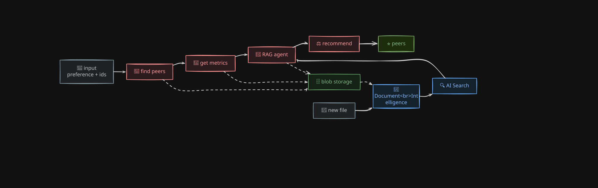
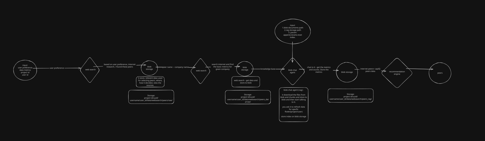
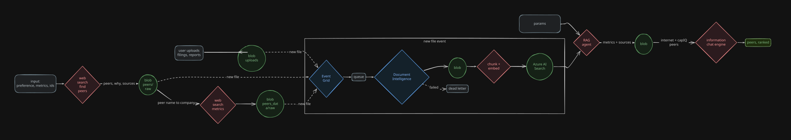
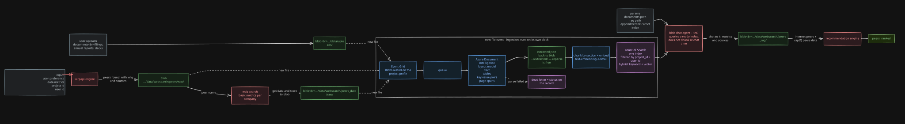

# TO BE DELETE.

[View in Confluence](https://bainco.atlassian.net/wiki/spaces/OI30/pages/19849445516)

Design decisions

- AI Search, not blob — the index lives in Azure AI Search. Blob cannot serve a filtered hybrid query. AI Search gives keyword + vector + the semantic reranker, and filters by project_id and user_id, which is the per-folder scoping the pipeline needs.
- Parse first — Document Intelligence runs before chunking, not instead of it. A filing's tables do not survive naive text chunking, and parsing at chat time makes the first question slow.
- Event driven — a file indexes itself when it lands. Manual refresh stays as an escape hatch, not the only path.
- Keep the extraction — extracted JSON stays in blob. Document Intelligence is the expensive step, so re-chunking or changing the embedding model never re-runs it.
- Queue in between — a 200-page filing takes minutes; the upload must return immediately.

Benefits

Azure AI Search instead of an index on blob

- Speed — a blob index has to be downloaded and searched inside the app process on every question. AI Search answers server-side in tens of milliseconds, with no cold start after a restart.
- Hybrid — keyword and vector in one query. Keyword catches tickers, exact figures and defined terms; vector catches paraphrase. A blob index gives you whichever one you coded, not both.
- Reranker — one flag improves the ordering of the top results, with no extra LLM calls.
- Filtering — project_id and user_id are filters inside the query, so one index serves every project safely. With a blob index you need a separate file per folder, or you load everything and filter afterwards.
- Incremental — add or delete single documents. A blob index usually means rewriting the whole file, which is slow and races with concurrent readers.
- Scale — the index no longer has to fit in the app's memory.

Document Intelligence before chunking

- Tables survive — filings are mostly tables. Plain text extraction turns a table into a run of loose numbers with no row or column meaning, and wrong numbers reaching the model are worse than no numbers.
- Citations — each chunk carries its page and section, so an answer can point at page 42 of a named file.
- OCR — a PDF that is really an image yields nothing from a text librareads it.
- Chunk boundaries — chunking by section rather than character count means fewer chunks cut mid-sentence or mid-table.
- One shape — PDF, docx and images all come back in the same structure,s one path.

New file event

- Always fresh — the document is searchable by the time the user asks. Nobody has to remember to press refresh.
- Fast upload — the parse happens behind the event, not in the request.
- One path — user uploads and pipeline outputs index themselves the same way.
- Replayable — the queue gives retries and a dead letter, so a bad fileer than a silent gap.
- Scales out — a burst of fifty files drains through the queue instead of hitting the Document Intelligence rate limit at once.

Keeping the extracted JSON

- Parse once — changing chunk size, changing the embedding model, or rething extra.
- Cheap reset — re-index from extracted/ with no Document Intelligence call.
- Debuggable — you can read exactly what the model was given.

Overall

- Cost — parsing is once per file, not once per chat. Embedding is once per chunk.
- Traceability — every answer walks back to a blob path and a page.
- Isolation — per-project filters keep one customer's documents out of another's answers.

Compared with plain web search and embedding HTML

Audit

- Evidence kept — the original file sits in blob with the date it was fthere is nothing to open, only a vector and, if you were careful, a URL.
- URLs rot — a page cited today may be edited or gone in six months. An audit that cannot reach the source is not an audit.
- Full chain — raw file, extracted JSON, chunk, answer. Naive embeddingage to vector, and the middle is unrecoverable.
- Reproducible — re-running a year later uses the same stored inputs. Web search returns different pages on different days.
- Who and when — the blob path carries project and user, the file event
- Provable scope — you can list exactly which documents informed a conclusion. With live web search you cannot reconstruct it.

Search quality

- No page junk — navigation, cookie banners, footers and ad rails get eent and pollute the top results.
- Tables hold — a financial table as a string loses its rows and columns, so numbers lose their line item.
- Whole document — web search hands you the few pages an engine picked;where segment detail usually is.
- Many questions — the index answers repeatedly and cheaply. Web search pays latency and cost per question for a summary you cannot re-query.
- Stable results — same query, same chunks, until you change the index.
- Filtered scope — open web search can pull in a different company with a similar name and answer confidently from it.
- Freshness on purpose — you choose when to re-ingest, rather than a wet.

Limitations section.

Cost and operations

- Standing bill — AI Search is a running service, charged whether anyone queries it or not. A blob index costs storage only.
- Per-page parsing — Document Intelligence is priced per page, and the layout model costs more than plain read. A few thousand filings is a real number.
- More moving parts — Event Grid, queue, worker, Document Intelligence, AI Search and blob all have to be deployed, monitored, secured and paid for. The simple version has one.
- Harder local dev — you need real Azure services or emulators to run the ingestion path end to end.

Freshness and consistency

- Ingest lag — a file is not searchable the moment it lands. Parsing takes seconds to minutes, so the UI needs a visible status.
- Index drift — blob and AI Search can diverge. Deleting a file from blob does not remove its chunks unless deletion is also evented; you need a reconciliation job.
- Stale by design — freshness being a decision cuts both ways. The index stays as of the last ingest until someone refreshes it.

What the tooling cannot do

- Parsing is not perfect — nested tables, multi-column layouts, footnotes and handwriting still come out wrong sometimes. It gives layout, not meaning, and has page-size and rate limits.
- AI Search has ceilings — index size and vector capacity depend on tier, the semantic reranker has its own quota and only reranks the top slice, and filter fields must be designed up front. A schema change means a re-index.
- Retrieval can still miss — hybrid improves the odds, it does not guarantee the right chunk is in the top k. Bad chunking is not fixed by the index.
- The model can still be wrong — a citation proves where a chunk came from, not that the answer read it correctly.

Audit caveats

- Inputs are reproducible, outputs are not — the same chunks can produce different wording, sometimes different numbers, on a second run. Storage fixes the evidence, not the model's determinism.
- Retention is now your problem — keeping every source document has compliance and cost consequences, and a deletion request has to reach blob, extracted/ and the index.
- One index, one bug — with per-project filters, a mistake in the filter leaks across projects. An index per project is safer and costs more.

Scope

- Documents only answer what is in them — finding new peers still needs live web search. This design makes the evidence trail solid; it does not remove the search step.
